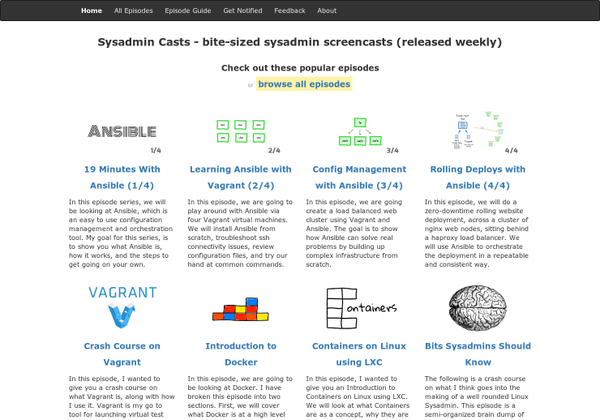
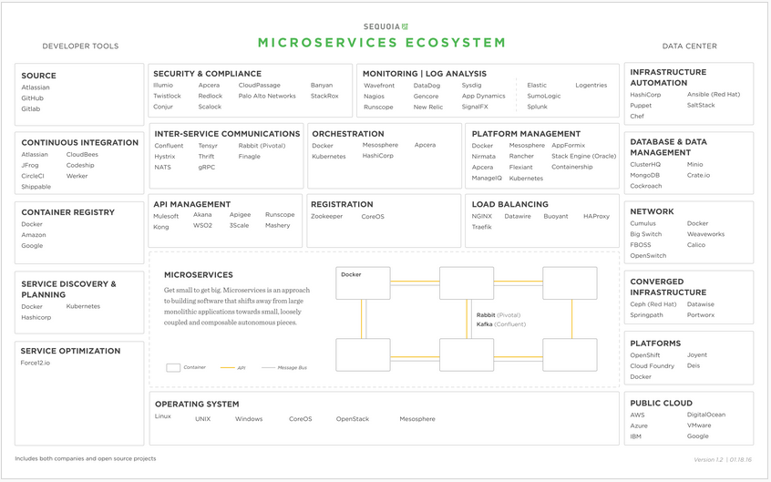

**Table of Contents**
<!-- MarkdownTOC -->

- [Configuration Management and Orchestration](#configuration-management-and-orchestration)
	- [Microservices](#microservices)
	- [Vagrant](#vagrant)
	- [Ansible](#ansible)
	- [Docker](#docker)
	- [Puppet](#puppet)
		- [Application Orchestration](#application-orchestration)
		- [WebLogic via Puppet](#weblogic-via-puppet)
	- [Provisioning: Red Hat Satellite, Katello, Foreman, Cobbler and others](#provisioning-red-hat-satellite-katello-foreman-cobbler-and-others)
	- [Chef and SAP](#chef-and-sap)
	- [Capistrano](#capistrano)
	- [SaltStack](#saltstack)

<!-- /MarkdownTOC -->

# Configuration Management and Orchestration

## Microservices
- [Introduction to Microservices | NGINX](https://www.nginx.com/blog/introduction-to-microservices/)
- [Microservices, Martin Fowler](http://martinfowler.com/articles/microservices.html)
- [What are Microservices?](https://www.linkedin.com/pulse/what-microservices-walli-datoo)
- [Microservices architecture: advantages and drawbacks](http://cloudacademy.com/blog/microservices-architecture-challenge-advantage-drawback/)
- [Welcome to Microservices.TV, where you will get the latest news, trends and tutorials on all things microservices](https://developer.ibm.com/tv/microservices/)
- [Microservices via Ansible. Deploying services with rollback and error handling, truncating releases, and restarting processes](http://www.ansible.com/ansiblefest-videos-spark-central-sf15)
- [capgemini.github.io: Is REST best in a Microservices architecture](https://capgemini.github.io/architecture/is-rest-best-microservices/)
- [javaadvent.com: Microservices and Java EE](http://www.javaadvent.com/2015/12/microservices-and-java-ee.html)
- [ibm.com: Microservices in action, Part 2: Containers and microservices — a perfect pair](http://www.ibm.com/developerworks/cloud/library/cl-bluemix-microservices-in-action-part-2-trs/)
- [DZone.com: Microservices and DevOps. A great list of resources to help you with your microservice development and deployments](https://dzone.com/articles/microservices-and-devops) 
- [ibm.com: Microservices in action, Part 2: Containers and microservices — a perfect pair](http://www.ibm.com/developerworks/cloud/library/cl-bluemix-microservices-in-action-part-2-trs/index.html)
- [Red Hat Middleware: All the videos from the #RedHat #Microservices Day 2015](https://www.youtube.com/watch?v=jAYvizggc9M&list=PLJFQ0_l_KBO7DXxeF4g0pcqT3AZ4oSHCT)
	- [Microservices in the Real World](https://www.youtube.com/watch?v=XG5sl_7Zi6k)
- [redhat.com videos: Logging and Management for Microservices](http://www.redhat.com/en/about/videos/logging-and-management-microservices)
- [rhelblog.redhat.com: Looking Back on Containers in 2015](http://rhelblog.redhat.com/2016/01/08/looking-back-on-containers-in-2015/)
- [DZone/Integration: Apache Camel for Micro­service Architectures](https://dzone.com/articles/apache-camel-micro%C2%ADservice)
	- [hawt.io: a modular web console for managing your Java stuff](http://hawt.io/)
- [Benefits of Cross-Functional Teams When Building Microservices](https://blog.risingstack.com/benefits-of-cross-functional-teams-when-building-microservices/)

<iframe src="//es.slideshare.net/slideshow/embed_code/key/Lu1TJmC0hR2CMy" width="595" height="485" frameborder="0" marginwidth="0" marginheight="0" scrolling="no" style="border:1px solid #CCC; border-width:1px; margin-bottom:5px; max-width: 100%;" allowfullscreen class="video"> </iframe> 
 <strong> <a href="//es.slideshare.net/danveloper/microservices-the-right-way" title="Microservices: The Right Way" target="_blank">Microservices: The Right Way</a> </strong> from <strong><a href="//es.slideshare.net/danveloper" target="_blank">Daniel Woods</a></strong> 

 

## Vagrant
- [How Vagrant Eases the Software Research and Testing - The New Stack](http://thenewstack.io/vagrant-developers-researchers/)
- [Improve your development environments with virtualization - Vagrant, Python ](http://pyvideo.org/video/3411/improve-your-development-environments-with-virtua)
- [Why tools like Docker, Vagrant, and Ansible are hotter than ever](http://opensource.com/business/15/5/why-Docker-Vagrant-and-Ansible)
- [Crash course on Vagrant, video tutorial at sysadmincasts.com](https://sysadmincasts.com/episodes/42-crash-course-on-vagrant-revised)
- [developerblog.redhat.com: Using Vagrant Tooling in Eclipse](http://developerblog.redhat.com/2015/12/22/using-vagrant-tooling-in-eclipse/)
- [vagrantbox.es](http://www.vagrantbox.es/)
- [Discover Vagrant Boxes](https://atlas.hashicorp.com/boxes/search)
- [Synced Folders Basic Usage](http://docs.vagrantup.com/v2/synced-folders/basic_usage.html)
> By default Vagrant will set up a share with your host machine automatically... /vagrant on the virtual box will be mapped to the folder containing your Vagrantfile this allows you to edit anything in this folder and the changes will be made instantly on the virtual box as well.

## Ansible
- [Ansible](ansible.md)

## Docker
- [Docker](docker.md)

## Puppet
- [Download the Learning VM](https://puppetlabs.com/download-learning-vm)
	- [Bringing application orchestration to the Learning VM](https://puppetlabs.com/blog/bringing-application-orchestration-to-learning-vm)
- [sysadmincasts.com: Learning Puppet with Vagrant](http://sysadmincasts.com/episodes/8-learning-puppet-with-vagrant)
	- [Sysadmincasts.com: Git to Puppet Deployment Workflow](https://sysadmincasts.com/episodes/33-git-to-puppet-deployment-workflow)
- [Webinar: Getting Started with Puppet Enterprise 3.3](https://puppetlabs.com/webinars/getting-started-puppet-enterprise-33-us)
	- [Puppet Enterprise 3.3 disponible con soporte para RHEL 7, Ubuntu 14.04 LTS, Windows Server 2012 R2, y Mac OS X Mavericks](https://puppetlabs.com/blog/puppet-enterprise-3.3-get-started-faster)
	- [Learning Puppet can be like drinking from a fire hose. Here is a guide to basic terms and resources to help you learn](https://puppetlabs.com/blog/starting-puppet-basics-from-puppet-labs-employee)
	- [puppetlabs/mcollective](https://forge.puppetlabs.com/puppetlabs/mcollective)
- [Github: The Puppet Dashboard is a web interface providing node classification and reporting features for Puppet, an open source system configuration management tool](https://github.com/sodabrew/puppet-dashboard)
- [Github: Smarter Puppet deployment.R10k provides a general purpose toolset for deploying Puppet environments and modules](https://github.com/puppetlabs/r10k)
- [Librarian-puppet is a bundler for your puppet infrastructure. You can use librarian-puppet to manage the puppet modules your infrastructure depends on, whether the modules come from the Puppet Forge, Git repositories or a just a path](http://librarian-puppet.com/)
- [Puppet and Python](http://pyvideo.org/video/3649/puppet-and-python)
- [Puppet Modules: Apps for Ops](http://pyvideo.org/video/2589/puppet-modules-apps-for-ops)
- [Geppetto, eclipse plugin for puppet](https://puppetlabs.com/blog-tags/geppetto)
- [New Releases for AWS and vSphere Modules](https://puppetlabs.com/blog/new-releases-aws-and-vsphere-modules)

### Application Orchestration
- [Bringing application orchestration to the Learning VM](https://puppetlabs.com/blog/bringing-application-orchestration-to-learning-vm)
- [Extending your Puppet language dictionary for application orchestration](https://puppetlabs.com/blog/extending-your-puppet-language-dictionary-application-orchestration)

### WebLogic via Puppet
- [Setup WebLogic 12c environment with Vagrant and Puppet](http://multikoop.blogspot.com.br/2013/11/setup-weblogic-12c-environment-with.html)
- [New Puppet 3 Weblogic provisioning module by Edwin Biemond](https://blogs.oracle.com/emeapartnerweblogic/entry/new_puppet_3_weblogic_provisioning)
	- [puppet forge: Oracle WebLogic / Fusion Middleware ( ADF, OSB, WebCenter, SOA Suite, WebCenter ,OAM, OIM) puppet module](https://forge.puppetlabs.com/biemond/wls)
	- [middlewaresnippets.blogspot.com - Install and Configure a WebLogic Server Environment using Puppet](http://middlewaresnippets.blogspot.com/2015/03/install-and-configure-weblogic-server.html)

## Provisioning: Red Hat Satellite, Katello, Foreman, Cobbler and others
- [Red Hat Satellite](https://access.redhat.com/products/red-hat-satellite)
	- [redhat.com: Product Documentation for Red Hat Network Satellite](https://access.redhat.com/documentation/en/red-hat-network-satellite/)
	- [community.dell.com: Red Hat Network Satellite administration tips](http://en.community.dell.com/techcenter/os-applications/w/wiki/red-hat-network-satellite-administration-tips)
	- [Satellite 6 and Foreman re-provisioning](https://chruz.wordpress.com/2015/11/23/satellite-6-and-foreman-re-provisioning/)
- [Katello](http://www.katello.org/)
	- [The Katello project is the Open Source, upstream equivalent of the new iteration of Red Hat’s Satellite Server](http://itnerdchronicles.com/katello-one-cloud-to-rule-them-all/)
- [Foreman is a complete lifecycle management tool](http://www.theforeman.org/)
- [Cobbler](http://cobbler.github.io/)
- [Candlepin](http://www.candlepinproject.org/)
- [Pulp](http://www.pulpproject.org/)

<a href="http://securityreactions.tumblr.com/post/134927085230/when-client-confidently-references-sneakernet">http://securityreactions.tumblr.com/post/134927085230/when-client-confidently-references-sneakernet</a>

## Chef and SAP
- [twitter.com/chef](https://twitter.com/chef)
- [docs.chef.io](https://docs.chef.io/)
- [SAP cookbooks with chef](http://sapcc.github.io/sap-cookbook-docs/)
- [Chef for DevOps - an Introduction. This slide deck Introduces Chef and its role in DevOps](http://www.slideshare.net/sanjeev-sharma/chef-for-dev-ops-an-introduction)

## Capistrano
- [Capistrano](http://capistranorb.com)
- [Capistrano GitHub](https://github.com/capistrano/capistrano)

## SaltStack
- [twitter.com/saltstack](https://twitter.com/saltstack)
- [devopslibrary.com: Mastering SaltStack](http://devopslibrary.com/courses/mastering-saltstack/)
- [Salt vs. Ansible](http://jensrantil.github.io/salt-vs-ansible.html)

<a href="http://inafev.tumblr.com/post/137946400536/hello-docker">http://inafev.tumblr.com/post/137946400536/hello-docker</a>

<a href="http://inafev.tumblr.com/post/137946079986/microservices-have-you-metdevops">http://inafev.tumblr.com/post/137946079986/microservices-have-you-metdevops</a>

