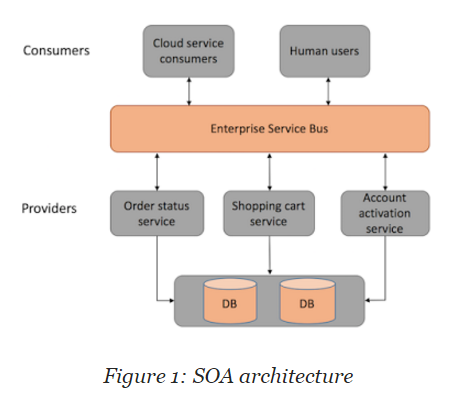
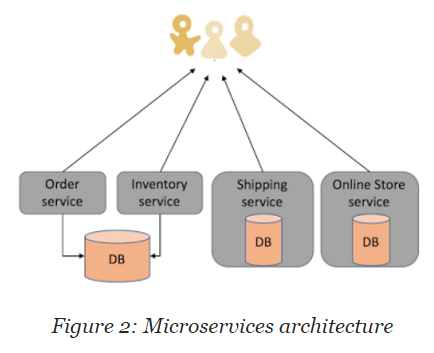
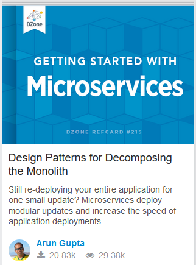

**Table of Contents**
<!-- MarkdownTOC -->

- [Configuration Management and Orchestration](#configuration-management-and-orchestration)
	- [Microservices](#microservices)
	- [Vagrant](#vagrant)
	- [Ansible](#ansible)
	- [Docker](#docker)
	- [Puppet](#puppet)
	- [Chef](#chef)
	- [Capistrano](#capistrano)
	- [SaltStack](#saltstack)

<!-- /MarkdownTOC -->

<iframe width="560" height="315" src="https://www.youtube.com/embed/TYLpChzXTBc?rel=0" frameborder="0" allowfullscreen class="video"></iframe>

 

<blockquote class="twitter-tweet tw-align-center" data-lang="es">
So true. Via <a href="https://t.co/4clkafRHuu">https://t.co/4clkafRHuu</a> <a href="https://t.co/vaqPZPMnmx">pic.twitter.com/vaqPZPMnmx</a>
&mdash; nixCraft # (@nixcraft) <a href="https://twitter.com/nixcraft/status/783649481946312704">5 de octubre de 2016</a></blockquote>

||||||
|:---:|:---:|:---:|:---:|:---:|

# Configuration Management and Orchestration
## Microservices
- [microservices.io](http://microservices.io)
- Building applications with a microservices architecture:
	- [1/6 - Introduction to Microservices | NGINX 🌟🌟🌟](https://www.nginx.com/blog/introduction-to-microservices/)
	- [2/6 - Building Microservices: Using an API Gateway](https://www.nginx.com/blog/building-microservices-using-an-api-gateway/)
	- [3/6 - DZone: Inter-Process Communication in a Microservices Architecture 🌟🌟](https://dzone.com/articles/building-microservices-inter-process-communication-2)
	- [4/6 - Service Discovery in a Microservices Architecture](https://www.nginx.com/blog/service-discovery-in-a-microservices-architecture/)
	- [5/6 - Event-Driven Data Management for Microservices](https://www.nginx.com/blog/event-driven-data-management-microservices/)
	- [6/6 - Choosing a Microservices Deployment Strategy](https://www.nginx.com/blog/deploying-microservices/)
- [Microservices, Martin Fowler 🌟🌟🌟](http://martinfowler.com/articles/microservices.html)
- [What are Microservices? 🌟](https://www.linkedin.com/pulse/what-microservices-walli-datoo)
- [Microservices architecture: advantages and drawbacks](http://cloudacademy.com/blog/microservices-architecture-challenge-advantage-drawback/)
- [Welcome to Microservices.TV, where you will get the latest news, trends and tutorials on all things microservices](https://developer.ibm.com/tv/microservices/)
- [Microservices via Ansible. Deploying services with rollback and error handling, truncating releases, and restarting processes](http://www.ansible.com/ansiblefest-videos-spark-central-sf15)
- [capgemini.github.io: Is REST best in a Microservices architecture](https://capgemini.github.io/architecture/is-rest-best-microservices/)
- [javaadvent.com: Microservices and Java EE](http://www.javaadvent.com/2015/12/microservices-and-java-ee.html)
- [ibm.com: Microservices in action, Part 2: Containers and microservices — a perfect pair](http://www.ibm.com/developerworks/cloud/library/cl-bluemix-microservices-in-action-part-2-trs/)
- [DZone.com: Microservices and DevOps. A great list of resources to help you with your microservice development and deployments](https://dzone.com/articles/microservices-and-devops) 
- [ibm.com: Microservices in action, Part 2: Containers and microservices — a perfect pair](http://www.ibm.com/developerworks/cloud/library/cl-bluemix-microservices-in-action-part-2-trs/index.html)
- [Red Hat Middleware: All the videos from the #RedHat #Microservices Day 2015](https://www.youtube.com/watch?v=jAYvizggc9M&list=PLJFQ0_l_KBO7DXxeF4g0pcqT3AZ4oSHCT)
	- [Microservices in the Real World](https://www.youtube.com/watch?v=XG5sl_7Zi6k)
- [redhat.com videos: Logging and Management for Microservices](http://www.redhat.com/en/about/videos/logging-and-management-microservices)
- [rhelblog.redhat.com: Looking Back on Containers in 2015](http://rhelblog.redhat.com/2016/01/08/looking-back-on-containers-in-2015/)
- [DZone/Integration: Apache Camel for Micro­service Architectures](https://dzone.com/articles/apache-camel-micro%C2%ADservice)
	- [hawt.io: a modular web console for managing your Java stuff](http://hawt.io/)
- [Benefits of Cross-Functional Teams When Building Microservices](https://blog.risingstack.com/benefits-of-cross-functional-teams-when-building-microservices/)
- [highscalability.com: How to build your Property Management System integration using Microservices](http://highscalability.com/blog/2016/2/10/how-to-build-your-property-management-system-integration-usi.html)
- [DZone: Breaking Down the Monolith: Microservices vs. Self-Contained Systems](https://dzone.com/articles/breaking-down-a-monolithic-software-a-case-for-mic)
- [DZone: Carving the Java EE Monolith Into Microservices](https://dzone.com/articles/carving-the-java-ee-monolith-into-microservices) This article looks at how to break up enterprise Java applications into microservices and how to separate concerns and build smaller usable modules.
- [DZone: 4 Challenges You Need to Address With Microservices Adoption](https://dzone.com/articles/4-challenges-you-need-to-address-with-microservice) Transitioning to microservices creates significant challenges for organizations. This week, I’ll delve into some of the obstacles you might face and the ultimate benefits of your efforts.
- [nginx.com: Microservices VS Service-Oriented Architecture. EXPLORE MICROSERVICES AND SOA IN THIS EXCLUSIVE O'REILLY REPORT](https://www.nginx.com/microservices-soa/)
- [DZone: Microservices Architecture: What, When, and How 🌟🌟🌟](https://dzone.com/articles/microservices-architecture-what-when-how) Microservices have seen widespread adoption. Even Google Trends points to this rapid evolution. Check out what microservices are, a brief overview of when and how to use them, and advantages over monolithic structures.
- [DZone: Microservices — Myths and Misunderstandings 🌟🌟🌟](https://dzone.com/articles/microservices-myths-and-misunderstanding) Microservices are quite popular. Learn more about microservices, what's myth and misunderstood, and what's fact.

 

<iframe src="//es.slideshare.net/slideshow/embed_code/key/Lu1TJmC0hR2CMy" width="595" height="485" frameborder="0" marginwidth="0" marginheight="0" scrolling="no" style="border:1px solid #CCC; border-width:1px; margin-bottom:5px; max-width: 100%;" allowfullscreen class="video"> </iframe> 
 <strong> <a href="//es.slideshare.net/danveloper/microservices-the-right-way" title="Microservices: The Right Way" target="_blank">Microservices: The Right Way</a> </strong> from <strong><a href="//es.slideshare.net/danveloper" target="_blank">Daniel Woods</a></strong> 

 

<blockquote class="twitter-tweet tw-align-center" data-lang="es">
4 Challenges You Need to Address with Microservices Adoption <a href="https://t.co/n5jD5LD1Rv">https://t.co/n5jD5LD1Rv</a>   via <a href="https://twitter.com/hashtag/MVB?src=hash">#MVB</a> <a href="https://twitter.com/sabaanees">@sabaanees</a> <a href="https://t.co/5GGNGlYicr">pic.twitter.com/5GGNGlYicr</a>
&mdash; DZone (@DZone) <a href="https://twitter.com/DZone/status/743096304113471488">15 de junio de 2016</a></blockquote>

<blockquote class="twitter-tweet tw-align-center" data-lang="es">
Coder bingo  <a href="https://t.co/c4Sk4k8MZu">https://t.co/c4Sk4k8MZu</a> <a href="https://t.co/EkeKiyIBZI">pic.twitter.com/EkeKiyIBZI</a>
&mdash; CommitStrip (@CommitStrip) <a href="https://twitter.com/CommitStrip/status/744948598450823168">20 de junio de 2016</a></blockquote>

## Vagrant
- [How Vagrant Eases the Software Research and Testing - The New Stack](http://thenewstack.io/vagrant-developers-researchers/)
- [Improve your development environments with virtualization - Vagrant, Python ](http://pyvideo.org/video/3411/improve-your-development-environments-with-virtua)
- [Why tools like Docker, Vagrant, and Ansible are hotter than ever 🌟](http://opensource.com/business/15/5/why-Docker-Vagrant-and-Ansible)
- [Crash course on Vagrant, video tutorial at sysadmincasts.com 🌟🌟🌟](https://sysadmincasts.com/episodes/42-crash-course-on-vagrant-revised)
- [developerblog.redhat.com: Using Vagrant Tooling in Eclipse](http://developerblog.redhat.com/2015/12/22/using-vagrant-tooling-in-eclipse/)
- [vagrantbox.es](http://www.vagrantbox.es/) A list of base boxes for Vagrant
- [boxcutter](https://atlas.hashicorp.com/boxcutter) Community-driven templates and tools for creating cloud, virtual machines, containers and metal operating system environments.
- [Discover Vagrant Boxes](https://atlas.hashicorp.com/boxes/search)
- [Synced Folders Basic Usage](http://docs.vagrantup.com/v2/synced-folders/basic_usage.html)
> By default Vagrant will set up a share with your host machine automatically... /vagrant on the virtual box will be mapped to the folder containing your Vagrantfile this allows you to edit anything in this folder and the changes will be made instantly on the virtual box as well.
- [opensource.com: Using Vagrant and Ansible to deploy virtual machines for web development 🌟](https://opensource.com/business/16/2/vagrant-ansible-virtual-machines-web-development)

<iframe src="//www.slideshare.net/slideshow/embed_code/key/v1m86PyLZBjFTY" width="595" height="485" frameborder="0" marginwidth="0" marginheight="0" scrolling="no" style="border:1px solid #CCC; border-width:1px; margin-bottom:5px; max-width: 100%;" allowfullscreen class="video"> </iframe> 
 <strong> <a href="//www.slideshare.net/MicheleOrselli/vagrant-for-real-codemotion-rome-2016" title="Vagrant for real (codemotion rome 2016)" target="_blank">Vagrant for real (codemotion rome 2016)</a> </strong> from <strong><a href="//www.slideshare.net/MicheleOrselli" target="_blank">Michele Orselli</a></strong> 

 

<iframe src="//www.slideshare.net/slideshow/embed_code/key/CrMFdpjP6F8nMJ" width="595" height="485" frameborder="0" marginwidth="0" marginheight="0" scrolling="no" style="border:1px solid #CCC; border-width:1px; margin-bottom:5px; max-width: 100%;" allowfullscreen class="video"> </iframe> 
 <strong> <a href="//www.slideshare.net/then4way/vagrant-fordevops" title="Vagrant For DevOps" target="_blank">Vagrant For DevOps</a> </strong> from <strong><a href="//www.slideshare.net/then4way" target="_blank">Lalatendu Mohanty</a></strong> 

 

<iframe src="//www.slideshare.net/slideshow/embed_code/key/dQFeJire0DGqwK" width="595" height="485" frameborder="0" marginwidth="0" marginheight="0" scrolling="no" style="border:1px solid #CCC; border-width:1px; margin-bottom:5px; max-width: 100%;" allowfullscreen class="video"> </iframe> 
 <strong> <a href="//www.slideshare.net/CarlosPerez166/it-works-on-my-machine-vagrant-for-software-development" title="It Works On My Machine: Vagrant for Software Development" target="_blank">It Works On My Machine: Vagrant for Software Development</a> </strong> from <strong><a href="//www.slideshare.net/CarlosPerez166" target="_blank">Carlos Perez</a></strong> 

 

<iframe src="//www.slideshare.net/slideshow/embed_code/key/rVIhwjwYXc4yHn" width="595" height="485" frameborder="0" marginwidth="0" marginheight="0" scrolling="no" style="border:1px solid #CCC; border-width:1px; margin-bottom:5px; max-width: 100%;" allowfullscreen class="video"> </iframe> 
 <strong> <a href="//www.slideshare.net/bctmarketing/vagrant-toawsflow" title="Vagrant to-aws-flow" target="_blank">Vagrant to-aws-flow</a> </strong> from <strong><a href="//www.slideshare.net/bctmarketing" target="_blank">Kimberly Macias</a></strong> 

 

<iframe src="https://player.vimeo.com/video/64392910" width="640" height="360" frameborder="0" webkitallowfullscreen mozallowfullscreen allowfullscreen class="video"></iframe>

 

<iframe width="560" height="315" src="https://www.youtube.com/embed/aUew6WauUsI?rel=0" frameborder="0" allowfullscreen class="video"></iframe>

 

|||
|:---:|:---:|

<iframe src="//www.slideshare.net/slideshow/embed_code/key/5LVJbmkS2hdsuJ" width="595" height="485" frameborder="0" marginwidth="0" marginheight="0" scrolling="no" style="border:1px solid #CCC; border-width:1px; margin-bottom:5px; max-width: 100%;" allowfullscreen class="video"> </iframe> 
 <strong> <a href="//www.slideshare.net/opscode/multi-providervagrantmitchellhashimoto" title="Multi-provider Vagrant and Chef: AWS, VMware, and more" target="_blank">Multi-provider Vagrant and Chef: AWS, VMware, and more</a> </strong> from <strong><a href="//www.slideshare.net/opscode" target="_blank">Chef Software, Inc.</a></strong> 

 

<iframe src="//www.slideshare.net/slideshow/embed_code/key/Ai5fUyOPrDi9m" width="595" height="485" frameborder="0" marginwidth="0" marginheight="0" scrolling="no" style="border:1px solid #CCC; border-width:1px; margin-bottom:5px; max-width: 100%;" allowfullscreen class="video"> </iframe> 
 <strong> <a href="//www.slideshare.net/juanvicenteherrera/md-vagrant-chefawssept2013novideo" title="Immutable servers provided by Vagrant/Chef/AWS" target="_blank">Immutable servers provided by Vagrant/Chef/AWS</a> </strong> from <strong><a href="//www.slideshare.net/juanvicenteherrera" target="_blank">Juan Vicente Herrera Ruiz de Alejo</a></strong> 

 

## Ansible
- [Ansible](ansible.md)

## Docker
- [Docker](docker.md)

## Puppet
- [Puppet](puppet.md)

## Chef
- [Chef](chef.md)

## Capistrano
- [Capistrano](http://capistranorb.com)
- [Capistrano GitHub](https://github.com/capistrano/capistrano)

<iframe src="//www.slideshare.net/slideshow/embed_code/key/2pJCggyg9f24hj" width="595" height="485" frameborder="0" marginwidth="0" marginheight="0" scrolling="no" style="border:1px solid #CCC; border-width:1px; margin-bottom:5px; max-width: 100%;" allowfullscreen class="video"> </iframe> 
 <strong> <a href="//www.slideshare.net/SumitChhetri1/automated-deployment-with-capistrano" title="Automated Deployment with Capistrano" target="_blank">Automated Deployment with Capistrano</a> </strong> from <strong><a href="//www.slideshare.net/SumitChhetri1" target="_blank">Sumit Chhetri</a></strong> 

 

<iframe src="https://player.vimeo.com/video/61887298" width="640" height="360" frameborder="0" webkitallowfullscreen mozallowfullscreen allowfullscreen class="video"></iframe>

 

## SaltStack
- [twitter.com/saltstack](https://twitter.com/saltstack)
- [devopslibrary.com: Mastering SaltStack](http://devopslibrary.com/courses/mastering-saltstack/)
- [Salt vs. Ansible](http://jensrantil.github.io/salt-vs-ansible.html)
- [solutionexchange.vmware.com: vRealize Orchestrator Salt Plugin](https://solutionexchange.vmware.com/store/products/vrealize-orchestrator-salt-plugin#.V1dAOzvFoLU.linkedin) vRealize Orchestrator (vRO) Salt plugin enables SaltStack to work together with VMware products to achieve infrastructure configuration, application deployment, and lifecycle management. SaltStack is unique in offering an orchestration platform with native configuration management for automation of critical CloudOps, ITOps and DevOps tasks.

<iframe width="560" height="315" src="https://www.youtube.com/embed/TQjE2I8CrzQ?rel=0" frameborder="0" allowfullscreen class="video"></iframe>

 

<a href="http://blog.ingineering.it/post/110741562854/microservices-have-you-metdevops">http://blog.ingineering.it/post/110741562854/microservices-have-you-metdevops</a>

<iframe width="560" height="315" src="https://www.youtube.com/embed/BSBTCOEdLkA?rel=0" frameborder="0" allowfullscreen class="video"></iframe>

 

<iframe width="560" height="315" src="https://www.youtube.com/embed/1gQpu_Ciyug?list=RD1gQpu_Ciyug" frameborder="0" allowfullscreen class="video"></iframe>

 