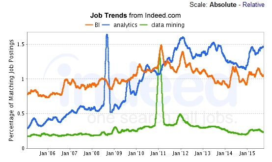
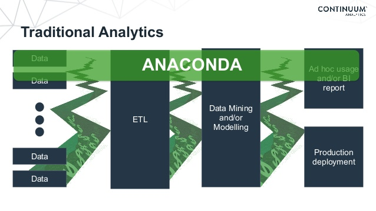

**Table of Contents**
<!-- MarkdownTOC -->

- [Data Science and Big Data](#data-science-and-big-data)
	- [Data collection and processing is growing in sports](#data-collection-and-processing-is-growing-in-sports)
	- [Google Analytics](#google-analytics)
	- [Python analytics](#python-analytics)
		- [Anaconda Analytics](#anaconda-analytics)
			- [Anaconda Code examples](#anaconda-code-examples)
		- [Apache Zeppelin](#apache-zeppelin)
	- [Big Data](#big-data)
		- [Big Data Blogs](#big-data-blogs)
		- [Data visualization: Tableau](#data-visualization-tableau)
		- [Apache Spark](#apache-spark)
		- [Apache Storm and Kite SDK Morphlines](#apache-storm-and-kite-sdk-morphlines)
		- [Pentaho Data Integration and Business Analytics Platforms](#pentaho-data-integration-and-business-analytics-platforms)
	- [SQL](#sql)
		- [SQL Blogs and Forums](#sql-blogs-and-forums)
		- [SQL Docs](#sql-docs)
			- [Database Version Control](#database-version-control)
			- [MySQL](#mysql)
			- [PostgreSQL](#postgresql)
			- [TinyDB](#tinydb)
		- [SQL replication](#sql-replication)
		- [NoSQL](#nosql)
			- [MongoDB Tools and MongoDB as a Service](#mongodb-tools-and-mongodb-as-a-service)
			- [Redis, Coudhdb, and others](#redis-coudhdb-and-others)
			- [Schema free SQL query on everything engines](#schema-free-sql-query-on-everything-engines)
		- [NewSQL](#newsql)

<!-- /MarkdownTOC -->

# Data Science and Big Data
- [Data is beautiful 'subreddit'](https://www.reddit.com/r/dataisbeautiful)
- [datasciencecentral.com: 24 Data Science, R, Python, Excel, and Machine Learning Cheat Sheets](http://www.datasciencecentral.com/profiles/blogs/20-data-science-r-python-excel-and-machine-learning-cheat-sheets)
- [All of the World’s Money and Markets in One Visualization](http://money.visualcapitalist.com/all-of-the-worlds-money-and-markets-in-one-visualization/)
- [civisanalytics.com: Machine Learning. Workflows in Python: Getting data ready to build models](https://civisanalytics.com/blog/data-science/2015/12/17/workflows-in-python-getting-data-ready-to-build-models/)
	- [civisanalytics.com: Machine Learning. Workflows in Python: Curating Features and Thinking Scientifically about Algorithms](https://civisanalytics.com/blog/data-science/2015/12/23/workflows-in-python-curating-features-and-thinking-scientifically-about-algorithms/)
- [redash.io Open Source Data Collaboration Platform](https://github.com/getredash/redash) Connect to any data source, visualize your data and share it with anyone!
- [Beginner tips to becoming a data analyst](http://thenextweb.com/offers/2015/12/19/beginner-tips-becoming-data-analyst/)

### Data collection and processing is growing in sports
- [reddit: Are there any good resources for Python and Proffesional sports data?](https://www.reddit.com/r/Python/comments/3xa59x/are_there_any_good_resources_for_python_and/)
	- [nba_py - stats.nba.com API for python](https://github.com/seemethere/nba_py)
	- [Pro Football Statistics](http://www.pro-football-reference.com/)
	- [how data collection and processing is growing in sports. TED talk](https://www.youtube.com/watch?v=66ko_cWSHBU)

## Google Analytics
- [Google Analytics para principiantes](http://www.contunegocio.es/tecnologia/google-analytics-para-principiantes-i/)

## Python analytics
- [PyData, a community for developers and users of Python data tools](http://pydata.org)
- [Python for Data Science vs Python for Web Development](http://www.datasciencecentral.com/profiles/blogs/python-for-data-science-vs-python-for-web-development)
- [Python for Social Scientists](http://www.pythonforsocialscientists.org/#welcome-to-python-for-social-scientists)
- [Cheat Sheet: Data Visualisation in Python](http://www.analyticsvidhya.com/blog/2015/06/data-visualization-in-python-cheat-sheet/)
- [Distributed Computing on your Cluster with Anaconda (modern open source analytics platform powered by Python) - Webinar 2015](http://www.slideshare.net/continuumio/distributed-computing-on-your-cluster-with-anaconda-webinar-2015)
- [reddit: 100 Data Science in Python Interview Questions and Answers](https://www.reddit.com/r/Python/comments/3yrciq/100_data_science_in_python_interview_questions/)

### Anaconda Analytics
- [docs.continuum.io](http://docs.continuum.io/anaconda/index)
- [Python: The Next Big Thing in Big Data](https://dzone.com/articles/python-the-next-big-thing-in-big-data)
- [The State of Python for Data Science, PySS 2015](https://speakerdeck.com/chdoig/the-state-of-python-for-data-science-pyss-2015)
- [Continuum analytics videos](https://www.continuum.io/content/videos)
- [Continuum analytics youtube channel](https://www.youtube.com/channel/UCND4vKhJssAtK8p1Blfj14Q)
- [Continuum analytics youtube channel conference talks 2015](https://www.youtube.com/channel/UCND4vKhJssAtK8p1Blfj14Q/playlists)
- [PyData youtube channel](https://www.youtube.com/channel/UCOjD18EJYcsBog4IozkF_7w)
- [PyCon 2015 youtube channel](https://www.youtube.com/channel/UCgxzjK6GuOHVKR_08TT4hJQ)
- [PyData NYC 2015. See talks on Anaconda, Bokeh, pandas, and more. Travis Oliphant & Peter Wang (Keynote): Python as the Zen of Data Science](https://youtu.be/mNvPiV37F7Q?list=PLGVZCDnMOq0ourWlul1F7aYE30VQPaMRL)
	- [Slide: Python as the Zen of Data Science](http://www.slideshare.net/teoliphant/python-as-the-zen-of-data-science)
	- [Continuum Analytics' Peter Wang on the State of Analytics](https://youtu.be/Xb5r_495_-k)
	- [Jessica Forde: Visualizing Wireless Router Timeseries Data with the Density API, Seaborn, and Pandas](https://www.youtube.com/watch?v=V85G5Q-Lj9o&feature=youtu.be&list=PLGVZCDnMOq0ourWlul1F7aYE30VQPaMRL)
	- [Network data, also known as linked data, is the new frontier of data analysis](https://www.youtube.com/watch?v=wcrwASR5DCQ&index=42&list=PLGVZCDnMOq0ourWlul1F7aYE30VQPaMRL)
- [Talk Python to Me Podcast. Episode #34: Continuum: Scientific Python and The Business of Open Source](http://talkpython.fm/episodes/show/34/continuum-scientific-python-and-the-business-of-open-source)
- [data science IPython Notebooks under the Apache 2 license](https://github.com/donnemartin/data-science-ipython-notebooks)

#### Anaconda Code examples
- [Introduction to Python for data mining](http://nbviewer.ipython.org/github/tfolkman/learningwithdata/blob/master/Python_For_Data_Mining.ipynb)
- [Jeff Reback's pandas tutorial at PyDataNYC2015, notebooks included](https://github.com/jreback/pydatanyc2015)
- [Nginx log analysis with pandas and matplotlib](https://github.com/grokcode/ipython-notebooks/blob/master/nginx-log-analysis.ipynb)
- [Exploring U.S. Traffic Fatality Data](http://blog.yhathq.com/posts/traffic-fatalities-in-us.html)
- [Data mining with Anaconda proof of concept](https://github.com/inafev/anacondalearning)

### Apache Zeppelin
- [Apache Zeppelin. A web-based notebook that enables interactive data analytics. Very cool for data exploration and data science](https://zeppelin.incubator.apache.org/)

## Big Data
- [whatsthebigdata.com: History of Databases (Infographic)](http://whatsthebigdata.com/2016/01/04/history-of-databases-infographic/)
- [Big data is simply another name for complicated business intelligence: New visualization tools like Tableau, Clearstory, and Domo aims to unlock enterprise data for a broader audience than before](http://www.infoworld.com/article/2868007/big-data/big-data-is-just-another-name-for-complicated-business-intelligence.html)
- [dzone.com The DZone Guide to Big Data, Business Intelligence and Analytics, 2015 Edition](http://bit.ly/1MHcFT4)
- [Don't use Hadoop - your data isn't that big](https://www.reddit.com/r/programming/comments/1mkvhs/dont_use_hadoop_your_data_isnt_that_big/)
- [OpenRefine, a power tool for working with messy data](http://openrefine.org/)
- [stratebi - Apache Storm: Introduccion](http://es.slideshare.net/zanorte/apache-storm-introduccion)
- [stratebi - Instalación de Storm](http://es.slideshare.net/zanorte/apache-storm-instalacin)
- [stratebi - youtube- Introducción al Big Data Open Source: Map reduce, Hive, Pentaho..](https://www.youtube.com/watch?v=2YHenimvFEs)
- [HP Big Data Reference Architecture for Apache Spark based on RHEL](http://hpe.to/6019BO4TW)
- [datanami.com: Top 33 Big Data Predictions for 2016](http://www.datanami.com/2015/12/15/industry-speaks-top-33-big-data-predictions-for-2016/)
- [zdnet.com: Big Data Predictions for 2016](http://www.zdnet.com/article/big-data-predictions-for-2016/)
- [dzone.com: Learning Big Data Tools in 2016](https://dzone.com/articles/learning-big-data-tools-in-2016)
- [dzone.com: Taming the Data Variety Beast](https://dzone.com/articles/taming-the-data-variety-beast)
- [javacodegeeks.com: Top 10 Big Data Trends in 2016 for Financial Services](http://www.javacodegeeks.com/2015/12/top-10-big-data-trends-2016-financial-services.html)

### Big Data Blogs
- [datanami.com](http://www.datanami.com)
- [What's The Big Data?](http://whatsthebigdata.com/)
- [Data Science Central - the online resource for big data practitioners](http://www.datasciencecentral.com)

### Data visualization: Tableau
- [tableau.com: How to Make Your Own Tableau Application](https://www.tableau.com/about/blog/2015/12/make-your-own-tableau-application-48041)

### Apache Spark
- [Tools for Troubleshooting, Installation and Setup of Apache Spark Environments](https://dzone.com/articles/tools-for-troubleshooting-installation-and-setup-o)
- [mapr.com: Getting Started with Apache Spark – free interactive Spark ebook ](https://www.mapr.com/ebooks/spark/)
- [Spark Streaming: What Is It and Who’s Using It?](http://www.datanami.com/2015/11/30/spark-streaming-what-is-it-and-whos-using-it/)
- [Getting Started with Spark (in Python)](https://districtdatalabs.silvrback.com/getting-started-with-spark-in-python)
- [Apache Spark Interview Questions](https://intellipaat.com/interview-question/apache-spark-interview-questions/)
- [PyData Seattle 2015 - youtube: Holden Karau: A brief introduction to Distributed Computing with PySpark](https://www.youtube.com/watch?v=bJouNc1REno)

### Apache Storm and Kite SDK Morphlines
- Apache Storm is a distributed streaming processing engine
- Kite SDK Morphlines is a configurable ETL engine
- [javacodegeeks.com: Apache Storm and Kite SDK Morphlines. Building a configurable ETL distributed application](http://www.javacodegeeks.com/2016/01/configurable-etl-processing-using-apache-storm-kite-sdk-morphlines.html)

### Pentaho Data Integration and Business Analytics Platforms
- [Pentaho](http://www.pentaho.com/)

## SQL
### SQL Blogs and Forums
- [New subreddit about SQL](https://www.reddit.com/r/sqlporn)
- [essentialsql.com](http://www.essentialsql.com)
- [Use-the-index-luke.com: SQL Indexing and Tuning e-Book](http://use-the-index-luke.com/)
- [T-SQL Tidy: Online T-SQL Statement Parser and Formatter](http://tsqltidy.com/)
- [Instant SQL Formatter](http://www.dpriver.com/pp/sqlformat.htm)
- [SQLFormat: Online SQL formatting service](http://sqlformat.org)
- [SQL Joins Visualizer. SQL Joins Visualizer help to you build SQL JOIN between two tables by using of Venn diagrams](http://sql-joins.leopard.in.ua/)
- [blog.jooq.org: Java, SQL and jOOQ](http://blog.jooq.org/)
- [The Database Programmer. All things related to database applications, both desktop and web](http://database-programmer.blogspot.co.at/)
- [stackoverflow.com](http://stackoverflow.com/)
- [dba.stackexchange.com](http://dba.stackexchange.com/)

### SQL Docs
- [18 Best Online Resources For Learning SQL and Database Concepts](http://www.vertabelo.com/blog/notes-from-the-lab/18-best-online-resources-for-learning-sql-and-database)
- [essentialsql.com's twitter](https://twitter.com/sqlkris)
	- [essentialsql.com: Get Ready to Learn SQL: 8. Database Normalization Explained in Simple English](http://www.essentialsql.com/get-ready-to-learn-sql-database-normalization-explained-in-simple-english/)
		- [essentialsql.com: Get Ready to Learn SQL: 9. Database First Normal Form Explained in Simple English](http://www.essentialsql.com/get-ready-to-learn-sql-8-database-first-normal-form-explained-in-simple-english/)
		- [essentialsql.com: Get Ready to Learn SQL: 10. Database Second Normal Form Explained in Simple English](http://www.essentialsql.com/get-ready-to-learn-sql-10-database-second-normal-form-explained-in-simple-english/)
	    - [essentialsql.com: Get Ready to Learn SQL: 11. Database Third Normal Form Explained in Simple English](http://www.essentialsql.com/get-ready-to-learn-sql-11-database-third-normal-form-explained-in-simple-english/)
	- [essentialsql.com: What are the Major Parts of a Database?](http://www.essentialsql.com/what-are-the-major-parts-of-a-database)
	- [essentialsql.com: What is the Difference Between Cast and Convert?](http://www.essentialsql.com/get-ready-to-learn-sql-database-normalization-explained-in-simple-english/)
	- [essentialsql.com: How to Write Queries – Introduction to Three Simple Steps to Writing SQL](http://www.essentialsql.com/how-to-write-queries-introduction-to-three-simple-steps-to-writing-sql)
	- [essentialsql.com: Get Ready to Learn SQL Server 21: Using Subqueries in the WHERE Clause](http://www.essentialsql.com/get-ready-to-learn-sql-server-21-using-subqueries-in-the-where-clause/)
	- [essentialsql.com: How Do I combine results from more than one table?](http://www.essentialsql.com/how-do-i-combine-results-from-more-than-one-table)
	- [essentialsql.com: Using Conditional Logic in SQL with CASE Expression](http://www.essentialsql.com/using-conditional-logic-in-sql-with-case-expression)
	- [essentialsql.com: How Do I combine results from more than one table?](http://www.essentialsql.com/how-do-i-combine-results-from-more-than-one-table/)
	- [essentialsql.com: Get Ready to Learn SQL Server 21: Using Subqueries in the WHERE Clause](http://www.essentialsql.com/get-ready-to-learn-sql-server-21-using-subqueries-in-the-where-clause/)
	- [essentialsql.com: Get Ready to Learn SQL Server 23: Using Subqueries in the HAVING Clause](http://www.essentialsql.com/get-ready-to-learn-sql-server-23-using-subqueries-in-the-having-clause)
	- [essentialsql.com: What are Ten Things a Junior DBA should know?](http://www.essentialsql.com/what-are-ten-things-a-junior-dba-should-know/)
	- [essentialsql.com: What is the Difference between a Join and Subquery?](http://www.essentialsql.com/what-is-the-difference-between-a-join-and-subquery/)
	- [essentialsql.com: What is a Data Dictionary?](http://www.essentialsql.com/what-is-a-data-dictionary)
	- [essentialsql.com: How can I find Duplicate Values in SQL Server?](http://www.essentialsql.com/how-can-i-find-duplicate-values-in-sql-server/)
	- [essentialsql.com: Commonly used SQL Server Data Types](http://www.essentialsql.com/commonly-used-sql-server-data-types/)
	- [essentialsql.com: Using Conditional Logic in SQL with CASE Expression](http://www.essentialsql.com/using-conditional-logic-in-sql-with-case-expression/)
- [SQL in ten minutes](http://www.codeproject.com/Articles/2059/SQL-in-ten-minutes)
- [10 sql tips to speed up your database](http://www.catswhocode.com/blog/10-sql-tips-to-speed-up-your-database)
- [dzone.com: SQL GROUP BY and Functional Dependencies: a Very Useful Feature](https://dzone.com/articles/sql-group-by-and-functional-dependencies-a-very-us)
- [How do you handle the ORM problem? When do you say YES or NO to using ORM?](http://www.vertabelo.com/blog/technical-articles/orms-under-the-hood)
- [SQL Query to find all table names on database in MySQL and SQL Server Examples](http://javarevisited.blogspot.com.es/2012/10/sql-query-to-find-all-table-on-database-mysql-sqlserver.html)
- [Curso SQL. Referencias cruzadas. Vídeo 15](https://www.youtube.com/watch?v=_kIWDzZUdA8)
- [Difference between Primary and Foreign key in table](http://java67.blogspot.com.es/2015/12/difference-between-primary-and-foreign.html)
- [Naming Conventions in Database Modeling](http://www.vertabelo.com/blog/technical-articles/naming-conventions-in-database-modeling)
- [Database design: Did You Know You Could Index SUM() and COUNT()? SQL Server Indexed Views, Part 3](http://explainextended.com/2013/08/26/did-you-know-you-could-index-sum-and-count-sql-server-indexed-views-part-3/)
- [use-the-index-luke.com: Partial Indexes: Indexing Selected Rows](http://use-the-index-luke.com/sql/where-clause/partial-and-filtered-indexes)
- [use-the-index-luke.com: A visual explanation why LIKE filters are slow](http://use-the-index-luke.com/sql/where-clause/searching-for-ranges/like-performance-tuning)
- [use-the-index-luke.com: Performance Impacts of System Load](http://use-the-index-luke.com/sql/testing-scalability/system-load)
- [use-the-index-luke.com: NULL in the Oracle Database](http://use-the-index-luke.com/sql/where-clause/null)
- [use-the-index-luke.com: Finding All the Red M&Ms: A sweet explanation how database optimization works](http://use-the-index-luke.com/blog/2014-07/finding-all-the-red-mms)
- [use-the-index-luke.com: Clustered Indexes have major drawbacks you might not be aware of](http://use-the-index-luke.com/sql/clustering/index-organized-clustered-index)
- [use-the-index-luke.com: SQL Server Distinguishing Access and Filter-Predicates](http://use-the-index-luke.com/sql/explain-plan/sql-server/filter-predicates)
- [database-programmer.blogspot.co.at: Database Performance: Pay Me Now or Pay Me Later](http://database-programmer.blogspot.co.at/2008/07/database-performance-pay-me-now-or-pay.html)
- [Datazenit Web-based database administration tool for MySQL and PostgreSQL](https://datazenit.com)
- [javacodegeeks.com: The 10 Most Popular DB Engines (SQL and NoSQL)](http://www.javacodegeeks.com/2013/10/the-10-most-popular-db-engines-sql-and-nosql.html)

#### Database Version Control
- [dzone.com: The Definitive Guide to Database Version Control — Part 6](https://dzone.com/articles/the-definitive-guide-to-database-version-control-p-7)

#### MySQL
- [Syadmincasts: Crash Course on MySQL](https://sysadmincasts.com/episodes/38-crash-course-on-mysql)
	- [What Every Data Scientist Needs to Know about SQL](http://joshualande.com/data-science-sql/)
	- [Top 20+ MySQL Best Practices](http://code.tutsplus.com/tutorials/top-20-mysql-best-practices--net-7855)
	- [highperfmysql.com - High Performance MySQL. Learn to Build Fast, Reliable, Scalable Systems with MySQL](http://www.highperfmysql.com/)
	- [MySQL very high CPU usage (and other processes)](http://www.corrspt.com/blog/2015/07/01/mysql-very-high-cpu-usage/)
	- [It’s the Hardware, idiot! Increasing MySQL Performance](http://www.monitis.com/blog/2012/09/04/hardware-solutions-for-increasing-mysql-performance/)
	- [Python Mysql Connector](http://jasonralph.org/?p=291)
	- [Tutorialspoint.com - MySQL Tutorial](http://www.tutorialspoint.com/mysql/index.htm)
	- [Anemometer: MySQL Slow Query Monitor](http://olindata.com/blog/2014/07/anemometer-mysql-slow-query-monitor)
	- [MySQL for Excel 1.3.5](http://insidemysql.com/mysql-for-excel-1-3-5-has-been-released/)
	- [Top 20+ MySQL Best Practices](http://code.tutsplus.com/tutorials/top-20-mysql-best-practices--net-7855)
	- [Find and remove duplicate indexes](https://www.percona.com/blog/2012/06/20/find-and-remove-duplicate-indexes/)
	- [MySQL Indexing Explained](https://blog.viaduct.io/mysql-indexes-primer/)
	- [Use MySQL’s Strict Mode on all new Projects! get a better, more modern SQL experience](http://blog.jooq.org/2014/11/20/use-mysqls-strict-mode-on-all-new-projects/)
	- [High Performance MySQL, 3rd Edition](http://it-ebooks.info/book/676/)
	- [Terrible choices: MySQL (for Django)](https://www.reddit.com/r/Python/comments/2qm448/terrible_choices_mysql_for_django)
	- [MySQL 5.7: Improved Performance of Queries with Derived Tables](http://mysqlserverteam.com/mysql-5-7-improved-performance-of-queries-with-derived-tables/)
	- [generatedata.com via percona.com: Generating test data for MySQL tables](https://www.percona.com/blog/2014/02/10/generating-test-data-mysql-tables/)

#### PostgreSQL
- [PostgreSQL docs](http://www.postgresql.org/docs/)
- [SQL Monitoring in PostgreSQL. Identify long running queries](http://blog.dbi-services.com/sql-monitoring-in-postgresql-1-the-logging-system/)
- [PGCon](http://www.pgcon.org)
- [PGCon 2014: PostgreSQL and SQLite](http://www.pgcon.org/2014/schedule/attachments/319_PGCon2014OpeningKeynote.pdf)
- [NoSQL vs. Postgres](https://jaxenter.com/nosql-vs-postgres-121967.html)
- [talks: NoSQL as Not Only SQL](https://github.com/sjstoelting/talks/blob/master/no-sql-as-not-only-sql/NoSQL-as-Not-Only-SQL.pdf)
- [SQL Tabs: Rich SQL console for Postgresql](http://www.sqltabs.com/)
- [Minicurso de PostgreSQL - Parte 4 - tuning](https://blog.infranetworking.com/tuning-de-postgresql/)
- [Postgres 9.5 - the Feature Rundown: row level security policies, grouping sets and upsert](http://www.craigkerstiens.com/2015/12/27/postgres-9-5-feature-rundown/)
- [UPSERT on Postgres 9.5](http://blog.andrebarbosa.co/upsert-on-postgres-9-5/)
- [wiki.postgresql.org: UPSERT on Postgres 9.5](https://wiki.postgresql.org/wiki/What's_new_in_PostgreSQL_9.5#INSERT_..._ON_CONFLICT_DO_NOTHING.2FUPDATE_.28.22UPSERT.22.29)
- [CrudGen 1.0 un generador de CRUD para Postgresql](http://skatox.com/blog/2014/12/25/crudgen-1-0-generador-de-crud-para-postgresql/)
- Command to start PostgreSQL 9.4 database cluster manually

		sudo pg_ctlcluster 9.4 main start

- [dba.stackexchange.com: Restore PostgreSQL database (or db names) to new version, from files?](http://dba.stackexchange.com/questions/124093/restore-postgresql-database-or-db-names-to-new-version-from-files)
- [Node, Postgres, MassiveJS - a Better Database Experience](http://www.craigkerstiens.com/2015/11/30/massive-node-postgres-an-overview-and-intro/)
- [Postgres full-text search](http://blog.garage-coding.com/2015/12/18/postgres-fulltext-search.html)
- [dba.stackexchange.com: Postgresql join removal](http://dba.stackexchange.com/questions/123896/postgresql-join-removal)
- [Using Repository pattern to migrate Rails app from MongoDB to PostgreSQL](https://www.amberbit.com/blog/2015/11/30/using-repository-pattern-to-migrate-rails-app-from-mongodb-to-postgresql/)
- [MongoDB 3.2: Now Powered by PostgreSQL](https://www.linkedin.com/pulse/mongodb-32-now-powered-postgresql-john-de-goes)
- [PostgreSQL Studio, web based postgresql development](http://www.postgresqlstudio.org/)

#### TinyDB
- [TinyDB:](http://tinydb.readthedocs.org) a pure Python document (i.e., JSON) database for simple local storage

### SQL replication
- [Traditional database replication drawbacks](http://www.nuodb.com/blog/replication-is-it-easy)
- [Amazon RDS](https://serversforhackers.com/amazon-rds)
- [Tungsten Replicator is an open source replication engine supporting a variety of different extractor and applier modules](https://github.com/vmware/tungsten-replicator)
- [Multi-source replication in MySQL 5.7 vs Tungsten Replicator](https://www.percona.com/blog/2015/07/29/multi-source-replication-in-mysql-5-7-vs-tungsten-replicator/)
- [MySQL Multi-Source Replication](https://dev.mysql.com/doc/refman/5.7/en/replication-multi-source.html)
- [MariaDB Galera Cluster 10.0.21 and 5.5.45 now available](https://blog.mariadb.org/mariadb-galera-cluster-10-0-21-and-5-5-45-now-available/)
- [What is MariaDB Galera Cluster?](https://mariadb.com/kb/en/mariadb/what-is-mariadb-galera-cluster/)
- [Replication Manager for PostgreSQL Clusters](http://repmgr.org/)

### NoSQL
- [Introduction to NoSQL by Martin Fowler, video tutorial](https://www.youtube.com/watch?v=qI_g07C_Q5I)
- [NoSQL vs. SQL: Choosing a Data Management Solution](http://www.javacodegeeks.com/2015/10/nosql-vs-sql.html)
- [NoSQL Guide, by Martin Fowler](http://martinfowler.com/nosql.html)
- [thoughtworks.com: NoSQL Databases, an overview](https://www.thoughtworks.com/insights/blog/nosql-databases-overview)
- [Diferencias entre SQL y NoSQL ¿Sabes cuál usar?](http://www.facilcloud.com/noticias/?p=1294&lang=es_ES)
- [zdnet.com: SQL, NoSQL? What's the difference these days?](http://www.zdnet.com/article/sql-nosql-whats-the-difference-these-days/)

#### MongoDB Tools and MongoDB as a Service
- [MongoDB Tools - Admin GUIs, Monitoring and Other Good Stuff](http://mongodb-tools.com/)
- [blog.mongodirector.com: Which is the best MongoDB GUI?](http://blog.mongodirector.com/which-is-the-best-mongodb-gui/)
- [MongoLab: Fully managed MongoDB-as-a-Service](https://mongolab.com/)
- [Orchestrate: DBaaS|NoSQL with One REST API](https://orchestrate.io/)
- [mongodirector: MongoDB Hosting](http://mongodirector.com)
- [MongoDB security tutorial](https://docs.mongodb.org/manual/administration/security)
- [3T MongoChef – Your New MongoDB GUI](http://3t.io/)
	- [Connecting to your MongoDB at MongoLab](http://3t.io/blog/how-to-connect-to-mongolab/)
	- Effortless CSV import into MongoDB with MongoChef 3.2 (click to see the video). You can export your collections to CSV:

#### Redis, Coudhdb, and others
- [NoSQL - Wikipedia](https://en.wikipedia.org/wiki/NoSQL)
- [Redis](http://redis.io/)
- [Couchdb.apache.org](http://couchdb.apache.org)
- [Cassandra.apache.org](http://cassandra.apache.org/)
- [HBase.apache.org](http://hbase.apache.org/)
- [Hive.apache.org](https://hive.apache.org/)

#### Schema free SQL query on everything engines
- [Apache Drill](https://drill.apache.org/)
- [dzone: SQL Syntax for Apache Drill](https://dzone.com/refcardz/sql-syntax-for-apache-drill)

### NewSQL
- [NuoDB, elastically scalable database. A revolution compared to traditional monolithic 1-box databases. NuoDB is ACID,SQL, distributed/scalable and support flexible schemas](http://www.nuodb.com/)
- [Traditional database replication drawbacks](http://www.nuodb.com/blog/replication-is-it-easy)

