<!-- MarkdownTOC -->

- [Economy](#economy)
    - [Cost of living](#cost-of-living)
    - [Charts and tweets](#charts-and-tweets)
    - [Miscellaneous](#miscellaneous)
    - [IT](#it)
    - [Referencias](#referencias)
    - [Business process improvement](#business-process-improvement)
    - [Economy Videos](#economy-videos)
    - [Live News](#live-news)
    - [World Press Photo](#world-press-photo)
    - [Quote](#quote)

<!-- /MarkdownTOC -->

<blockquote class="twitter-tweet tw-align-center" data-lang="es">
A mi parecer, una de las partes más curiosas de la película &quot;El Pianista&quot;, Roman Polański. Chopin, &quot;Ballade&quot; G Minor<a href="https://t.co/Ge6t9rmfrN">https://t.co/Ge6t9rmfrN</a>
&mdash; Elena Esparcia (@elenaespartana) <a href="https://twitter.com/elenaespartana/status/704819359311642628">2 de marzo de 2016</a></blockquote>

<blockquote class="twitter-tweet tw-align-center" data-lang="es">
I liked a <a href="https://twitter.com/YouTube">@YouTube</a> video <a href="https://t.co/DseolgaQVy">https://t.co/DseolgaQVy</a> The 25th Anniversary of the Fall of the Berlin Wall Google Doodle
&mdash; DaHnA BeLLe (@donnabellknox) <a href="https://twitter.com/donnabellknox/status/707350965649854464">8 de marzo de 2016</a></blockquote>

<blockquote class="twitter-tweet tw-align-center" data-lang="es">
Fragmento de la última entrevista a Carl Sagan <a href="https://t.co/cJIoOcXpAO">https://t.co/cJIoOcXpAO</a>
&mdash; Albert Montserrat (@tenormontserrat) <a href="https://twitter.com/tenormontserrat/status/704633194830831616">1 de marzo de 2016</a></blockquote>

# Economy
- [World Economic Forum](http://www.weforum.org/)
- [ourworldindata.org](http://ourworldindata.org/) Topic by topic the data-entries show you how the world is changing
- [OECD Job quality 🌟🌟🌟🌟](http://www.oecd.org/statistics/job-quality.htm)
- [data.oecd.org](https://data.oecd.org)
    - [twitter.com/OECD 🌟🌟🌟🌟](https://twitter.com/OECD)
    - [twitter.com/OECD_Centre](https://twitter.com/OECD_Centre) 
    - [twitter.com/OECDEduSkills](https://twitter.com/OECDEduSkills)
    - [twitter.com/OECDinnovation](https://twitter.com/OECDinnovation) 
    - [twitter.com/OECDeconomy](https://twitter.com/OECDeconomy)
    - [twitter.com/OECD_Pubs](https://twitter.com/OECD_Pubs)
    - [twitter.com/OECD_Stat](https://twitter.com/OECD_Stat)
    - [twitter.com/OECD_Social](https://twitter.com/OECD_Social) 
    - [twitter.com/ocdeenespanol](https://twitter.com/ocdeenespanol)
- [PositiveMoney.org 🌟](http://positivemoney.org)
- [Economy of Spain](https://en.wikipedia.org/wiki/Economy_of_Spain)
- [tradingeconomics.com/spain 🌟](http://www.tradingeconomics.com/spain/indicators)
- [FT chart of the day: real wages in the US, Germany, UK and Spain since the crisis](http://blogs.ft.com/ftdata/2014/12/08/datawatch-real-wages-since-the-crisis/)
- [All of the World’s Money and Markets in One Visualization 🌟🌟](http://money.visualcapitalist.com/all-of-the-worlds-money-and-markets-in-one-visualization/)
- [uk.businessinsider.com: The 16 best countries in Europe if you want to get a job](http://uk.businessinsider.com/glassdoor-european-employment-rankings-201516-2015-12)
- [economist.com: The future of jobs. The onrushing wave.](http://www.economist.com/news/briefing/21594264-previous-technological-innovation-has-always-delivered-more-long-run-employment-not-less) Previous technological innovation has always delivered more long-run employment, not less. But things can change
- [economist.com: Youth unemployment is a massive waste of resources 🌟](http://www.economist.com/news/special-report/21688588-youth-unemployment-massive-waste-resources-walled-world-work)
- [theguardian.com: Each generation should be better off than their parents? Think again 🌟](http://www.theguardian.com/business/2016/feb/14/economics-viewpoint-baby-boomers-generation-x-generation-rent-gig-economy)

## Cost of living
- [Cost of living database 🌟](http://www.numbeo.com/cost-of-living/)
- [Global house prices 🌟](http://www.economist.com/blogs/dailychart/2011/11/global-house-prices)
- [Property in San Francisco](http://www.economist.com/news/united-states/21677989-capital-disruption-fears-it-may-be-experiencing-too-much-golden-gates)
- [Why are house prices cheaper today than ever before?](https://contrarianstraighttalker.wordpress.com/2015/10/18/why-are-house-prices-cheaper-today-than-ever-before-2/)
- [Londoners need 266% pay rise to buy home in the city, National Housing Federation claims](http://www.independent.co.uk/news/business/news/londoners-need-a-266-pay-rise-to-buy-a-home-in-the-city-national-housing-federation-claims-a6891116.html)

## Charts and tweets

[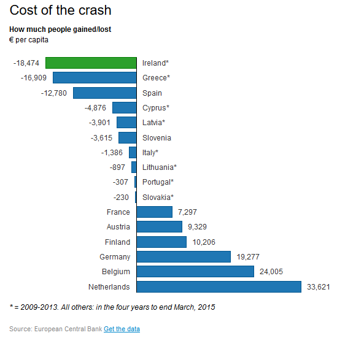](http://www.irishtimes.com/business/economy/irish-biggest-losers-from-financial-crash-ecb-1.2398588)

[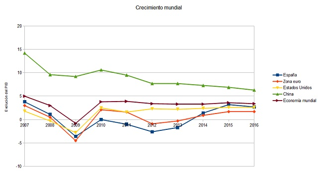](http://www.bolsamania.com/noticias/economia/los-cinco-graficos-que-explican-la-situacion-economica-mundial--1035065.html)

[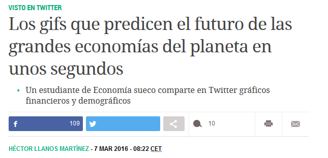](http://verne.elpais.com/verne/2016/02/17/articulo/1455697977_530997.html)

<blockquote class="twitter-tweet tw-align-center" data-lang="es">
<a href="https://twitter.com/hashtag/Spain?src=hash">#Spain</a> Population Projection 1960-2060 <a href="https://t.co/IY75se3hyw">pic.twitter.com/IY75se3hyw</a>
&mdash; Aron Strandberg (@aronstrandberg) <a href="https://twitter.com/aronstrandberg/status/696704891843166208">8 de febrero de 2016</a></blockquote>

<blockquote class="twitter-tweet tw-align-center" data-lang="es">
Another <a href="https://twitter.com/hashtag/Spain?src=hash">#Spain</a> age comparison: Age at which a person becomes older than the majority of the country&#39;s population: <a href="https://t.co/6gQhjRUgm3">pic.twitter.com/6gQhjRUgm3</a>
&mdash; Aron Strandberg (@aronstrandberg) <a href="https://twitter.com/aronstrandberg/status/697813591739756544">11 de febrero de 2016</a></blockquote>

<blockquote class="twitter-tweet tw-align-center" data-lang="es">
Aging <a href="https://twitter.com/hashtag/Germany?src=hash">#Germany</a>: Population Projection 1960-2060 <a href="https://t.co/Rjam0uKWMM">pic.twitter.com/Rjam0uKWMM</a>
&mdash; Aron Strandberg (@aronstrandberg) <a href="https://twitter.com/aronstrandberg/status/696714912706461696">8 de febrero de 2016</a></blockquote>

<blockquote class="twitter-tweet tw-align-center" data-lang="es">
Alternative variation of previous tweet: Share of Global GDP by Country (Total = 100) <a href="https://t.co/NFBOMyvzAZ">https://t.co/NFBOMyvzAZ</a> <a href="https://t.co/BuJTEn3Q1D">pic.twitter.com/BuJTEn3Q1D</a>
&mdash; Aron Strandberg (@aronstrandberg) <a href="https://twitter.com/aronstrandberg/status/688771709890093057">17 de enero de 2016</a></blockquote>

<blockquote class="twitter-tweet tw-align-center" data-lang="es">
Projection: The World&#39;s 10 Largest Economies 1970-2030 <a href="https://t.co/jWIl1Qxvcv">pic.twitter.com/jWIl1Qxvcv</a>
&mdash; Aron Strandberg (@aronstrandberg) <a href="https://twitter.com/aronstrandberg/status/688121706360090626">15 de enero de 2016</a></blockquote>

<blockquote class="twitter-tweet tw-align-center" data-lang="es">
Country area (million km2)  Russia: 17.1 Canada: 9.9 China: 9.57 US: 9.52 Brazil: 8.5 Australia: 7.7 India: 3.3 <a href="https://t.co/6URXXKoT81">pic.twitter.com/6URXXKoT81</a>
&mdash; The Int&#39;l Spectator (@intlspectator) <a href="https://twitter.com/intlspectator/status/710178887422988288">16 de marzo de 2016</a></blockquote>

<blockquote class="twitter-tweet tw-align-center" data-lang="es">
GDP (nominal)  Africa: $2.3 trillion California: $2.3 trillion <a href="https://t.co/FrYIWJIaOH">pic.twitter.com/FrYIWJIaOH</a>
&mdash; The Int&#39;l Spectator (@intlspectator) <a href="https://twitter.com/intlspectator/status/708786390067187713">12 de marzo de 2016</a></blockquote>

<blockquote class="twitter-tweet tw-align-center" data-lang="es">
Share of global GDP (PPP).  1980 EU and Japan: 38.2% China and India: 5.3%  2016 EU and Japan: 20.8% China and India: 24.7%
&mdash; The Int&#39;l Spectator (@intlspectator) <a href="https://twitter.com/intlspectator/status/710066956578127872">16 de marzo de 2016</a></blockquote>

<blockquote class="twitter-tweet tw-align-center" data-lang="es">
China&#39;s share of global consumption  Aluminum: 54% Copper: 48% Zinc: 46% Steel: 45% Rice: 30% Gold: 23% Wheat: 17% Oil: 12% Gas: 6%
&mdash; The Int&#39;l Spectator (@intlspectator) <a href="https://twitter.com/intlspectator/status/710201506046156800">16 de marzo de 2016</a></blockquote>

<blockquote class="twitter-tweet tw-align-center" data-lang="es">
Household debt as % of GDP  Australia: 122% UK: 86% US: 77% Japan: 66% France: 56% Germany: 54% China: 37% Turkey: 21% India: 9.5%
&mdash; The Int&#39;l Spectator (@intlspectator) <a href="https://twitter.com/intlspectator/status/710193986921635840">16 de marzo de 2016</a></blockquote>

<blockquote class="twitter-tweet tw-align-center" data-lang="es">
Projection: Global GDP Distribution 1970-2030, with highlighted USA, <a href="https://twitter.com/hashtag/China?src=hash">#China</a> and <a href="https://twitter.com/hashtag/India?src=hash">#India</a> <a href="https://t.co/uGnIloxS4O">pic.twitter.com/uGnIloxS4O</a>
&mdash; Aron Strandberg (@aronstrandberg) <a href="https://twitter.com/aronstrandberg/status/700076818041303041">17 de febrero de 2016</a></blockquote>

<blockquote class="twitter-tweet tw-align-center" data-lang="es">
Generation Y, Curling or Maybe: what the world calls millennials <a href="https://t.co/cQWAO8yyxe">https://t.co/cQWAO8yyxe</a>
&mdash; The Guardian (@guardian) <a href="https://twitter.com/guardian/status/707102616032026629">8 de marzo de 2016</a></blockquote>

<blockquote class="twitter-tweet tw-align-center" data-lang="es">
Employers &#39;will cut overtime and weekend pay&#39; to meet living wage <a href="https://t.co/zca9ZSG3zG">https://t.co/zca9ZSG3zG</a>
&mdash; The Guardian (@guardian) <a href="https://twitter.com/guardian/status/706996150516191232">8 de marzo de 2016</a></blockquote>

<blockquote class="twitter-tweet tw-align-center" data-lang="es">
How Much Money Have Banks Created? - <a href="https://t.co/QtDlHX21rN">https://t.co/QtDlHX21rN</a> <a href="https://t.co/TwDyItw8lL">pic.twitter.com/TwDyItw8lL</a>
&mdash; Positive Money (@PositiveMoneyUK) <a href="https://twitter.com/PositiveMoneyUK/status/701858021132083200">febrero 22, 2016</a></blockquote>

<blockquote class="twitter-tweet tw-align-center" data-lang="es">
Nasdaq 20 year monthly chart going back to the 2000 dot com bubble. <a href="https://twitter.com/search?q=%24QQQ&amp;src=ctag">$QQQ</a> <a href="https://twitter.com/search?q=%24SPY&amp;src=ctag">$SPY</a> <a href="https://twitter.com/search?q=%24NFLX&amp;src=ctag">$NFLX</a> <a href="https://twitter.com/search?q=%24AMZN&amp;src=ctag">$AMZN</a> <a href="https://twitter.com/search?q=%24GOOG&amp;src=ctag">$GOOG</a>  <a href="https://twitter.com/search?q=%24FB&amp;src=ctag">$FB</a> <a href="https://twitter.com/search?q=%24AAPL&amp;src=ctag">$AAPL</a> <a href="https://twitter.com/search?q=%24GOOGL&amp;src=ctag">$GOOGL</a> <a href="https://t.co/XZqim9WN34">pic.twitter.com/XZqim9WN34</a>
&mdash; GOODGREED (@GOODGREED) <a href="https://twitter.com/GOODGREED/status/697786991451111424">febrero 11, 2016</a></blockquote>

<blockquote class="twitter-tweet tw-align-center" data-lang="es">
How bad are tech stocks doing? We attached a chart. 😱  On momo stocks <a href="https://twitter.com/search?q=%24AMZN&amp;src=ctag">$AMZN</a>, <a href="https://twitter.com/search?q=%24NFLX&amp;src=ctag">$NFLX</a> and more: <a href="https://t.co/je8X1Ju2HG">https://t.co/je8X1Ju2HG</a> <a href="https://t.co/PXsXpXcZ5R">pic.twitter.com/PXsXpXcZ5R</a>
&mdash; StockTwits (@StockTwits) <a href="https://twitter.com/StockTwits/status/695649857785049088">febrero 5, 2016</a></blockquote>

<blockquote class="twitter-tweet tw-align-center" data-lang="es">
Is a recession coming? Everyone is freaked out that one is coming. But this chart. <a href="https://t.co/I8ZmbCFe27">https://t.co/I8ZmbCFe27</a> <a href="https://twitter.com/search?q=%24TLT&amp;src=ctag">$TLT</a> <a href="https://twitter.com/search?q=%24SPY&amp;src=ctag">$SPY</a> <a href="https://t.co/N9K2AmFrSd">pic.twitter.com/N9K2AmFrSd</a>
&mdash; StockTwits (@StockTwits) <a href="https://twitter.com/StockTwits/status/698966004022403073">febrero 14, 2016</a></blockquote>

<blockquote class="twitter-tweet tw-align-center" data-lang="es">
When the Fed tightens. This can be the impact. CHART: <a href="https://t.co/bR1LeT1DFp">https://t.co/bR1LeT1DFp</a><a href="https://twitter.com/search?q=%24SPY&amp;src=ctag">$SPY</a> <a href="https://twitter.com/search?q=%24TLT&amp;src=ctag">$TLT</a> <a href="https://twitter.com/search?q=%24GLD&amp;src=ctag">$GLD</a> <a href="https://t.co/ybBxczmYtW">pic.twitter.com/ybBxczmYtW</a>
&mdash; StockTwits (@StockTwits) <a href="https://twitter.com/StockTwits/status/699289052965515266">febrero 15, 2016</a></blockquote>

<blockquote class="twitter-tweet tw-align-center" data-lang="es">
DEUTCHE BANK Is Back: 5 Year Sub CDS Soar To Record High, similar to LEHMAN bankruptcy. <a href="https://t.co/HSyodUk3GH">https://t.co/HSyodUk3GH</a> <a href="https://t.co/fNFg80Sz21">pic.twitter.com/fNFg80Sz21</a>
&mdash; Marco-Hans (@mhwillik) <a href="https://twitter.com/mhwillik/status/697820500165324800">febrero 11, 2016</a></blockquote>

<blockquote class="twitter-tweet tw-align-center" data-lang="es">
<a href="https://twitter.com/hashtag/EU?src=hash">#EU</a>, it&#39;s time to wake up. <a href="https://twitter.com/hashtag/deutchebank?src=hash">#deutchebank</a> derivatives critical. <a href="https://twitter.com/hashtag/Italy?src=hash">#Italy</a> banks breaking.$EUR dying  Look into <a href="https://twitter.com/hashtag/bitcoin?src=hash">#bitcoin</a>. <a href="https://t.co/tW3XgjuxOt">pic.twitter.com/tW3XgjuxOt</a>
&mdash; Ansel Lindner (@AnselLindner) <a href="https://twitter.com/AnselLindner/status/694940218244239361">febrero 3, 2016</a></blockquote>

<blockquote class="twitter-tweet tw-align-center" data-lang="es">
&quot;rock solid&quot; Deutche bank shares hit all time low this week.  lets face the music<a href="https://t.co/n9pmQs2D3a">https://t.co/n9pmQs2D3a</a> <a href="https://t.co/0lYEm5LfJj">pic.twitter.com/0lYEm5LfJj</a>
&mdash; David Scott (@Albion_Rover) <a href="https://twitter.com/Albion_Rover/status/698614818610221056">febrero 13, 2016</a></blockquote>

<blockquote class="twitter-tweet tw-align-center" data-lang="es">
<a href="https://twitter.com/xaquinonil">@xaquinonil</a> las mentiras sobre fundamentales en bolsa. Hablan de problemas de Deutche Bank y es gemelo al santander. <a href="https://t.co/2pj2hcHFQa">pic.twitter.com/2pj2hcHFQa</a>
&mdash; xaquinonil (@xaquinonil) <a href="https://twitter.com/xaquinonil/status/698830464102993920">febrero 14, 2016</a></blockquote>

<blockquote class="twitter-tweet tw-align-center" data-lang="es">
Machines may replace half of human jobs <a href="https://t.co/eG4UM5H2KY">https://t.co/eG4UM5H2KY</a> <a href="https://t.co/wLEPMYJL0i">pic.twitter.com/wLEPMYJL0i</a>
&mdash; Business Insider (@businessinsider) <a href="https://twitter.com/businessinsider/status/699604520414945281">febrero 16, 2016</a></blockquote>

<blockquote class="twitter-tweet tw-align-center" data-lang="es">
Top story: Apple could not afford to bring production to the US - Business Insi… <a href="https://t.co/tnjr4Jh0nH">https://t.co/tnjr4Jh0nH</a>, see more <a href="https://t.co/IoIQnbuajI">https://t.co/IoIQnbuajI</a>
&mdash; WSI DOM voir @wsidom (@WSI_DOM) <a href="https://twitter.com/WSI_DOM/status/707653601490046976">9 de marzo de 2016</a></blockquote>

<blockquote class="twitter-tweet tw-align-center" data-lang="es">
There&#39;s a grim chart going around. And it&#39;s comparing the 08&#39; crash to today: <a href="https://t.co/Lfsb8nJkaA">https://t.co/Lfsb8nJkaA</a><a href="https://twitter.com/search?q=%24SPY&amp;src=ctag">$SPY</a> <a href="https://twitter.com/search?q=%24TLT&amp;src=ctag">$TLT</a> <a href="https://t.co/ggdYLYMfWt">pic.twitter.com/ggdYLYMfWt</a>
&mdash; StockTwits (@StockTwits) <a href="https://twitter.com/StockTwits/status/700424616339075072">febrero 18, 2016</a></blockquote>

<blockquote class="twitter-tweet tw-align-center" data-lang="es">
Advancing versus declining stocks highest since 2009. Here’s the chart everyone is talking about: <a href="https://t.co/tfwuJZssMo">https://t.co/tfwuJZssMo</a>
&mdash; StockTwits (@StockTwits) <a href="https://twitter.com/StockTwits/status/705585147551227908">4 de marzo de 2016</a></blockquote>

<blockquote class="twitter-tweet tw-align-center" data-lang="es">
Unemployment in the UK down by 60,000 between October and December to 1.69 million, latest figures show <a href="https://t.co/KkJBXmHt9m">https://t.co/KkJBXmHt9m</a>
&mdash; BBC Breaking News (@BBCBreaking) <a href="https://twitter.com/BBCBreaking/status/699889334711951360">febrero 17, 2016</a></blockquote>

<blockquote class="twitter-tweet tw-align-center" data-lang="es">
Witness an actual Grexit: how big tax rises are driving companies out of the country <a href="https://t.co/nGwlmEIN5E">https://t.co/nGwlmEIN5E</a> <a href="https://t.co/1vmh3wIZRu">pic.twitter.com/1vmh3wIZRu</a>
&mdash; The Economist (@TheEconomist) <a href="https://twitter.com/TheEconomist/status/701060358019149824">febrero 20, 2016</a></blockquote>

<blockquote class="twitter-tweet tw-align-center" data-lang="es">
Las 20 Mayores Economías del Mundo en 2030 <a href="https://t.co/Ulq1cxm4Xb">pic.twitter.com/Ulq1cxm4Xb</a>
&mdash; Comunidad Financiera (@comunidadfinan) <a href="https://twitter.com/comunidadfinan/status/702261095621382145">febrero 23, 2016</a></blockquote>

<blockquote class="twitter-tweet tw-align-center" data-lang="es">
GDP ($ trillion, at constant prices)  European Union  2008: 19.1 2015: 16.4  United States  2008: 14.7 2015: 18.1 <a href="https://t.co/encwEbXHXc">pic.twitter.com/encwEbXHXc</a>
&mdash; The Int&#39;l Spectator (@intlspectator) <a href="https://twitter.com/intlspectator/status/708237051166990337">11 de marzo de 2016</a></blockquote>

<blockquote class="twitter-tweet tw-align-center" data-lang="es">
Slowest G20 GDP growth, 2016.  Brazil: -2.6 Russia: -0.3% Argentina: 0.1% Japan: 1.1% Italy: 1.3% France: 1.4% S Africa: 1.5% Germany: 1.7%
&mdash; The Int&#39;l Spectator (@intlspectator) <a href="https://twitter.com/intlspectator/status/708080061086244864">11 de marzo de 2016</a></blockquote>

<blockquote class="twitter-tweet tw-align-center" data-lang="es">
GDP growth, 2016.  Poland: 3.5% Turkey: 3.2% Spain: 2.7% UK: 2% Netherlands: 1.7% Germany: 1.5% France: 1.3% Italy: 1.1% Russia: -1.3%
&mdash; The Int&#39;l Spectator (@intlspectator) <a href="https://twitter.com/intlspectator/status/709683440585547776">15 de marzo de 2016</a></blockquote>

<blockquote class="twitter-tweet tw-align-center" data-lang="es">
The gig economy attracts many workers, few full-time jobs <a href="https://t.co/q76qFZF5Fg">https://t.co/q76qFZF5Fg</a> <a href="https://t.co/utzF0EzV9m">pic.twitter.com/utzF0EzV9m</a>
&mdash; Real Time Economics (@WSJecon) <a href="https://twitter.com/WSJecon/status/702238896873205764">febrero 23, 2016</a></blockquote>

<blockquote class="twitter-tweet tw-align-center" data-lang="es">
81% of adults in <a href="https://twitter.com/hashtag/OECD?src=hash">#OECD</a> might use the <a href="https://twitter.com/hashtag/internet?src=hash">#internet</a>, but there are still gaps between age groups <a href="https://t.co/WacVHqMAU9">https://t.co/WacVHqMAU9</a> <a href="https://t.co/ZEJ4IldezE">pic.twitter.com/ZEJ4IldezE</a>
&mdash; OECD (@OECD) <a href="https://twitter.com/OECD/status/702892226293178369">25 de febrero de 2016</a></blockquote>

<blockquote class="twitter-tweet tw-align-center" data-lang="es">
Gender pay gap: S Korea 37% Japan 27 Turkey 20 US 18 Swiss, Chile 17 Spain 9 New Zealand 6<a href="https://t.co/keVLfd5Mjd">https://t.co/keVLfd5Mjd</a> <a href="https://t.co/gURsefDoQQ">pic.twitter.com/gURsefDoQQ</a>
&mdash; Dina Pomeranz (@dinapomeranz) <a href="https://twitter.com/dinapomeranz/status/701563247875465216">febrero 22, 2016</a></blockquote>

<blockquote class="twitter-tweet tw-align-center" data-lang="es">
By population and output, London is the EU&#39;s largest city. It could be bigger still <a href="https://t.co/nI16hgNU8z">https://t.co/nI16hgNU8z</a> <a href="https://t.co/mtbcq3Zh0i">pic.twitter.com/mtbcq3Zh0i</a>
&mdash; The Economist (@TheEconomist) <a href="https://twitter.com/TheEconomist/status/703933265397325824">28 de febrero de 2016</a></blockquote>

<blockquote class="twitter-tweet tw-align-center" data-lang="es">
Countries which have officially adopted metric system <a href="https://t.co/7JFA67A8BE">pic.twitter.com/7JFA67A8BE</a>
&mdash; Terrible Maps (@TerribleMaps) <a href="https://twitter.com/TerribleMaps/status/695745094239023104">febrero 5, 2016</a></blockquote>

<blockquote class="twitter-tweet tw-align-center" data-lang="es">
Marcas que por alguna razón que desconozco cambian de nombre en UK vía <a href="https://twitter.com/amazingmap">@amazingmap</a> <a href="https://t.co/OnIsJxtmvu">pic.twitter.com/OnIsJxtmvu</a>
&mdash; Roberto García Esteb (@72rge) <a href="https://twitter.com/72rge/status/708753750471606274">12 de marzo de 2016</a></blockquote>

<blockquote class="twitter-tweet tw-align-center" data-lang="es">
Países con PIB inferior a la fortuna de Bill Gates vía <a href="https://twitter.com/amazingmap">@amazingmap</a>
&mdash; Roberto García Esteb (@72rge) <a href="https://twitter.com/72rge/status/708754639475372033">12 de marzo de 2016</a></blockquote>

[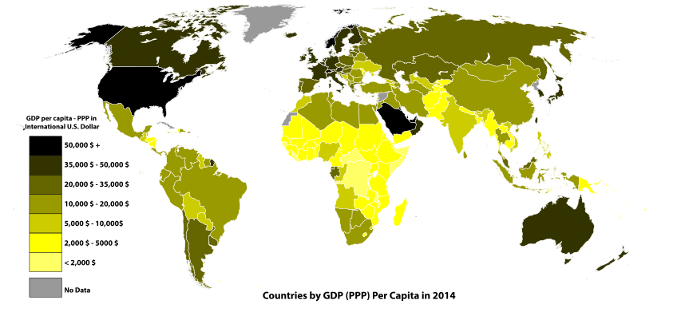](https://en.wikipedia.org/wiki/Recession)

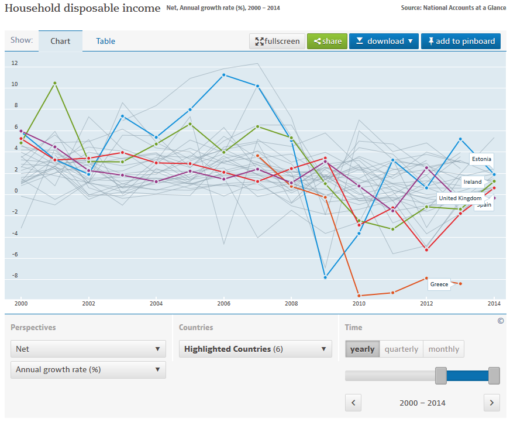

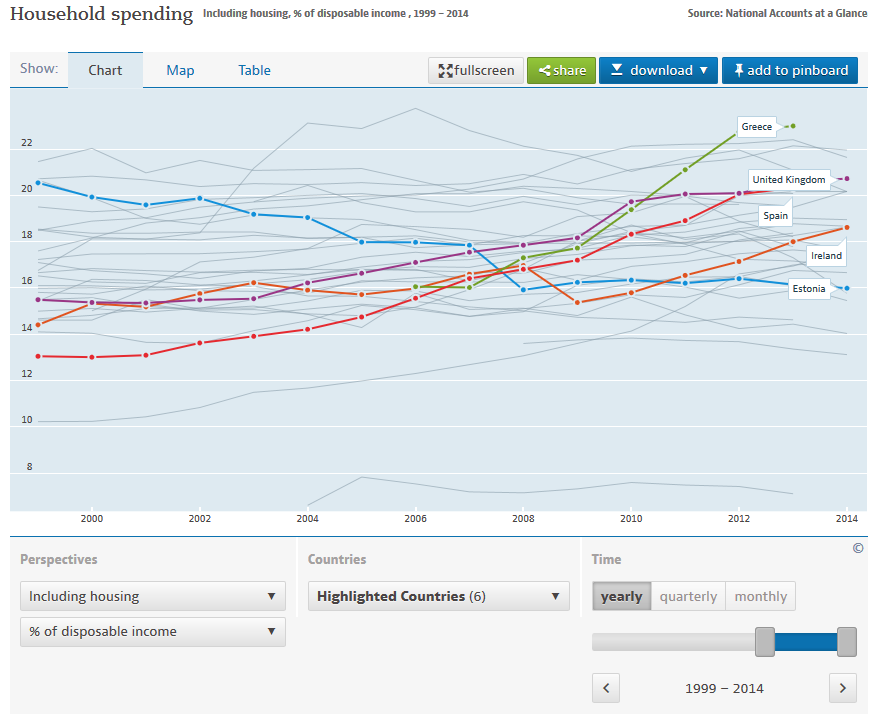

[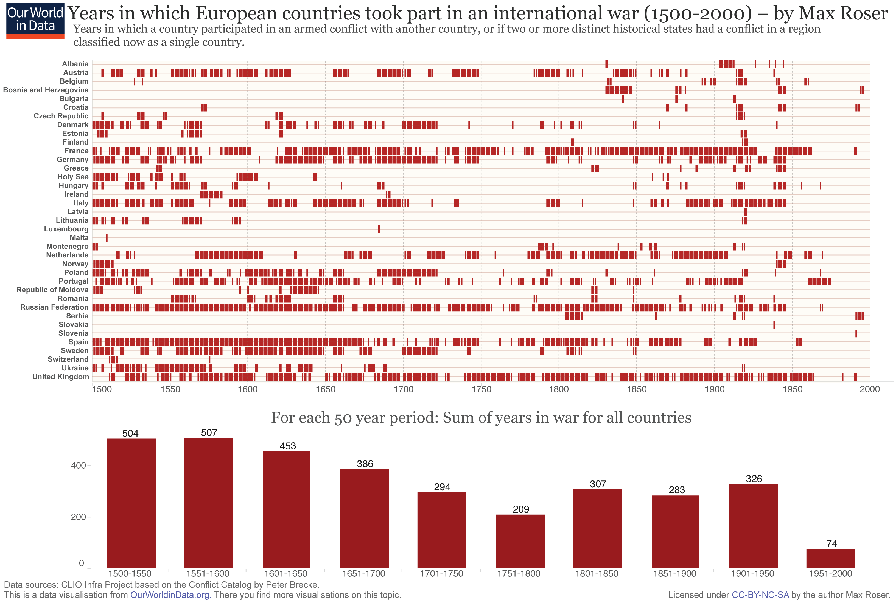](http://ourworldindata.org/data/war-peace/war-and-peace-before-1945/)

[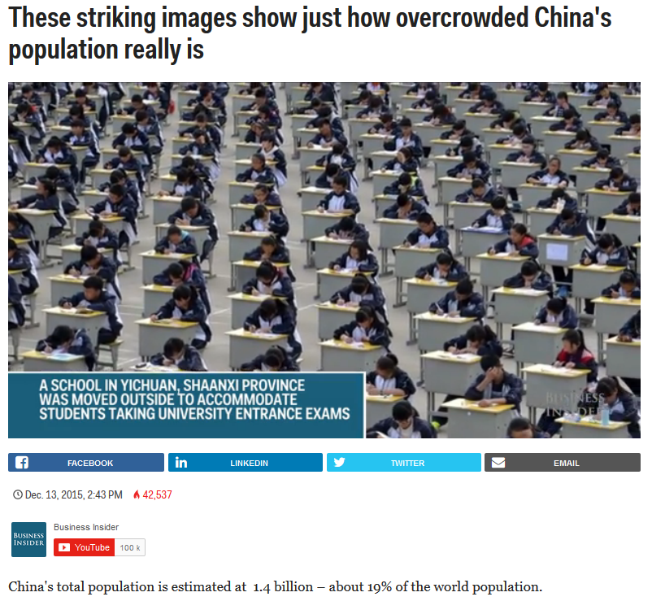](http://www.businessinsider.com/photos-show-overcrowded-china-2015-11)

[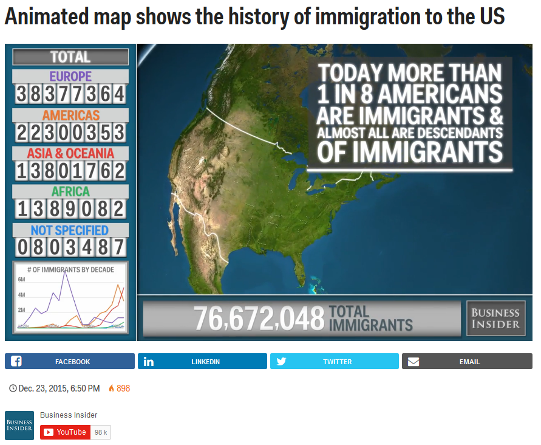](http://uk.businessinsider.com/animated-map-shows-history-us-immigration-2015-12)

[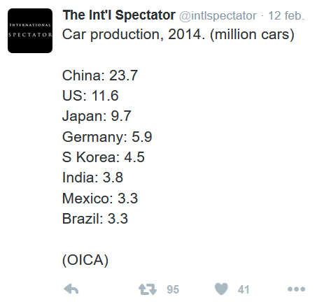](https://twitter.com/intlspectator)

[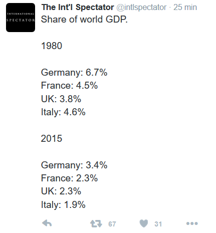](https://twitter.com/intlspectator)

[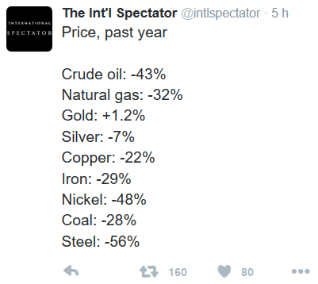](https://twitter.com/intlspectator)

[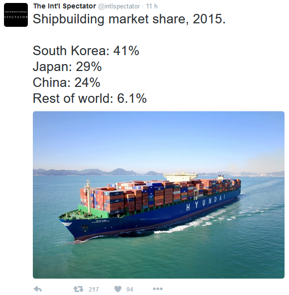](https://twitter.com/intlspectator)

<blockquote class="twitter-tweet tw-align-center" data-lang="es">
US spends $640 billion on its military; more than China, Russia, Saudi, France, UK, India and Germany combined. <a href="https://t.co/YSHHIqWpBg">pic.twitter.com/YSHHIqWpBg</a>
&mdash; The Int&#39;l Spectator (@intlspectator) <a href="https://twitter.com/intlspectator/status/700417049864982529">febrero 18, 2016</a></blockquote>

<blockquote class="twitter-tweet tw-align-center" data-lang="es">
A map of all the battles fought around the world over the last 4,000 years <a href="https://t.co/5qiHQNknei">https://t.co/5qiHQNknei</a> <a href="https://t.co/JOONDQTgip">pic.twitter.com/JOONDQTgip</a>
&mdash; indy100 (@indy100) <a href="https://twitter.com/indy100/status/703930964301520896">28 de febrero de 2016</a></blockquote>

<blockquote class="twitter-tweet tw-align-center" data-lang="es">
21 maps and charts to challenge your perceptions of Europe <a href="https://t.co/gAFMI02PP0">https://t.co/gAFMI02PP0</a> <a href="https://t.co/GrXEV8IpHi">pic.twitter.com/GrXEV8IpHi</a>
&mdash; indy100 (@indy100) <a href="https://twitter.com/indy100/status/704349044483694592">29 de febrero de 2016</a></blockquote>

<blockquote class="twitter-tweet tw-align-center" data-lang="es">
2016 share of world GDP  China: 17.3% US: 16% India: 7.4% Japan: 4.2% Germany: 3.3% Russia: 2.9% Brazil: 2.8% Indonesia: 2.6% UK: 2.3%
&mdash; The Int&#39;l Spectator (@intlspectator) <a href="https://twitter.com/intlspectator/status/702259169584283648">febrero 23, 2016</a></blockquote>

<blockquote class="twitter-tweet tw-align-center" data-lang="es">
Price, past year  Crude oil: -43% Natural gas: -32% Gold: +1.2% Silver: -7% Copper: -22% Iron: -29% Nickel: -48% Coal: -28% Steel: -56%
&mdash; The Int&#39;l Spectator (@intlspectator) <a href="https://twitter.com/intlspectator/status/702251619598008321">febrero 23, 2016</a></blockquote>

<blockquote class="twitter-tweet tw-align-center" data-lang="es">
Oil price, March  2008: $117 2009: $53 2010: $88 2011: $109 2012: $106 2013: $98 2014: $102 2015: $48  Now: $35.9 <a href="https://t.co/IfKYFJNkEd">pic.twitter.com/IfKYFJNkEd</a>
&mdash; The Int&#39;l Spectator (@intlspectator) <a href="https://twitter.com/intlspectator/status/706443233040031744">6 de marzo de 2016</a></blockquote>

<blockquote class="twitter-tweet tw-align-center" data-lang="es">
Steel price.  June, 2008: $1,265  February, 2016: $210 <a href="https://t.co/3tWUA97xaL">pic.twitter.com/3tWUA97xaL</a>
&mdash; The Int&#39;l Spectator (@intlspectator) <a href="https://twitter.com/intlspectator/status/704285857881071616">29 de febrero de 2016</a></blockquote>

<blockquote class="twitter-tweet tw-align-center" data-lang="es">
Share of global economy  US 1980: 25% 2014: 19.2%  EU 1980: 30.9% 2014: 18.4%  China 1980: 2.2% 2014: 16.6%  India 1980: 2.54% 2014: 5.96%
&mdash; The Int&#39;l Spectator (@intlspectator) <a href="https://twitter.com/intlspectator/status/702236512746758145">febrero 23, 2016</a></blockquote>

<blockquote class="twitter-tweet tw-align-center" data-lang="es">
China is world&#39;s largest producer of:  - Aluminum - Gold - Cement - Iron - Steel - Coal - Zinc - Cotton - Tobacco - Cars - Hi-tech exports
&mdash; The Int&#39;l Spectator (@intlspectator) <a href="https://twitter.com/intlspectator/status/708699252902350848">12 de marzo de 2016</a></blockquote>

<blockquote class="twitter-tweet tw-align-center" data-lang="es">
Primary education quality, 2015  1. Finland 2. Belgium 3. Singapore  10. Japan 22. Germany 30. UK 36. US 59. China 88. India 141. Egypt  WEF
&mdash; The Int&#39;l Spectator (@intlspectator) <a href="https://twitter.com/intlspectator/status/702893343122919424">25 de febrero de 2016</a></blockquote>

<blockquote class="twitter-tweet tw-align-center" data-lang="es">
GRAPHIC: The world&#39;s biggest banks by nationality, 2004-2013 <a href="https://t.co/kTF9t28AD6">pic.twitter.com/kTF9t28AD6</a>
&mdash; The Int&#39;l Spectator (@intlspectator) <a href="https://twitter.com/intlspectator/status/706245425880170496">5 de marzo de 2016</a></blockquote>

<blockquote class="twitter-tweet tw-align-center" data-lang="es">
<a href="https://twitter.com/hashtag/Denmark?src=hash">#Denmark</a> leads in life satisfaction; Today at OECD <a href="https://twitter.com/MaleneRydahl">@MaleneRydahl</a> explained <a href="https://twitter.com/hashtag/trust?src=hash">#trust</a> is key <a href="https://t.co/xBPhbLtVPP">https://t.co/xBPhbLtVPP</a> <a href="https://t.co/Ou2ybw4KA5">pic.twitter.com/Ou2ybw4KA5</a>
&mdash; OECD (@OECD) <a href="https://twitter.com/OECD/status/702559308224065537">24 de febrero de 2016</a></blockquote>

<blockquote class="twitter-tweet tw-align-center" data-lang="es">
What’s the health of your <a href="https://twitter.com/hashtag/health?src=hash">#health</a> workforce? Compare <a href="https://twitter.com/hashtag/doctors?src=hash">#doctors</a> per <a href="https://twitter.com/hashtag/OECD?src=hash">#OECD</a> country, see report <a href="https://t.co/PYyFOLqLeW">https://t.co/PYyFOLqLeW</a> <a href="https://t.co/5xO0VzBUGn">pic.twitter.com/5xO0VzBUGn</a>
&mdash; OECD (@OECD) <a href="https://twitter.com/OECD/status/709682362964176896">15 de marzo de 2016</a></blockquote>

<blockquote class="twitter-tweet tw-align-center" data-lang="es">
Japan, govt debt as % of GDP  1980: 52% 1985: 69% 1990: 69% 1995: 95% 2000: 144% 2005: 186% 2010: 216% 2015: 246% <a href="https://t.co/YkEGLO3niP">pic.twitter.com/YkEGLO3niP</a>
&mdash; The Int&#39;l Spectator (@intlspectator) <a href="https://twitter.com/intlspectator/status/706230311965700096">5 de marzo de 2016</a></blockquote>

<blockquote class="twitter-tweet tw-align-center" data-lang="es">
India and UK GDP (PPP)  1980 UK: $490 billion India: $386 billion  2016 UK: $2.74 trillion India: $8.72 trillion <a href="https://t.co/LWbvDFVMZl">pic.twitter.com/LWbvDFVMZl</a>
&mdash; The Int&#39;l Spectator (@intlspectator) <a href="https://twitter.com/intlspectator/status/710511293178904576">17 de marzo de 2016</a></blockquote>

<blockquote class="twitter-tweet tw-align-center" data-lang="es">
Least corrupt states  1. Denmark 2. NZ 3. Finland  12. Germany 14. UK 15. Japan 17. US 26. France 85. India 100. China 136. Russia  (TI)
&mdash; The Int&#39;l Spectator (@intlspectator) <a href="https://twitter.com/intlspectator/status/706499585074552833">6 de marzo de 2016</a></blockquote>

<blockquote class="twitter-tweet tw-align-center" data-lang="es">
Aware of <a href="https://twitter.com/hashtag/corruption?src=hash">#corruption</a> at work but afraid to speak up? Read <a href="https://twitter.com/hashtag/whistleblower?src=hash">#whistleblower</a> protection issues <a href="https://t.co/zIpEE2lDAy">https://t.co/zIpEE2lDAy</a> <a href="https://t.co/h1yoWO0lMd">pic.twitter.com/h1yoWO0lMd</a>
&mdash; OECD (@OECD) <a href="https://twitter.com/OECD/status/710060826837839872">16 de marzo de 2016</a></blockquote>

<blockquote class="twitter-tweet tw-align-center" data-lang="es">
Willing to fight for country.  Pakistan: 89% India: 75% Turkey: 73% China: 71% Russia: 59% US: 44% UK: 27% Germany: 18% Japan: 11%  (Gallup)
&mdash; The Int&#39;l Spectator (@intlspectator) <a href="https://twitter.com/intlspectator/status/709026246869458944">13 de marzo de 2016</a></blockquote>

<blockquote class="twitter-tweet tw-align-center" data-lang="es">
Productividad: En <a href="https://twitter.com/hashtag/Francia?src=hash">#Francia</a> se trabajan MENOS horas que en Uk pero son MAS PRODUCTIVOS<a href="https://t.co/ZjWIvu76rZ">https://t.co/ZjWIvu76rZ</a> <a href="https://t.co/uMpeltlpJj">pic.twitter.com/uMpeltlpJj</a>
&mdash; TrabajarenEuropa (@TrabajarEuropa) <a href="https://twitter.com/TrabajarEuropa/status/706555241060306945">6 de marzo de 2016</a></blockquote>

<blockquote class="twitter-tweet tw-align-center" data-lang="es">
The unemployment rate is below 5% but this doesn&#39;t look like typical full-employment <a href="https://t.co/jsyzIUSKqy">https://t.co/jsyzIUSKqy</a> <a href="https://t.co/GZOtkiphnx">pic.twitter.com/GZOtkiphnx</a>
&mdash; Nick Timiraos (@NickTimiraos) <a href="https://twitter.com/NickTimiraos/status/706162531740602368">5 de marzo de 2016</a></blockquote>

<blockquote class="twitter-tweet tw-align-center" data-lang="es">
MIT thinks a carbon tax is the only way to break our dependence on fossil fuels <a href="https://t.co/7OjSBk0dLT">https://t.co/7OjSBk0dLT</a>
&mdash; Business Insider (@businessinsider) <a href="https://twitter.com/businessinsider/status/706239670997422080">5 de marzo de 2016</a></blockquote>

<blockquote class="twitter-tweet tw-align-center" data-lang="es">
The four big reasons why 4 billion people aren&#39;t online <a href="https://t.co/HSd9qaunHo">https://t.co/HSd9qaunHo</a> via <a href="https://twitter.com/ZDNet">@ZDNet</a> &amp; <a href="https://twitter.com/jackschofield">@jackschofield</a> <a href="https://t.co/ZpS6zRQigQ">pic.twitter.com/ZpS6zRQigQ</a>
&mdash; ZDNet (@ZDNet) <a href="https://twitter.com/ZDNet/status/706494911428874240">6 de marzo de 2016</a></blockquote>

## Miscellaneous
- [flowingdata.com: American Immigration history](http://flowingdata.com/2016/01/12/immigration-history/)
- [Real Time Economics twitter.com/WSJecon](https://twitter.com/WSJecon)
- [tradingview.com/widget](https://www.tradingview.com/widget)
- [Why Londoners are worse off than any other British region since 2008](http://www.economist.com/news/britain/21688435-those-living-london-seem-have-fared-well-crisis-fact-their-ludicrously)
- [uk.businessinsider.com: Animated map shows the history of immigration to the US](http://uk.businessinsider.com/animated-map-shows-history-us-immigration-2015-12)
- [Irish biggest losers from financial crash - ECB 🌟](http://www.irishtimes.com/business/economy/irish-biggest-losers-from-financial-crash-ecb-1.2398588)
- [Educated Greeks show highest rate of unemployment in OECD](http://www.ekathimerini.com/203808/article/ekathimerini/news/educated-greeks-show-highest-rate-of-unemployment-in-oecd)
- [Britain is heading for another 2008 crash: here’s why](http://www.theguardian.com/commentisfree/2015/oct/28/2008-crash-government-economic-growth-budgetary-surplus)
- [How does corruption in Africa really compare to OECD countries? Anti-Fraud & Corruption Law in Africa](http://africanantifraud.com/2016/01/20/circles-of-corruption-how-does-africa-stack-up-against-the-oecd/)
- [The General Theory of Employment, Interest and Money. John Maynard Keynes](https://en.wikipedia.org/wiki/The_General_Theory_of_Employment,_Interest_and_Money)
- [Thomas Piketty’s “Capital”, summarised in four paragraphs](http://www.economist.com/blogs/economist-explains/2014/05/economist-explains)
- [Debt: The First 5000 Years. David Graeber](https://en.wikipedia.org/wiki/Debt:_The_First_5000_Years)
- [The End of Work: The Decline of the Global Labor Force and the Dawn of the Post-Market Era. Jeremy Rifkin](https://en.wikipedia.org/wiki/The_End_of_Work)
- [blogs.wsj.com: Six Years Later, 93% of U.S. Counties Haven’t Recovered From Recession, Study Finds](http://blogs.wsj.com/economics/2016/01/12/six-years-later-93-of-u-s-counties-havent-recovered-from-recession-study-finds/)
- [businessinsider.com: Watch 1,400 US workers learn their jobs are moving to Mexico](http://www.businessinsider.com/carrier-workers-learn-jobs-are-moving-to-mexico-2016-2)

## IT
- [IT Jobs Watch, Tracking the IT Job Market](http://www.itjobswatch.co.uk/)
- [zdnet.com: 'It's a graveyard': The software devs leaving Greece for good 🌟🌟](http://www.zdnet.com/article/its-a-graveyard-the-software-devs-leaving-greece-for-good/)
- [These 10 cities have the fastest-growing startup scenes — and neither New York nor Silicon Valley made the cut](http://www.businessinsider.com/us-cities-with-fastest-growing-startup-scenes-2016-1)
- [The Economist. The other side of paradise](http://www.economist.com/news/business/21688390-glamorous-tech-startups-can-be-brutal-places-workers-other-side-paradise) Glamorous tech startups can be brutal places for workers
- [businessinsider.com: The 13 worst things about Silicon Valley](http://www.businessinsider.com/the-dark-side-of-silicon-valley-2016-1)
- [Laid-off IT workers muzzled as H-1B debate heats up](http://www.cio.com/article/3027539/outsourcing/laid-off-it-workers-muzzled-as-h-1b-debate-heats-up.html)

______________________________________________________________________________________________________________________________________

## Referencias 

- [Quince películas para entender la crisis 🌟](http://www.elmundo.es/cultura/2016/01/15/56991002e2704e61348b45cb.html)
	- [Margin Call quotes](http://www.imdb.com/title/tt1615147/quotes)
- [La banca especula con instrumentos semejantes a los usados antes de la crisis](http://www.mundiario.com/articulo/a-fondo/banca-especulando-instrumentos-semejantes-utilizados-antes-crisis/20151031004951048655.html)
- [José María Gay, el economista indignado 🌟](https://youtu.be/cby2vsK8O6k)
- Keiser Report en español:
	- [Una economía de casino (E715)](https://youtu.be/guLunFqJYw4)
	- [Una economía momificada (E718)](https://youtu.be/4wZNfZ5j_Ck)
	- [La destrucción de la clase media (E730)](https://youtu.be/y0HvhKH3YrQ)
	- [¡Compren oro! (E739)](https://youtu.be/Zqt18VH2F5o)
	- [Salarios, lo que baja no vuelve a subir (E754)](https://youtu.be/JHrXPlBpDNc)
	- [Una economía en coma (E760)](https://youtu.be/QC7LyJko7dA)
	- [Economías rentistas condenadas al fracaso (E767)](https://youtu.be/QXtbyGwnZEE)
	- [Esclavos de la deuda (E764)](https://youtu.be/esoMBsfa1M4)
	- [Caos financiero general (E782)](https://youtu.be/7yJEgClYDzU)
	- [La Unión Europea en la cuerda floja (E785)](https://youtu.be/P-XLyWS3Wek)
	- [El engaño de la burbuja inmobiliaria (E788)](https://youtu.be/qNQtcKqULcU)
	- [Las gigantes malvadas hipotecarias (E789)](https://youtu.be/mnErMBHrKPk)
	- [El comienzo del fin del capitalismo (E790)](https://youtu.be/OBNbUk3D2XM) El post-capitalismo
	- [El precariado: una nueva clase social (E791) 🌟](https://youtu.be/8cdPD71jZjM) El fenómeno supera todas la fronteras geográficas
	- [La maldita deuda (E792)](https://youtu.be/M89qDw1p2lQ)
	- [Un mundo de estafas Ponzi (E795)](https://youtu.be/Uv7KhOqiBSA)
	- [Volver a la norma del oro (E796)](https://youtu.be/cnfEC4PF23U)
	- [El caso de Chicago (E797)](https://youtu.be/TlA160S9mdw)
	- [La vertiginosa caída del precio del barril (E805)](https://youtu.be/1EvJr_-zx8g)
	- [Días de rabia (E816)](https://youtu.be/nHSPva8eTC0)
	- [El páramo de los mercados financieros (E817)](https://youtu.be/xaJ8rClIjOs)
	- [Todos a endeudarse! (E818)](https://youtu.be/875-LANXBeg)
	- [Guerra contra la pobreza y políticos marioneta (E823)](https://youtu.be/4CmZaGTEZnc)
	- [El control de la riqueza mundial (E824)](https://youtu.be/FcIL2k0LuyY)
	- [Banqueros centrales, secretarios del Tesoro y otros mentirosos (E825)](https://youtu.be/YPEq8_ygWh8)
	- [El imperio de la deuda y calcetines como garantía (E826)](https://youtu.be/NP_Mh2XNy2w)
	- [El fin del capitalismo (E828)](https://youtu.be/IIcIPz4wpCU)
	- [China: el gigante despierto (E830)](https://youtu.be/k0q_zUO4e1M)
	- [La fiesta de las criptodivisas (E832)](https://youtu.be/8xtmuV18Y04)
	- [Misterio y magia en los mercados financieros (E833)](https://youtu.be/dekXrmppTUg)
	- [La muerte del comercio mundial y sobredosis de heroína (E835)](https://youtu.be/1m_NODT6I8g)
	- [Mentiras, evasivas, disparates, odios y esquizofrenia (E839)](https://youtu.be/yWoeZsZdaxs)
	- [Época de recesiones (E840) 🌟](https://youtu.be/esnj2lfr4zA)
    - [La extinción del universo financiero (E880) 🌟](https://www.youtube.com/watch?v=UWfzb0l1jV4)
- [Una de mates: Media y mediana (sueldos)](https://youtu.be/lynZYPTVelw)
- [El sarcasmo de Niño Becerra con la economía española y su visión sobre la recesión mundial](http://www.bolsamania.com/noticias/economia/el-sarcasmo-de-nino-becerra-con-la-economia-espanola--1029719.html)
- [Economistas frente a la crisis](http://economistasfrentealacrisis.com/)
    - [Crisis generacional. Los jóvenes dejan de buscar empleo en España](http://economistasfrentealacrisis.com/crisis-generacional-los-jovenes-dejan-de-buscar-empleo-en-espana/) 
- [¿Va a estallar Silicon Valley? 🌟](http://www.elmundo.es/tecnologia/2016/01/15/568f99eeca4741b7398b466f.html) "En realidad, me preocupa mucho más que España sufra por la falta de digitalización y de productividad que por su exceso"
- [Desmontando los mitos sobre la inflación y la creación de dinero 🌟](http://eduardogarzon.net/desmontando-los-mitos-sobre-la-inflacion-y-la-creacion-de-dinero/)
- [El gran desajuste: "Las empresas germanas son 16 veces más eficientes que los gigantes tecnológicos americanos generando empleo" 🌟🌟🌟](http://xavierferras.blogspot.com.es/2016/02/el-gran-desajuste.html)
- [Capitalismo clientelista](https://es.wikipedia.org/wiki/Capitalismo_clientelista)
- [“El clientelismo amenaza el futuro económico de España” 🌟](http://www.lavanguardia.com/ciencia/20160207/301978772341/clientelismo-corrupcion-amiguismo-economia-espanola.html)

<blockquote class="twitter-tweet tw-align-center" data-lang="es">
Oh España, ese gran pais. <a href="https://twitter.com/hashtag/ironia?src=hash">#ironia</a> El economista indignado <a href="https://t.co/rPu4HjN6IL">https://t.co/rPu4HjN6IL</a>
&mdash; Sara (@smaab6) <a href="https://twitter.com/smaab6/status/652115252528726017">8 de octubre de 2015</a></blockquote>

<iframe width="560" height="315" src="https://www.youtube.com/embed/lynZYPTVelw" frameborder="0" allowfullscreen class="video"></iframe>

 

<blockquote class="twitter-tweet tw-align-center" data-lang="es">
Niño Becerra: &#39;¿Por qué la economía tiene que crecer cada año? Seguimos como en los años 60&#39; <a href="https://t.co/ZxkoLx8DaD">https://t.co/ZxkoLx8DaD</a> <a href="https://t.co/Eo8Vawznfd">pic.twitter.com/Eo8Vawznfd</a>
&mdash; Bolsamanía (@bolsamania) <a href="https://twitter.com/bolsamania/status/702253251341766657">febrero 23, 2016</a></blockquote>

<blockquote class="twitter-tweet tw-align-center" data-lang="es">
&quot;La nueva era será la de las corporaciones, la de la tecnología desconocida&quot;, dice <a href="https://twitter.com/sninobecerra">@sninobecerra</a> | <a href="https://t.co/v3CesdR5CZ">https://t.co/v3CesdR5CZ</a>
&mdash; Bolsamanía (@bolsamania) <a href="https://twitter.com/bolsamania/status/702893530407149568">25 de febrero de 2016</a></blockquote>

______________________________________________________________________________________________________________________________________

## Business process improvement

- [The Italian Tech Sector Is Getting A Boost From Big U.S. Partners](http://techcrunch.com/2016/02/04/the-italian-tech-sector-is-getting-a-boost-from-big-u-s-partners)
- [OECD: Benefiting from the Next Production Revolution 🌟](http://oecdinsights.org/2016/02/23/benefiting-from-the-next-production-revolution/)

<blockquote class="twitter-tweet tw-align-center" data-lang="es">
<a href="https://twitter.com/hashtag/3D?src=hash">#3D</a> printers, nano, robots, big <a href="https://twitter.com/hashtag/data?src=hash">#data</a>: what r the challenges for the production revolution? <a href="https://t.co/34ZJvfML3O">https://t.co/34ZJvfML3O</a> <a href="https://t.co/NHCgphYXg6">pic.twitter.com/NHCgphYXg6</a>
&mdash; OECD (@OECD) <a href="https://twitter.com/OECD/status/702086166829514752">febrero 23, 2016</a></blockquote>

## Economy Videos
- [Economy Videos](economy-videos.md)

## Live News
- [Live News](live-news.md)

## World Press Photo
- [World Press Photo](world-press-photo.md)

## Quote
- [Quote](mkeiser.md)
