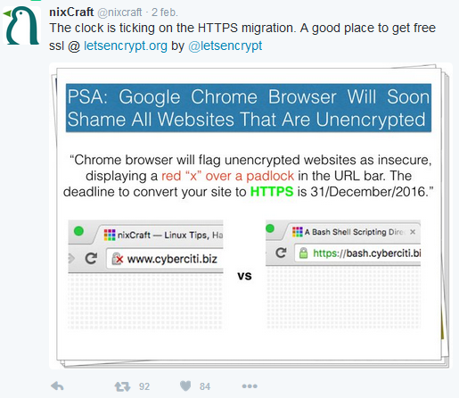

<!-- MarkdownTOC -->

- [HTTPS, HSTS and OpenSSL](#https-hsts-and-openssl)
    - [HSTS](#hsts)
    - [OpenSSL](#openssl)
    - [SSL Server Test](#ssl-server-test)

<!-- /MarkdownTOC -->

# HTTPS, HSTS and OpenSSL
- [letsencrypt.org free ssl](https://letsencrypt.org) Let’s Encrypt is a free, automated, and open certificate authority (CA), run for the public’s benefit. Let’s Encrypt is a service provided by the Internet Security Research Group (ISRG).
    - [Let’s Encrypt — A Free Security Certificate for Your Website 🌟](https://stosu.com/lets-encrypt-a-free-security-certificate-for-your-website/)
- [Enabling HTTPS Without Sacrificing Your Web Performance](http://moz.com/blog/enabling-https-without-sacrificing-web-performance)
- [As sites move to SHA2 encryption, millions face HTTPS lock-out | ZDNet](http://www.zdnet.com/article/as-sha1-winds-down-sha2-leap-will-leave-millions-stranded/)
- [Microsoft may block SHA1 certificates sooner than expected](http://www.zdnet.com/article/as-attacks-near-microsoft-mulls-banning-sha1-certificates/)
- [Google is about to start favoring HTTPS sites in search results](http://thenextweb.com/insider/2015/12/17/unsecured-websites-are-about-to-get-hammered-in-googles-search-ranking/)
- [Dead-simple HTTPS Set up with Docker and Let's Encrypt](http://steveltn.me/2015/12/18/nginx-acme/)
- [nixCraft: How to configure Nginx with free Let’s Encrypt SSL certificate on Debian or Ubuntu Linux](http://www.cyberciti.biz/faq/how-to-configure-nginx-with-free-lets-encrypt-ssl-certificate-on-debian-or-ubuntu-linux/)
- [What ISPs Can See Even When Traffic Is Encrypted With HTTPS and Poor Implantation of VPN](https://www.teamupturn.com/reports/2016/what-isps-can-see)

## HSTS
- [HTTP Strict Transport Security (HSTS)](https://en.wikipedia.org/wiki/HTTP_Strict_Transport_Security) is a web security policy mechanism which helps to protect websites against protocol downgrade attacks and cookie hijacking.

## OpenSSL
- [openssl.org](https://www.openssl.org)
- [openssl-announce](https://mta.openssl.org/pipermail/openssl-announce/)

<blockquote class="twitter-tweet tw-align-center" data-lang="es">
Forthcoming OpenSSL releases fixes many security bugs <a href="https://twitter.com/hashtag/infosec?src=hash">#infosec</a> <a href="https://t.co/ctpfCb8hhu">https://t.co/ctpfCb8hhu</a>
&mdash; nixCraft (@nixcraft) <a href="https://twitter.com/nixcraft/status/702901573148520448">25 de febrero de 2016</a></blockquote>

<blockquote class="twitter-tweet tw-align-center" data-lang="es">
What ISPs Can See Even When Traffic Is Encrypted With HTTPS and Poor Implantation of VPN <a href="https://t.co/az6kv5hvR1">https://t.co/az6kv5hvR1</a> <a href="https://twitter.com/hashtag/privacy?src=hash">#privacy</a> <a href="https://twitter.com/hashtag/security?src=hash">#security</a> <a href="https://twitter.com/hashtag/infosec?src=hash">#infosec</a>
&mdash; nixCraft (@nixcraft) <a href="https://twitter.com/nixcraft/status/709097739301171201">13 de marzo de 2016</a></blockquote>

<iframe src="//www.slideshare.net/slideshow/embed_code/key/KDYbKY2sFxwXCF" width="595" height="485" frameborder="0" marginwidth="0" marginheight="0" scrolling="no" style="border:1px solid #CCC; border-width:1px; margin-bottom:5px; max-width: 100%;" allowfullscreen class="video"> </iframe> 
 <strong> <a href="//www.slideshare.net/guypod/https-what-why-and-how-smashingconf-freiburg-sep-2015" title="HTTPS: What, Why and How (SmashingConf Freiburg, Sep 2015)" target="_blank">HTTPS: What, Why and How (SmashingConf Freiburg, Sep 2015)</a> </strong> from <strong><a href="//www.slideshare.net/guypod" target="_blank">Guy Podjarny</a></strong> 

 
 

<iframe src="//www.slideshare.net/slideshow/embed_code/key/JqlrXhJX6hs9sc" width="595" height="485" frameborder="0" marginwidth="0" marginheight="0" scrolling="no" style="border:1px solid #CCC; border-width:1px; margin-bottom:5px; max-width: 100%;" allowfullscreen class="video"> </iframe> 
 <strong> <a href="//www.slideshare.net/annadeepcrawl/brighton-seo-sep-2015-https-mark-thomas" title="BrightonSEO Sep 2015 - HTTPS | Mark Thomas " target="_blank">BrightonSEO Sep 2015 - HTTPS | Mark Thomas </a> </strong> from <strong><a href="//www.slideshare.net/annadeepcrawl" target="_blank">DeepCrawl Media</a></strong> 

 
 

<iframe src="//www.slideshare.net/slideshow/embed_code/key/7eSs5BnQG2bmhH" width="595" height="485" frameborder="0" marginwidth="0" marginheight="0" scrolling="no" style="border:1px solid #CCC; border-width:1px; margin-bottom:5px; max-width: 100%;" allowfullscreen class="video"> </iframe> 
 <strong> <a href="//www.slideshare.net/fmarier/security-and-privacy-on-the-web-in-2015" title="Security and Privacy on the Web in 2015" target="_blank">Security and Privacy on the Web in 2015</a> </strong> from <strong><a href="//www.slideshare.net/fmarier" target="_blank">Francois Marier</a></strong> 

 

<iframe src="//www.slideshare.net/slideshow/embed_code/key/hKWr4WgNbSPYYV" width="595" height="485" frameborder="0" marginwidth="0" marginheight="0" scrolling="no" style="border:1px solid #CCC; border-width:1px; margin-bottom:5px; max-width: 100%;" allowfullscreen class="video"> </iframe> 
 <strong> <a href="//www.slideshare.net/NicholasSullivan/nginx-https-101-the-basics-getting-started" title="NGINX + HTTPS 101: The basics &amp; getting started" target="_blank">NGINX + HTTPS 101: The basics &amp; getting started</a> </strong> from <strong><a href="//www.slideshare.net/NicholasSullivan" target="_blank">Nick Sullivan</a></strong> 

 

<iframe src="//www.slideshare.net/slideshow/embed_code/key/1SyYpyOmgQTLv8" width="595" height="485" frameborder="0" marginwidth="0" marginheight="0" scrolling="no" style="border:1px solid #CCC; border-width:1px; margin-bottom:5px; max-width: 100%;" allowfullscreen class="video"> </iframe> 
 <strong> <a href="//www.slideshare.net/ColdFusionConference/csp-and-http-headers" title="Csp and http headers" target="_blank">Csp and http headers</a> </strong> from <strong><a href="//www.slideshare.net/ColdFusionConference" target="_blank">ColdFusionConference</a></strong> 

 
 

## SSL Server Test
- [ssllabs.com/ssltest](https://www.ssllabs.com/ssltest)
- [SSL Report: bash.cyberciti.biz](https://www.ssllabs.com/ssltest/analyze.html?d=bash.cyberciti.biz)

<a href='http://www.scoop.it/t/d-n3n/p/4059806440/2016/02/16/why-i-stopped-using-startssl-hint-it-involves-a-chinese-company'>Why I stopped using StartSSL (Hint: it involves a Chinese company)</a>

 
 

<iframe src="//www.slideshare.net/slideshow/embed_code/key/2W5PXYTutNuCfK" width="595" height="485" frameborder="0" marginwidth="0" marginheight="0" scrolling="no" style="border:1px solid #CCC; border-width:1px; margin-bottom:5px; max-width: 100%;" allowfullscreen class="video"> </iframe> 
 <strong> <a href="//www.slideshare.net/wkandek/unsafe-ssl-compact" title="Unsafe SSL webinar" target="_blank">Unsafe SSL webinar</a> </strong> from <strong><a href="//www.slideshare.net/wkandek" target="_blank">Wolfgang Kandek</a></strong> 

 
