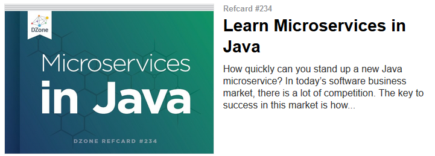
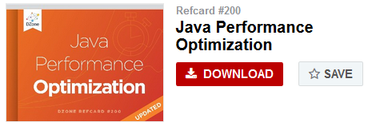
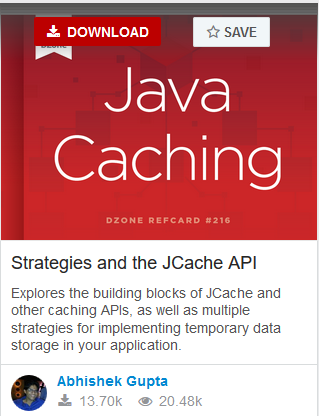

<!-- MarkdownTOC -->

- [Java](#java)
    - [Java on Twitter](#java-on-twitter)
    - [Java Blogs](#java-blogs)
    - [Java refs](#java-refs)
        - [Java Performance](#java-performance)
            - [Garbage Collection and Heap Offloading](#garbage-collection-and-heap-offloading)

<!-- /MarkdownTOC -->

<blockquote class="twitter-tweet tw-align-center" data-lang="es">
Oracle v. Google, and the end of programming as we know it <a href="https://t.co/FNSwzxLd2r">https://t.co/FNSwzxLd2r</a>
&mdash; Northbridge IT (@NorthbridgeIT) <a href="https://twitter.com/NorthbridgeIT/status/733449071483097089">20 de mayo de 2016</a></blockquote>

<blockquote class="twitter-tweet tw-align-center" data-lang="es">
The Oracle-Google case will decide the future of software. Closing arguments start today <a href="https://t.co/Ksa4Iq06Tx">https://t.co/Ksa4Iq06Tx</a>
&mdash; WIRED (@WIRED) <a href="https://twitter.com/WIRED/status/734733377375481857">23 de mayo de 2016</a></blockquote>

<blockquote class="twitter-tweet tw-align-center" data-lang="es">
Jury finds Google’s implementation of Java in Android was fair use <a href="https://t.co/CSFy3AL4d1">https://t.co/CSFy3AL4d1</a>
&mdash; TechCrunch (@TechCrunch) <a href="https://twitter.com/TechCrunch/status/736127580135432192">27 de mayo de 2016</a></blockquote>

<blockquote class="twitter-tweet tw-align-center" data-lang="es">
Why <a href="https://twitter.com/hashtag/Google?src=hash">#Google</a> &#39;s victory in a copyright fight with <a href="https://twitter.com/hashtag/Oracle?src=hash">#Oracle</a> is a big deal via <a href="https://twitter.com/voxdotcom">@voxdotcom</a> <a href="https://t.co/C38CnFdxbG">https://t.co/C38CnFdxbG</a> <a href="https://twitter.com/hashtag/APIs?src=hash">#APIs</a>
&mdash; Anita (@anitaht1011) <a href="https://twitter.com/anitaht1011/status/736215178685997056">27 de mayo de 2016</a></blockquote>

<blockquote class="twitter-tweet tw-align-center" data-lang="es">
<a href="https://twitter.com/hashtag/Google?src=hash">#Google</a> wins against <a href="https://twitter.com/hashtag/Oracle?src=hash">#Oracle</a> but the fight over fair use and <a href="https://twitter.com/hashtag/APIs?src=hash">#APIs</a> drags on <a href="https://t.co/XM1D0yaj75">https://t.co/XM1D0yaj75</a> via <a href="https://twitter.com/mashable">@mashable</a>
&mdash; Codiant (@CodiantInc) <a href="https://twitter.com/CodiantInc/status/737536399264485376">31 de mayo de 2016</a></blockquote>

<blockquote class="twitter-tweet tw-align-center" data-lang="es">
<a href="https://twitter.com/hashtag/APIs?src=hash">#APIs</a> can&#39;t be copyrighted. A loss for <a href="https://twitter.com/hashtag/Oracle?src=hash">#Oracle</a>, and a win for <a href="https://twitter.com/hashtag/opensource?src=hash">#opensource</a>. <a href="https://t.co/7C54tGHX6R">https://t.co/7C54tGHX6R</a>
&mdash; Tim Romero (@timoth3y) <a href="https://twitter.com/timoth3y/status/741112701032665088">10 de junio de 2016</a></blockquote>

<blockquote class="twitter-tweet tw-align-center" data-lang="es">
Red Hat (<a href="https://twitter.com/RedHatNews">@RedHatNews</a>) acquires API management company 3scale, will open-source the code <a href="https://t.co/fuauq0QSJ6">https://t.co/fuauq0QSJ6</a> <a href="https://twitter.com/hashtag/linux?src=hash">#linux</a> <a href="https://twitter.com/hashtag/opensource?src=hash">#opensource</a>
&mdash; nixCraft (@nixcraft) <a href="https://twitter.com/nixcraft/status/745920021730312192">23 de junio de 2016</a></blockquote>

# Java
## Java on Twitter
- [twitter.com/java](https://twitter.com/java)
- [twitter.com/Oraclejavamag](https://twitter.com/Oraclejavamag)
- [twitter.com/JavaOneConf](https://twitter.com/JavaOneConf)
- [twitter.com/javacodegeeks](https://twitter.com/javacodegeeks)
- [twitter.com/Java_EE](https://twitter.com/Java_EE)

<blockquote class="twitter-tweet tw-align-center" data-lang="es">
Java Annotations Are a Big Mistake <a href="https://t.co/8X4HNU0oyI">https://t.co/8X4HNU0oyI</a> via <a href="https://twitter.com/hashtag/MVB?src=hash">#MVB</a> <a href="https://twitter.com/yegor256">@yegor256</a> <a href="https://twitter.com/hashtag/Java?src=hash">#Java</a> <a href="https://t.co/zFQU48tnAY">pic.twitter.com/zFQU48tnAY</a>
&mdash; DZone (@DZone) <a href="https://twitter.com/DZone/status/735470667353706501">25 de mayo de 2016</a></blockquote>

<blockquote class="twitter-tweet tw-align-center" data-lang="es">
11 JPA and Hibernate query hints every developer should know<a href="https://t.co/IXq6npiU9j">https://t.co/IXq6npiU9j</a>  E.g. to set eager/lazy loading at runtime.
&mdash; SQL Performance Tips (@SQLPerfTips) <a href="https://twitter.com/SQLPerfTips/status/744818166379884545">20 de junio de 2016</a></blockquote>

<blockquote class="twitter-tweet tw-align-center" data-lang="es">
<a href="https://t.co/O8COQGR8bD">pic.twitter.com/O8COQGR8bD</a>
&mdash; Phil Webb (@phillip_webb) <a href="https://twitter.com/phillip_webb/status/758824415547109376">29 de julio de 2016</a></blockquote>

## Java Blogs
- [Java Magazine by and for the Java community](http://oraclejavamagazine-digital.com)
- [vladmihalcea.com](http://vladmihalcea.com) 
- [blog.eisele.net](http://blog.eisele.net)
- [Java Advent Blog](http://www.javaadvent.com/)
- [codejava.net](http://www.codejava.net/)
- [javacodegeeks.com](http://www.javacodegeeks.com)
- [DZone/Java](https://dzone.com/java-jdk-development-tutorials-tools-news)
- [genbetadev.com: java-j2ee](http://www.genbetadev.com/categoria/java-j2ee)

## Java refs
- [blog.eisele.net: A Refresher - Top 10 Java EE 7 Backend Features](http://blog.eisele.net/2015/12/a-refresher-top-10-java-ee-7-backend.html)
- [codejava.net: Spring Web MVC Security Basic Example Part 1 with XML Configuration](http://www.codejava.net/frameworks/spring/spring-web-mvc-security-basic-example-part-1-with-xml-configuration)
- [genbetadev.com: Herramientas imprescindibles para un desarrollador de Java (2011)](http://www.genbetadev.com/java-j2ee/herramientas-imprescindibles-para-un-desarrollador-de-java)
- [JavaOne 2015](https://www.youtube.com/playlist?list=PLPIzp-E1msrZz6RNdbDiK0nKuxAUZPs77)
- [javacodegeeks.com: Top 10 Books For Advanced Level Java Developers](http://www.javacodegeeks.com/2013/09/top-10-books-for-advanced-level-java-developers.html)
- [javacodegeeks.com: What’s new in Java 8](http://www.javacodegeeks.com/2013/09/whats-new-in-java-8-part-i-javafx.html)
- [Java EE 6 Cookbook for Securing, Tuning, and Extending Enterprise Applications--Free 60 Page Excerpt](http://javacodegeeks.tradepub.com/free/w_pack28/)
- [javacodegeeks.com: 15 Java Socket Programming, Networking Interview Questions and Answers](http://www.javacodegeeks.com/2014/08/15-java-socket-programming-networking-interview-questions-and-answers.html)
- [Multithreading and Concurrency Interview Questions and Answers – The ULTIMATE List (PDF Download)](http://www.javacodegeeks.com/2014/11/multithreading-concurrency-interview-questions-answers.html)
- [Analysis: Google Moving to OpenJDK, What That Really Means](https://www.codenameone.com/blog/analysis-google-moving-to-openjdk-what-that-really-means.html)
- [Java in 2015 – Major happenings](http://www.javacodegeeks.com/2015/12/java-2015-major-happenings.html)
- [5 Error Tracking Tools Java Developers Should Know](http://www.javacodegeeks.com/2014/09/5-error-tracking-tools-java-developers-should-know.html)
- [Dzone: A Simpler Way to Secure a Java Application](https://dzone.com/articles/a-simpler-way-to-secure-your-java-application-with)
- [javacodegeeks.com: Java 8 Features Tutorial – The ULTIMATE Guide (PDF Download) 🌟](http://www.javacodegeeks.com/2014/05/java-8-features-tutorial.html)
- [Profile of successful Java developer in 2016](http://www.javacodegeeks.com/2015/12/profile-successful-java-developer-2016.html)
- [Introduction to Docker for Java Developers – Getting started with Docker](http://examples.javacodegeeks.com/devops/introduction-docker-java-developers/)
- [dzone: High-Performance Immutable Business Objects](https://dzone.com/articles/high-performance-immutable-business-objects)
- [dzone: Java Annotated Monthly – January 2016.](https://dzone.com/articles/java-annotated-monthly-january-2016) All the latest interesting news and blogs around Java and the JVM languages, including the OpenJDK Android news and some thoughts from Mark Reinhold.
- [javacodegeeks.com: 10 Examples of using ArrayList in Java – Tutorial](http://www.javacodegeeks.com/2016/01/10-examples-using-arraylist-java-tutorial.html)
- [javacodegeeks.com: OutputStyleSheet Example with JSF 2.0](http://examples.javacodegeeks.com/enterprise-java/jsf/outputstylesheet-example-with-jsf-2-0)
- [examples.javacodegeeks.com: Spring MVC Handler Mapping Example](http://examples.javacodegeeks.com/enterprise-java/spring/mvc/spring-mvc-handler-mapping-example)
- [Coordination and service discovery with Apache Zookeeper](http://www.javacodegeeks.com/2013/11/coordination-and-service-discovery-with-apache-zookeeper.html)
- [Multithreading and Concurrency Interview Questions and Answers – The ULTIMATE List (PDF Download)](http://www.javacodegeeks.com/2014/11/multithreading-concurrency-interview-questions-answers.html)
- [DZone: Spring Data Mongodb and Spring Boot](https://dzone.com/articles/spring-data-mongodb-spring-boot) You really can quickly develop a microservice to access MongoDB from Java 8 with little coding. Give it a try... easy like Sunday morning.
- [slideshare: Troubleshooting Live Java Web Applications 🌟🌟](http://www.slideshare.net/SpringCentral/puls-spring-one2gx)
- [genbetadev.com: ¿Por qué empresas que empiezan con lenguajes modernos se vuelven a Java? 🌟🌟](http://www.genbetadev.com/java-j2ee/por-que-empresas-que-empiezan-con-lenguajes-modernos-se-vuelven-a-java)
- [Java EE devotees plot to seize control from Oracle 🌟🌟🌟](http://www.infoworld.com/article/3090528/java/java-ee-devotees-plot-to-seize-control-from-oracle.html)
- [DZone: Convert a List to a Comma-Separated String in Java 8](https://dzone.com/articles/java-8-convert-list-to-string-comma-separated)

<iframe src="//www.slideshare.net/slideshow/embed_code/key/AvZDfkHZEt7HUG" width="595" height="485" frameborder="0" marginwidth="0" marginheight="0" scrolling="no" style="border:1px solid #CCC; border-width:1px; margin-bottom:5px; max-width: 100%;" allowfullscreen class="video"> </iframe> 
 <strong> <a href="//www.slideshare.net/RedHatDevelopers/java-is-not-dead-bob-mcwhirter" title="Java Is Not Dead - Bob McWhirter" target="_blank">Java Is Not Dead - Bob McWhirter</a> </strong> from <strong><a href="//www.slideshare.net/RedHatDevelopers" target="_blank">Red Hat</a></strong> 

 

<blockquote class="twitter-tweet tw-align-center" data-lang="es">
Found something in my cellar that seems to be aging well ;-) <a href="https://t.co/FSoZCBUntW">pic.twitter.com/FSoZCBUntW</a>
&mdash; Mårten Mickos (@martenmickos) <a href="https://twitter.com/martenmickos/status/709086979959304192">13 de marzo de 2016</a></blockquote>

<blockquote class="twitter-tweet tw-align-center" data-lang="es">
<a href="https://twitter.com/hashtag/KnowledgeResource?src=hash">#KnowledgeResource</a>: <a href="https://twitter.com/hashtag/Java?src=hash">#Java</a> Dev <a href="https://t.co/8zO3rrS3Kl">https://t.co/8zO3rrS3Kl</a> <a href="https://twitter.com/CloudBees">@CloudBees</a> <a href="https://twitter.com/newrelic">@newrelic</a> <a href="https://twitter.com/jnbridge">@jnbridge</a> <a href="https://twitter.com/pivotal">@pivotal</a> <a href="https://twitter.com/riverbed">@riverbed</a> <a href="https://twitter.com/jetbrains">@jetbrains</a> <a href="https://t.co/SJP05Jr0AB">pic.twitter.com/SJP05Jr0AB</a>
&mdash; DZone Software (@DZoneSoftware) <a href="https://twitter.com/DZoneSoftware/status/717013243257032704">4 de abril de 2016</a></blockquote>

<iframe width="560" height="315" src="https://www.youtube.com/embed/WAy9mgEYb6o?rel=0" frameborder="0" allowfullscreen class="video"></iframe>

 

<iframe width="560" height="315" src="https://www.youtube.com/embed/pFyLUpCQK_4?rel=0" frameborder="0" allowfullscreen class="video"></iframe>

 

<iframe src="//www.slideshare.net/slideshow/embed_code/key/kqIovbUCru98tX" width="595" height="485" frameborder="0" marginwidth="0" marginheight="0" scrolling="no" style="border:1px solid #CCC; border-width:1px; margin-bottom:5px; max-width: 100%;" allowfullscreen class="video"> </iframe> 
 <strong> <a href="//www.slideshare.net/javafxpert/whats-new-in-java-8-34243710" title="What&#x27;s New in Java 8" target="_blank">What&#x27;s New in Java 8</a> </strong> from <strong><a target="_blank" href="//www.slideshare.net/javafxpert">javafxpert</a></strong> 

 

<iframe src="//www.slideshare.net/slideshow/embed_code/key/KuokrSCp9adRA8" width="595" height="485" frameborder="0" marginwidth="0" marginheight="0" scrolling="no" style="border:1px solid #CCC; border-width:1px; margin-bottom:5px; max-width: 100%;" allowfullscreen class="video"> </iframe> 
 <strong> <a href="//www.slideshare.net/SimonRitter/javase8-55thingsv2-sritter" title="55 New Features in Java SE 8" target="_blank">55 New Features in Java SE 8</a> </strong> from <strong><a target="_blank" href="//www.slideshare.net/SimonRitter">Simon Ritter</a></strong> 

 

<iframe src="//www.slideshare.net/slideshow/embed_code/key/g0xZOrGp6f0UWc" width="595" height="485" frameborder="0" marginwidth="0" marginheight="0" scrolling="no" style="border:1px solid #CCC; border-width:1px; margin-bottom:5px; max-width: 100%;" allowfullscreen class="video"> </iframe> 
 <strong> <a href="//www.slideshare.net/scolebourne/java-se-8-best-practices-53975908" title="Java SE 8 best practices" target="_blank">Java SE 8 best practices</a> </strong> from <strong><a target="_blank" href="//www.slideshare.net/scolebourne">Stephen Colebourne</a></strong> 

 

### Java Performance
- [DZone: String Concatenation's Effect on Performance](https://dzone.com/articles/string-concatentions-effect-on-performance) Don’t use the string concatenation operator to combine more than a few strings unless performance is irrelevant. Use StringBuilder’s append method instead. 
- [DZone refcard: java performance optimization 🌟🌟🌟🌟](https://dzone.com/refcardz/java-performance-optimization) Tools and Techniques for Turbocharged Apps
- [DZone: Performance Improvement in Java Applications: ORM/JPA 🌟🌟🌟](https://dzone.com/articles/performance-improvement-in-java-applications-orm-j)

#### Garbage Collection and Heap Offloading
- [Tecnologías de Heap-Offloading son EHcache, Memcached, Jillegal library, etc.](http://ehcache.org/)
- [Jillegal OffHeap Module](https://github.com/serkan-ozal/jillegal)
- [Free eGuide: JVM Troubleshooting Guide](http://freepromagazine.blogspot.de/2014/07/free-eguide-jvm-troubleshooting-guide.html)
- [Cambios importantes en la gestión de memoria de Java 8 de Oracle](http://karunsubramanian.com/websphere/one-important-change-in-memory-management-in-java-8/)
- [PermGen eliminado](http://www.infoq.com/articles/Java-PERMGEN-Removed)
- [On heap vs off heap memory usage](http://www.javacodegeeks.com/2014/12/on-heap-vs-off-heap-memory-usage.html)
- [How Garbage Collection differs in the three big JVMs](http://apmblog.dynatrace.com/2011/05/11/how-garbage-collection-differs-in-the-three-big-jvms/)
- [cubrid.org: How to Tune Java Garbage Collection](http://www.cubrid.org/blog/dev-platform/how-to-tune-java-garbage-collection)
- [DZone: Revisiting the Advanced Theories of ‘Java Garbage Collection’ 🌟🌟🌟](https://dzone.com/articles/revisiting-the-advanced-theories-of-java-garbage-c)
- [DZone: Understanding the Java Memory Model and Garbage Collection 🌟🌟🌟](https://dzone.com/articles/understanding-the-java-memory-model-and-the-garbag) In this article we will try to understand the Java memory model and how garbage collection works. In this article I have used JDK8 Oracle Hot Spot 64 bit JVM. First let me depict the different memory areas available for Java processes.

<iframe src="//www.slideshare.net/slideshow/embed_code/key/NpUYrnBQ59fyV6" width="595" height="485" frameborder="0" marginwidth="0" marginheight="0" scrolling="no" style="border:1px solid #CCC; border-width:1px; margin-bottom:5px; max-width: 100%;" allowfullscreen class="video"> </iframe> 
 <strong> <a href="//www.slideshare.net/feuteston/jvm-internals-2015corkdevio" title="JVM Internals (2015)" target="_blank">JVM Internals (2015)</a> </strong> from <strong><a href="//www.slideshare.net/feuteston" target="_blank">Luiz Fernando Teston</a></strong> 

 

<blockquote class="twitter-tweet tw-align-center" data-lang="es">
really awesome series on jvm garbage collection from <a href="https://twitter.com/gphat">@gphat</a> <a href="https://t.co/w4176p2ahq">https://t.co/w4176p2ahq</a> <a href="https://t.co/crmiXdLhBh">https://t.co/crmiXdLhBh</a> <a href="https://t.co/sKGxNXFuto">https://t.co/sKGxNXFuto</a>
&mdash; Julia Evans (@b0rk) <a href="https://twitter.com/b0rk/status/723894833824325632">23 de abril de 2016</a></blockquote>

<blockquote class="twitter-tweet tw-align-center" data-lang="es">
[NEW REFCARD]  Java Performance Optimization <a href="https://t.co/azKM9r69Lb">https://t.co/azKM9r69Lb</a> via <a href="https://twitter.com/AppDynamics">@AppDynamics</a> <a href="https://twitter.com/hashtag/JVM?src=hash">#JVM</a> <a href="https://t.co/Fp88Wr3LTA">pic.twitter.com/Fp88Wr3LTA</a>
&mdash; DZone (@DZone) <a href="https://twitter.com/DZone/status/729671300235530240">9 de mayo de 2016</a></blockquote>

