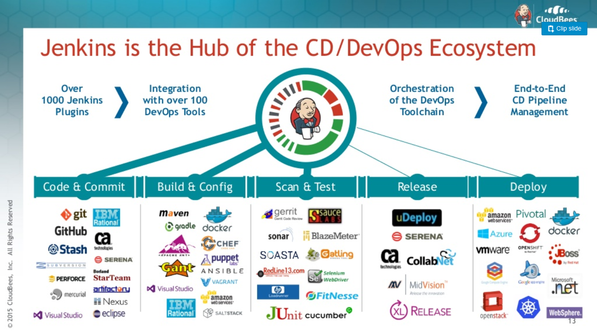
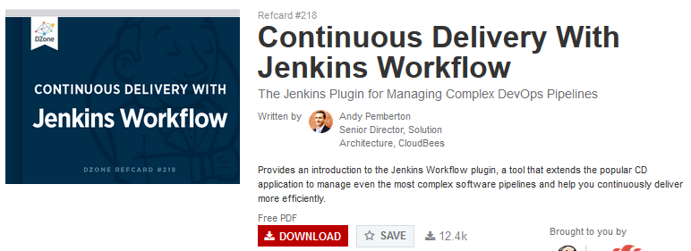
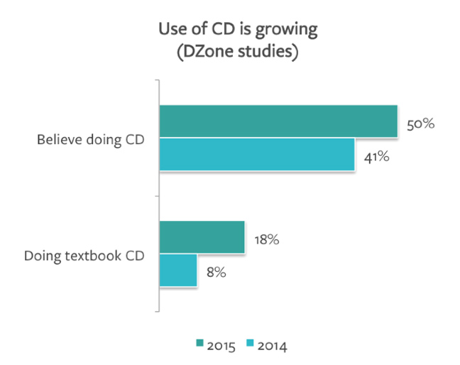
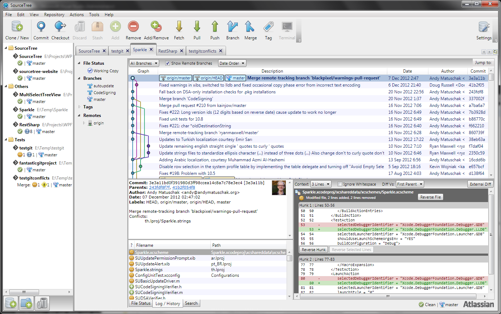

<!-- MarkdownTOC -->

- [Continuous Integration Tools](#continuous-integration-tools)
    - [CI Jenkins](#ci-jenkins)
        - [Jenkins on Twitter](#jenkins-on-twitter)
        - [Jenkins slides](#jenkins-slides)
        - [softwarefactory-project.io](#softwarefactory-projectio)
    - [Travis CI](#travis-ci)
        - [Travis on Twitter](#travis-on-twitter)
    - [CI Docker](#ci-docker)
    - [CI RPM build](#ci-rpm-build)
    - [CI Maven and Gradle](#ci-maven-and-gradle)
    - [Deploying PHP Applications](#deploying-php-applications)
    - [Git](#git)
        - [Git on Twitter](#git-on-twitter)
        - [Git clients](#git-clients)

<!-- /MarkdownTOC -->

<blockquote class="twitter-tweet tw-align-center" data-lang="es">
<a href="https://twitter.com/hashtag/Goodreads?src=hash">#Goodreads</a>: How We Build Code at <a href="https://twitter.com/netflix">@Netflix</a> <a href="https://t.co/FBdA5yshQg">https://t.co/FBdA5yshQg</a> <a href="https://twitter.com/hashtag/programming?src=hash">#programming</a>
&mdash; nixCraft (@nixcraft) <a href="https://twitter.com/nixcraft/status/707679713632759808">marzo 9, 2016</a></blockquote>

# Continuous Integration Tools
## CI Jenkins
- [jenkins.io (new jenkins 2.0 site)](https://jenkins.io/)
- [jenkins-ci.org](https://jenkins-ci.org)
- [AWS continuous integration](https://aws.amazon.com/devops/continuous-integration/)
- [Cloudbees Jenkins Platform](https://www.cloudbees.com/products/cloudbees-jenkins-platform)
- [Latest Jenkins related links can be found on @reddit.com/r/jenkinsci](https://www.reddit.com/r/jenkinsci/)
- [Jenkins User Conference West 2015 - Slides available](https://www.cloudbees.com/jenkins/juc-2015/us-west)
	- [Jenkins and Docker: Next Generation Continuous Delivery](https://www.linkedin.com/pulse/jenkins-docker-next-generation-continuous-delivery-khadija-kerissi)
	- [Tutorial: Gestión de Configuración – Ansible + Vagrant + Jenkins](http://www.carlessanagustin.com/2015/08/20/tutorial-gestion-de-configuracion-ansible-vagrant-jenkins/)
	- [Jenkins Docker Plugin](https://wiki.jenkins-ci.org/display/JENKINS/Docker+Plugin)
	- [jenkins-rpm-builder, wrapper for easy building of rpm packages in jenkins ci server](https://github.com/jhrcz/jenkins-rpm-builder)
- [DZone: Jenkins Pipeline - Software Delivery Made Easy 🌟🌟🌟](https://dzone.com/articles/jenkins-pipeline-software-delivery-made-easy) 
- [Jenkins CD and Pipelines Microsite](https://jenkins.io/solutions/pipeline/)
- [DZone: Continuous Delivery With Jenkins Workflow 🌟🌟🌟](https://dzone.com/refcardz/continuous-delivery-with-jenkins-workflow) The Jenkins Plugin for Managing Complex DevOps Pipelines

<blockquote class="twitter-tweet tw-align-center" data-lang="es">
&quot;Why Jenkins is becoming the engine of devops&quot; <a href="https://t.co/28OYn8mSjR">https://t.co/28OYn8mSjR</a> <a href="https://twitter.com/openshift">@OpenShift</a>
&mdash; Steve Speicher (@sspeiche) <a href="https://twitter.com/sspeiche/status/711903617767317504">21 de marzo de 2016</a></blockquote>

<blockquote class="twitter-tweet tw-align-center" data-lang="es">
Get started with brand new Jenkins 2.0 with Docker <a href="https://t.co/qju4n52Rg3">https://t.co/qju4n52Rg3</a>  <a href="https://twitter.com/hashtag/docker?src=hash">#docker</a> <a href="https://t.co/par4rc034h">pic.twitter.com/par4rc034h</a>
&mdash; DevOps Guy (@DevopsG) <a href="https://twitter.com/DevopsG/status/717508097833435136">6 de abril de 2016</a></blockquote>

<blockquote class="twitter-tweet tw-align-center" data-lang="es">
Jenkins Pipeline - Software Delivery Made Easy <a href="https://t.co/4Ek45kyTSa">https://t.co/4Ek45kyTSa</a> via <a href="https://twitter.com/singh_harpreet">@singh_harpreet</a> <a href="https://t.co/h0lkrK3rNJ">pic.twitter.com/h0lkrK3rNJ</a>
&mdash; DZone (@DZone) <a href="https://twitter.com/DZone/status/739577798231216128">5 de junio de 2016</a></blockquote>

<iframe src="//www.slideshare.net/slideshow/embed_code/key/cLH7UxrJLzcZLX" width="595" height="485" frameborder="0" marginwidth="0" marginheight="0" scrolling="no" style="border:1px solid #CCC; border-width:1px; margin-bottom:5px; max-width: 100%;" allowfullscreen class="video"> </iframe> 
 <strong> <a href="//www.slideshare.net/dcjuengst/cloudbeesjenkinsplatform2016" title="Master Continuous Delivery with CloudBees Jenkins Platform" target="_blank">Master Continuous Delivery with CloudBees Jenkins Platform</a> </strong> from <strong><a href="//www.slideshare.net/dcjuengst" target="_blank">dcjuengst</a></strong> 

 

<iframe width="560" height="315" src="https://www.youtube.com/embed/vQSpztWcGmw?rel=0" frameborder="0" allowfullscreen class="video"></iframe>

 

<iframe width="560" height="315" src="https://www.youtube.com/embed/OfptBK8AB_c?rel=0" frameborder="0" allowfullscreen class="video"></iframe>

 

<iframe width="560" height="315" src="https://www.youtube.com/embed/M-rxJBdYIrw?rel=0" frameborder="0" allowfullscreen class="video"></iframe>

 

<iframe style="border: none" src="//html5-player.libsyn.com/embed/episode/id/4319605/height/90/width/640/theme/custom/autoplay/no/autonext/no/thumbnail/yes/preload/no/no_addthis/no/direction/backward/render-playlist/no/custom-color/006096/" height="90" width="640" scrolling="no"  allowfullscreen webkitallowfullscreen mozallowfullscreen oallowfullscreen msallowfullscreen></iframe>

<iframe style="border: none" src="//html5-player.libsyn.com/embed/episode/id/4319626/height/90/width/640/theme/custom/autoplay/no/autonext/no/thumbnail/yes/preload/no/no_addthis/no/direction/backward/render-playlist/no/custom-color/006096/" height="90" width="640" scrolling="no"  allowfullscreen webkitallowfullscreen mozallowfullscreen oallowfullscreen msallowfullscreen></iframe>
 

### Jenkins on Twitter
- [twitter.com/jenkinsci](https://twitter.com/jenkinsci)

### Jenkins slides

<iframe src="//www.slideshare.net/slideshow/embed_code/key/Gxa29QTppYwhzc" width="595" height="485" frameborder="0" marginwidth="0" marginheight="0" scrolling="no" style="border:1px solid #CCC; border-width:1px; margin-bottom:5px; max-width: 100%;" allowfullscreen class="video"> </iframe> 
 <strong> <a href="//www.slideshare.net/andrewbayer/seven-habits-of-highly-effective-jenkins-users-2014-edition" title="Seven Habits of Highly Effective Jenkins Users (2014 edition!)" target="_blank">Seven Habits of Highly Effective Jenkins Users (2014 edition!)</a> </strong> from <strong><a target="_blank" href="//www.slideshare.net/andrewbayer">Andrew Bayer</a></strong> 

 

<iframe src="//www.slideshare.net/slideshow/embed_code/key/88Lal2BncXwMBk" width="595" height="485" frameborder="0" marginwidth="0" marginheight="0" scrolling="no" style="border:1px solid #CCC; border-width:1px; margin-bottom:5px; max-width: 100%;" allowfullscreen class="video"> </iframe> 
 <strong> <a href="//www.slideshare.net/asotobu/jenkins-docker" title="Jenkins Docker" target="_blank">Jenkins Docker</a> </strong> from <strong><a target="_blank" href="//www.slideshare.net/asotobu">Alex Soto</a></strong> 

 

<iframe src="//www.slideshare.net/slideshow/embed_code/key/wlyRDI5S2hmhcd" width="595" height="485" frameborder="0" marginwidth="0" marginheight="0" scrolling="no" style="border:1px solid #CCC; border-width:1px; margin-bottom:5px; max-width: 100%;" allowfullscreen class="video"> </iframe> 
 <strong> <a href="//www.slideshare.net/EdurekaIN/getting-started-with-jenkins" title="Getting started with Jenkins" target="_blank">Getting started with Jenkins</a> </strong> from <strong><a href="//www.slideshare.net/EdurekaIN" target="_blank">Edureka!</a></strong> 

 

<iframe src="//www.slideshare.net/slideshow/embed_code/key/sMuB2EAyZhyB7u" width="595" height="485" frameborder="0" marginwidth="0" marginheight="0" scrolling="no" style="border:1px solid #CCC; border-width:1px; margin-bottom:5px; max-width: 100%;" allowfullscreen class="video"> </iframe> 
 <strong> <a href="//www.slideshare.net/Docker/continuous-integration-with-jenkins-docker-and-compose" title="DockerCon EU 2015: Continuous Integration with Jenkins, Docker and Compose" target="_blank">DockerCon EU 2015: Continuous Integration with Jenkins, Docker and Compose</a> </strong> from <strong><a href="//www.slideshare.net/Docker" target="_blank">Docker, Inc.</a></strong>

 

<iframe src="//www.slideshare.net/slideshow/embed_code/key/rF5xrvdfL3HdAo" width="595" height="485" frameborder="0" marginwidth="0" marginheight="0" scrolling="no" style="border:1px solid #CCC; border-width:1px; margin-bottom:5px; max-width: 100%;" allowfullscreen class="video"> </iframe> 
 <strong> <a href="//www.slideshare.net/carlossg/using-docker-for-testing" title="Using Docker for Testing" target="_blank">Using Docker for Testing</a> </strong> from <strong><a href="//www.slideshare.net/carlossg" target="_blank">Carlos Sanchez</a></strong>

 

### softwarefactory-project.io
- [softwarefactory-project.io](http://softwarefactory-project.io) 
    - [Introduction to Software Factory](http://softwarefactory-project.io/docs/intro.html)
- [github 🌟](https://github.com/redhat-cip/software-factory)

## Travis CI
- [Travis CI](https://travis-ci.org/)
- [bencane.com: Using Travis CI to test Docker builds](http://bencane.com/2016/01/11/using-travis-ci-to-test-docker-builds/)

<iframe src="https://player.vimeo.com/video/58713038" width="640" height="360" frameborder="0" webkitallowfullscreen mozallowfullscreen allowfullscreen class="video"></iframe>

 

### Travis on Twitter
- [twitter.com/travisci](https://twitter.com/travisci)
- [twitter.com/traviscistatus](https://twitter.com/traviscistatus)

## CI Docker
- [pyvideo.org: Ship Python Apps with Docker!](http://pyvideo.org/video/3646/ship-python-apps-with-docker) Build a docker image for a simple python app and then deploy it to a computer, EC2, and Google cloud engine

<blockquote class="twitter-tweet tw-align-center" data-lang="es">
How to build CI/CD pipelines for your applications with Docker Hub <a href="https://t.co/zgmiWAOck8">https://t.co/zgmiWAOck8</a> via <a href="https://twitter.com/MBuffenoir">@MBuffenoir</a> <a href="https://t.co/zExQ9v1DPg">pic.twitter.com/zExQ9v1DPg</a>
&mdash; The Linux Foundation (@linuxfoundation) <a href="https://twitter.com/linuxfoundation/status/739351300756901888">5 de junio de 2016</a></blockquote>

<iframe width="560" height="315" src="https://www.youtube.com/embed/PMt98G4MOKg" frameborder="0" allowfullscreen class="video"></iframe>

 

## CI RPM build
- [Continuous integration + rpmbuild + Docker](https://access.redhat.com/discussions/1174853)
	- [Build native RPM packages by leveraging docker capabilities](https://github.com/alanfranz/docker-rpm-builder)
	- [Building RPM with Docker images](http://blog.chmouel.com/2014/12/31/building-rpm-with-docker-images/)
	- [Reddit: Creating internal RPM build environment?](https://www.reddit.com/r/linuxadmin/comments/2ke2vs/creating_internal_rpm_build_environment/)

## CI Maven and Gradle
- [Java: Maven vs Gradle](https://dzone.com/articles/maven-vs-gradle-one-year-later)
- [Gradle | Modern Open-Source Enterprise Build Automation](http://gradle.org/)
- [javacodegeeks.com: Setting up your application server with maven](http://www.javacodegeeks.com/2013/10/setting-up-your-application-server-with-maven.html)

## Deploying PHP Applications
- [deployingphpapplications.com](http://www.deployingphpapplications.com/)
	- [github: book Deploying PHP applications](https://github.com/modess/deploying-php-applications)

## Git
- [A tidy, linear Git history](http://www.bitsnbites.eu/?p=221)
- [One Million Downloads of GitLab 🌟](https://about.gitlab.com/2015/10/29/one-million-downloads-of-gitlab/)
    - [Setting up GitLab Runner For Continuous Integration](https://about.gitlab.com/2016/03/01/gitlab-runner-with-docker/)
- [git.training](http://git.training/)
- [training.github.com - GitHub Training](https://training.github.com/classes/developers/)
	- [GitHub lanza su propio curso de formación; objetivo:Que los desarrolladores exploten todo su potencial](http://www.genbeta.com/comparativa/github-lanza-su-propio-curso-de-formacion-el-objetivo-que-los-desarrolladores-exploten-todo-su-potencial)
- [Git Magic - training](http://www-cs-students.stanford.edu/~blynn/gitmagic/)
- [opentechschool.github.io - Social Coding with GitHub. This is the course content for Social Coding with GitHub](http://opentechschool.github.io/social-coding/)
- [Git-scm.com](http://git-scm.com/)
- [Git-scm ebook - free](http://git-scm.com/book/en/v2)
- [Git-Flow tutorial](https://es.atlassian.com/git/tutorials/comparing-workflowhttps://github.com/wdm0006/git-pandass/gitflow-workflow)
- [Git HowTo: How to get started with GIT and work with GIT Remote Repo](https://www3.ntu.edu.sg/home/ehchua/programming/howto/Git_HowTo.html)
- [Associating text editors with Git](https://help.github.com/articles/associating-text-editors-with-git/)
- [Using GIT to backup your website files on linux](http://techarena51.com/index.php/using-git-backup-website-files-on-linux/)
- [Sysadmincasts.com: Git to Puppet Deployment Workflow](https://sysadmincasts.com/episodes/33-git-to-puppet-deployment-workflow)
- [David Baumgold - Advanced Git - PyCon 2015](https://www.youtube.com/watch?v=4EOZvow1mk4)
- [Newrelic: GitHub Flow - Collaborating effectively using Git and GitHub](https://newrelic.com/webinar/github-for-teams)
- [Git Recipes. A Problem-Solution Approach](http://it-ebooks.info/book/3259/)
- [Git Pocket Guide](http://it-ebooks.info/book/2517/)
- [Git Pandas. A wrapper around gitpython to produce pandas dataframes for analysis](https://github.com/wdm0006/git-pandas)
- [Neat new features in Git 2.7](https://developer.atlassian.com/blog/2016/01/git-2.7-release/)
- [slideshare: Git, GitHub y Markdown](http://es.slideshare.net/asanzdiego/git-github-y-markdown)
- [At the Intersection of Git and DevOps](http://devops.com/2016/02/10/at-the-intersection-of-git-and-devops/) IT managers face the challenge of reconciling the needs of developers with the needs of the larger organization, especially when it comes to DevOps. In this article, we will examine some of these challenges and suggest best practices that can alleviate them.
- [opensource.com: Version control isn't just for programmers](https://opensource.com/life/16/2/version-control-isnt-just-programmers)
- [opensource.com: Using Git in the classroom 🌟](https://opensource.com/education/16/1/git-education-classroom)
- [medium: Understanding git for real by exploring the .git directory](https://medium.com/@pierreda/understanding-git-for-real-by-exploring-the-git-directory-1e079c15b807)
- [Git Cheat Sheet for Sysadmin/DevOps 🌟](http://zeroturnaround.com/wp-content/uploads/2016/02/Git-Cheat-Sheet.png)
- [DZone refcard: Getting started with Git 🌟🌟](https://dzone.com/refcardz/getting-started-git)
- [tutorialzine.com: Learn Git in 30 Minutes 🌟🌟🌟](http://tutorialzine.com/2016/06/learn-git-in-30-minutes/)
- [3 easy steps to submitting a GitHub pull request](https://opensource.com/life/16/3/submit-github-pull-request)

 

<blockquote class="twitter-tweet tw-align-center" data-lang="es">
Git Commands &amp; Best Practices Cheat Sheet For Sysadmin/DevOPS. Large version  <a href="https://t.co/Df4PQfXugz">https://t.co/Df4PQfXugz</a> <a href="https://twitter.com/hashtag/programming?src=hash">#programming</a> <a href="https://t.co/mBqSOfYEaH">pic.twitter.com/mBqSOfYEaH</a>
&mdash; nixCraft (@nixcraft) <a href="https://twitter.com/nixcraft/status/702915958118060033">25 de febrero de 2016</a></blockquote>

<blockquote class="twitter-tweet tw-align-center" data-lang="es">
Version control isn&#39;t just for programmers <a href="https://t.co/crPQTGPyiP">https://t.co/crPQTGPyiP</a> by <a href="https://twitter.com/monsterjavaguns">@monsterjavaguns</a> <a href="https://t.co/Bh7oGvWb20">pic.twitter.com/Bh7oGvWb20</a>
&mdash; Open Source Way (@opensourceway) <a href="https://twitter.com/opensourceway/status/700666648349376513">febrero 19, 2016</a></blockquote>

<blockquote class="twitter-tweet tw-align-center" data-lang="es">
You might want to hug this book: <a href="https://twitter.com/FunnelFiasco">@funnelfiasco</a> reviews &quot;Git for Teams&quot; <a href="https://t.co/9mnrQVBZL2">https://t.co/9mnrQVBZL2</a> <a href="https://t.co/wvoWJPWyKv">pic.twitter.com/wvoWJPWyKv</a>
&mdash; Open Source Way (@opensourceway) <a href="https://twitter.com/opensourceway/status/700234046941466625">febrero 18, 2016</a></blockquote>

<blockquote class="twitter-tweet tw-align-center" data-lang="es">
“Understanding git for real by exploring the .git directory” by <a href="https://twitter.com/PierreDeWulf">@PierreDeWulf</a> <a href="https://t.co/19QmkyK5JT">https://t.co/19QmkyK5JT</a>
&mdash; Rebecca Slatkin (@RebeccaSlatkin) <a href="https://twitter.com/RebeccaSlatkin/status/701496411150356480">febrero 21, 2016</a></blockquote>

<blockquote class="twitter-tweet tw-align-center" data-lang="es">
Migrating your <a href="https://twitter.com/gitlab">@Gitlab</a> infrastructure into <a href="https://twitter.com/docker">@Docker</a> by <a href="https://twitter.com/pedrofortuna">@pedrofortuna</a>: <a href="https://t.co/MXlcMKuwOK">https://t.co/MXlcMKuwOK</a> via <a href="https://twitter.com/Jscrambler">@Jscrambler</a> <a href="https://twitter.com/hashtag/devops?src=hash">#devops</a> <a href="https://t.co/0M4XIsLgb5">pic.twitter.com/0M4XIsLgb5</a>
&mdash; Docker (@docker) <a href="https://twitter.com/docker/status/725367167110287360">27 de abril de 2016</a></blockquote>

<iframe src="//www.slideshare.net/slideshow/embed_code/key/fTXc4C0qukQZVI" width="595" height="485" frameborder="0" marginwidth="0" marginheight="0" scrolling="no" style="border:1px solid #CCC; border-width:1px; margin-bottom:5px; max-width: 100%;" allowfullscreen class="video"> </iframe> 
 <strong> <a href="//www.slideshare.net/HubSpot/git-101-git-and-github-for-beginners" title="Git 101: Git and GitHub for Beginners " target="_blank">Git 101: Git and GitHub for Beginners </a> </strong> from <strong><a href="//www.slideshare.net/HubSpot" target="_blank">HubSpot</a></strong> 

 

<iframe src="//www.slideshare.net/slideshow/embed_code/key/oqkuFpIFrdOjWb" width="595" height="485" frameborder="0" marginwidth="0" marginheight="0" scrolling="no" style="border:1px solid #CCC; border-width:1px; margin-bottom:5px; max-width: 100%;" allowfullscreen class="video"> </iframe> 
 <strong> <a href="//www.slideshare.net/akrish/introduction-to-gitgithub-a-beginners-guide" title="Introduction to Git/Github - A beginner&#x27;s guide" target="_blank">Introduction to Git/Github - A beginner&#x27;s guide</a> </strong> from <strong><a href="//www.slideshare.net/akrish" target="_blank">Rohit Arora</a></strong> 

 

<iframe src="//www.slideshare.net/slideshow/embed_code/key/G6nfT5Z7tbpsaP" width="595" height="485" frameborder="0" marginwidth="0" marginheight="0" scrolling="no" style="border:1px solid #CCC; border-width:1px; margin-bottom:5px; max-width: 100%;" allowfullscreen class="video"> </iframe> 
 <strong> <a href="//www.slideshare.net/annegentle/git-and-github-for-documentation" title="Git and GitHub for Documentation" target="_blank">Git and GitHub for Documentation</a> </strong> from <strong><a href="//www.slideshare.net/annegentle" target="_blank">Anne Gentle</a></strong> 

 

<iframe src="//www.slideshare.net/slideshow/embed_code/key/Gbh3letZNByUIW" width="595" height="485" frameborder="0" marginwidth="0" marginheight="0" scrolling="no" style="border:1px solid #CCC; border-width:1px; margin-bottom:5px; max-width: 100%;" allowfullscreen class="video"> </iframe> 
 <strong> <a href="//www.slideshare.net/ottokekalainen/git-best-practices-workshop" title="Git best practices workshop" target="_blank">Git best practices workshop</a> </strong> from <strong><a href="//www.slideshare.net/ottokekalainen" target="_blank">Otto Kekäläinen</a></strong> 

 

<iframe src="//www.slideshare.net/slideshow/embed_code/key/pe2AAg6OQ07BZk" width="595" height="485" frameborder="0" marginwidth="0" marginheight="0" scrolling="no" style="border:1px solid #CCC; border-width:1px; margin-bottom:5px; max-width: 100%;" allowfullscreen class="video"> </iframe> 
 <strong> <a href="//www.slideshare.net/mailtoshinu/gitflow-sourcetree-and-gitlab" title="GitFlow, SourceTree and GitLab" target="_blank">GitFlow, SourceTree and GitLab</a> </strong> from <strong><a href="//www.slideshare.net/mailtoshinu" target="_blank">Shinu Suresh</a></strong> 

 

<iframe src="//www.slideshare.net/slideshow/embed_code/key/FNcboHLRiBKq93" width="595" height="485" frameborder="0" marginwidth="0" marginheight="0" scrolling="no" style="border:1px solid #CCC; border-width:1px; margin-bottom:5px; max-width: 100%;" allowfullscreen class="video"> </iframe> 
 <strong> <a href="//www.slideshare.net/engineerball/gitlab-training-with-git-and-sourcetree" title="Gitlab Training with GIT and SourceTree" target="_blank">Gitlab Training with GIT and SourceTree</a> </strong> from <strong><a href="//www.slideshare.net/engineerball" target="_blank">engineerball</a></strong> 

 

<blockquote class="twitter-tweet tw-align-center" data-lang="es">
$ git push --force origin master <a href="https://t.co/F2enmNzlTj">pic.twitter.com/F2enmNzlTj</a>
&mdash; Jose Ignacio Andres (@joserobleda) <a href="https://twitter.com/joserobleda/status/707846636345683968">10 de marzo de 2016</a></blockquote>

<blockquote class="twitter-tweet tw-align-center" data-lang="es">
How to close issues in GitHub with respect.  👏 to <a href="https://twitter.com/BenLesh">@BenLesh</a> <a href="https://t.co/KOtnKWYHel">pic.twitter.com/KOtnKWYHel</a>
&mdash; André Staltz (@andrestaltz) <a href="https://twitter.com/andrestaltz/status/711103704280264704">19 de marzo de 2016</a></blockquote>

<blockquote class="twitter-tweet tw-align-center" data-lang="es">
3 easy steps to submitting a GitHub pull request: <a href="https://t.co/KMx1jHn8h8">https://t.co/KMx1jHn8h8</a>
&mdash; Open Source Way (@opensourceway) <a href="https://twitter.com/opensourceway/status/738826844179292161">3 de junio de 2016</a></blockquote>

<iframe src="https://player.vimeo.com/video/50412080" width="640" height="360" frameborder="0" webkitallowfullscreen mozallowfullscreen allowfullscreen class="video"></iframe>

 

<iframe src="https://player.vimeo.com/video/44518572" width="640" height="360" frameborder="0" webkitallowfullscreen mozallowfullscreen allowfullscreen class="video"></iframe>

 

### Git on Twitter
- [twitter.com/github](https://twitter.com/github)
- [twitter.com/githubstatus](https://twitter.com/githubstatus)
- [twitter.com/BestGit](https://twitter.com/BestGit)
- [twitter.com/GitHubJobs](https://twitter.com/GitHubJobs)
- [twitter.com/GitHubCommunity](https://twitter.com/GitHubCommunity)
- [GitHubHelp](https://twitter.com/GitHubHelp)
- [twitter.com/GitHubEducation](https://twitter.com/GitHubEducation)
- [twitter.com/planetgit](https://twitter.com/planetgit)
- [twitter.com/git_tricks](https://twitter.com/git_tricks)
- [twitter.com/GitForWindows](https://twitter.com/GitForWindows)
- [twitter.com/progitbook](https://twitter.com/progitbook)
- [twitter.com/gitready](https://twitter.com/gitready)

<blockquote class="twitter-tweet tw-align-center" data-lang="es">
Learn Git in 30 Minutes <a href="https://t.co/Adq18pbhBK">https://t.co/Adq18pbhBK</a>  <a href="https://twitter.com/hashtag/programming?src=hash">#programming</a> <a href="https://twitter.com/hashtag/devops?src=hash">#devops</a> <a href="https://twitter.com/hashtag/sysadmin?src=hash">#sysadmin</a>
&mdash; nixCraft (@nixcraft) <a href="https://twitter.com/nixcraft/status/739020546231275520">4 de junio de 2016</a></blockquote>

### Git clients
- [SourceTree](https://www.sourcetreeapp.com/)
- [git-scm clients](http://git-scm.com/downloads)
- [TortoiseGit](https://tortoisegit.org/)
- [Git for Windows](https://git-for-windows.github.io)
    - [Need an SSH client on Windows? Don't use Putty or CygWin...use Git](http://www.hurryupandwait.io/blog/need-an-ssh-client-on-windows-dont-use-putty-or-cygwinuse-git)
- [Git Extensions](http://sourceforge.net/projects/gitextensions/) Git Extensions is a toolkit aimed at making working with Git on Windows more intuitive

<iframe width="560" height="315" src="https://www.youtube.com/embed/Mgme0yy9nXg?rel=0" frameborder="0" allowfullscreen class="video"></iframe>

 