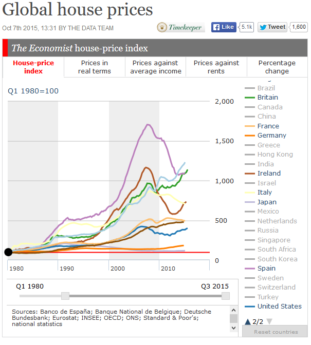
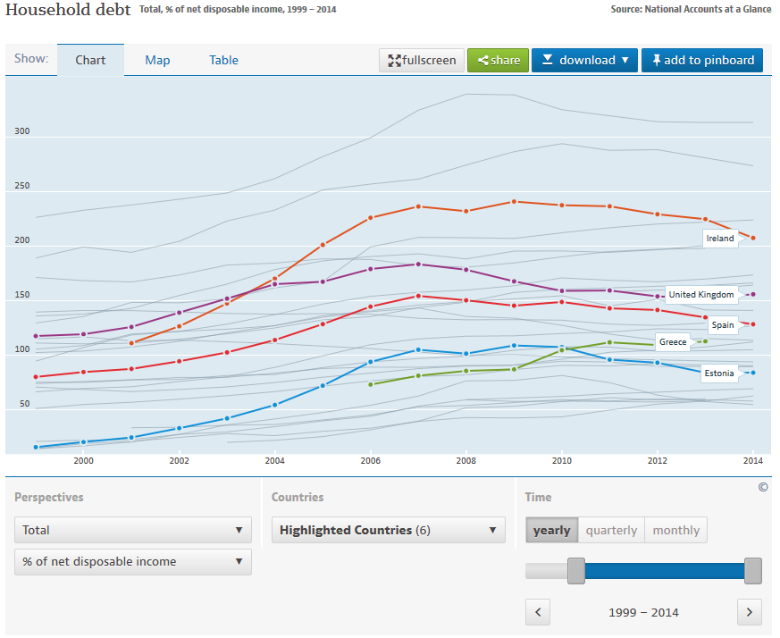
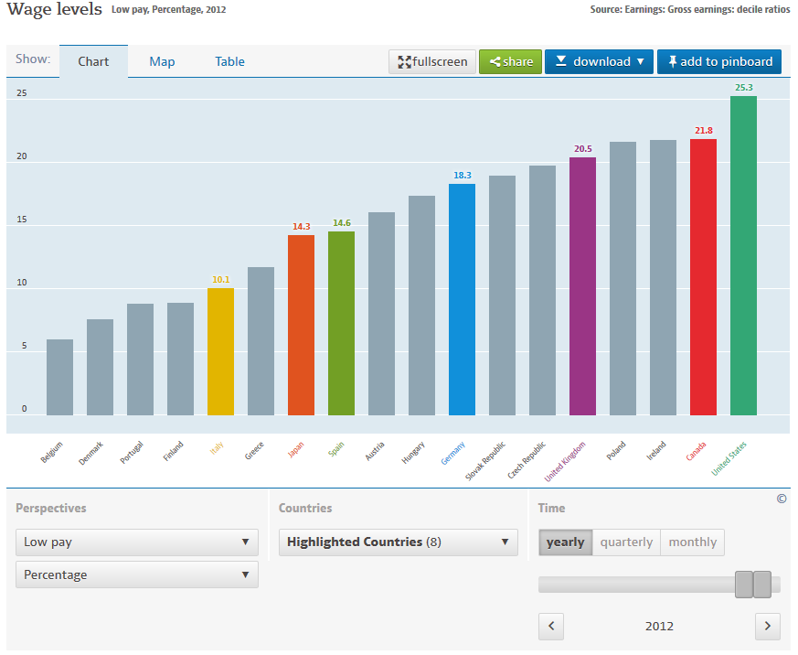
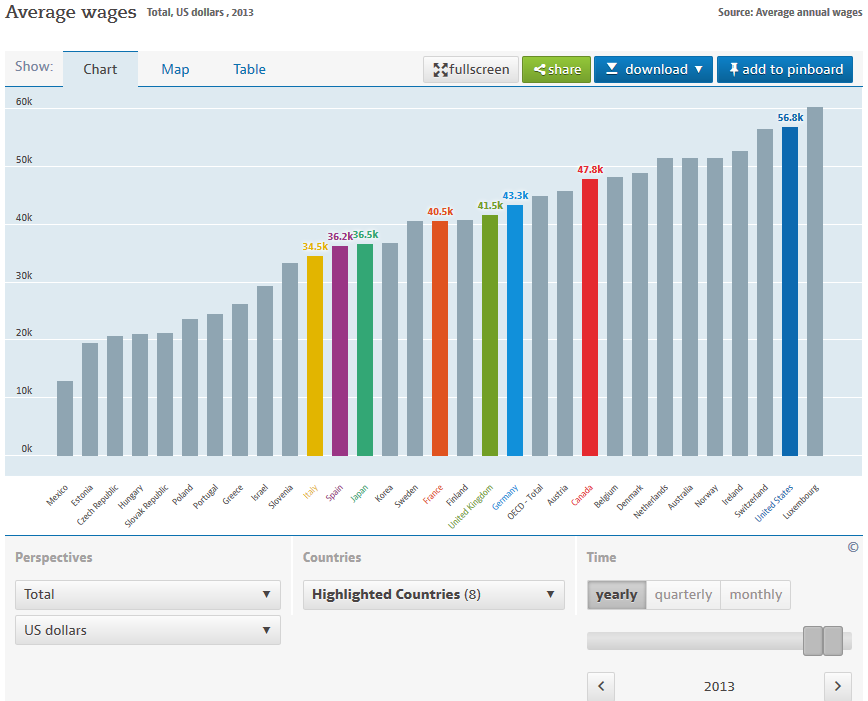
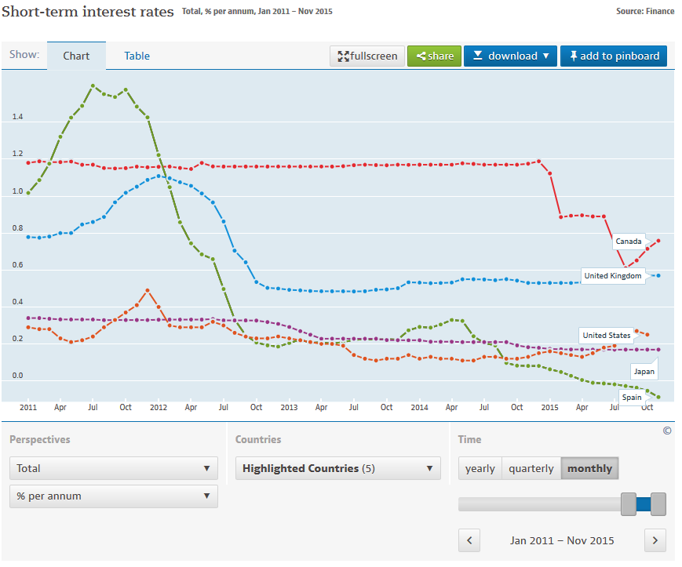
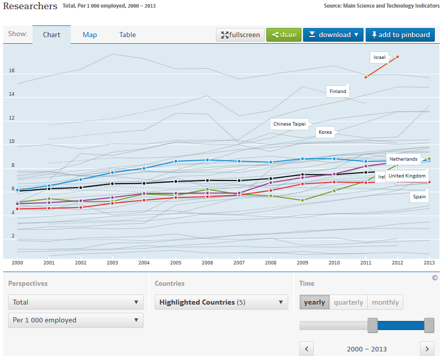
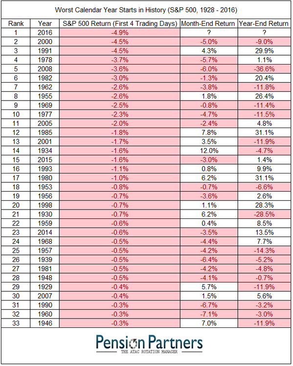

>La economía crece cuando las empresas reinvierten. La economía crece cuando la cuenta de ahorros genera un rendimiento positivo y por lo tanto la gente tiene ahorros que pueden servir como capital para el crecimiento económico. La economía global acumula una deuda de cerca del 300% del PBI, y todo lo que no está relacionado con la especulación está estancado porque se hace un esfuerzo muy concertado para ignorar este hecho.

>La flexibilización cuantitativa implica emitir moneda, lo que a su vez significa que el valor del dinero en circulación disminuye. El poder adquisitivo se ha visto reducido por culpa de este incremento de la oferta. Por eso resulta imposible cobrar un salario que dé para vivir porque la flexibilización cuantitativa provoca deflación.

>Un tercio de los trabajadores británicos se encuentran en situación de pobreza. Una pobreza que en la mayoría de los casos se debe al elevado costo de la vivienda. El problema es que si el precio de las casas no subiera por encima del 10%, como lo hace ahora, los votantes se rebelarían. El otro día decíamos que hay dos opciones: ó mantener los puestos de trabajos en el Reino Unido y dejar que los salarios suban, creando una tasa de inflación natural que sacará a flote a todo el mundo, ó exportar el empleo a china y a otros lugares que es lo que han hecho, lo cual sólo les deja un mecanismo político disponible: abaratar el crédito de manera artificial y bajar los intereses hasta el 0% para crear una burbuja inmobiliaria, un soborno en toda regla. Eso estaría bien si las burbujas pudieran inflarse indefinidamente pero sabemos que eso no es así y que las burbujas siempre acaban por estallar.

>Lo salarios ya no están encima de la mesa a la hora de establecer las políticas económicas. Ni en el Reino Unido, ni en EEUU ni en ningún otro lugar del mundo. Los salarios ya no forman parte del debate. ¿Y eso por qué? Porque antes si uno quería hacerse rico tenía que contratar personal. Eso fue lo que paso en la revolución industrial, en la que hizo falta mucho personal en las fábricas, lo que convirtió a los empresarios en dueños de los medios de producción. Mucha gente se dedicó a fabricar automóviles y si uno hacía como Henry Ford se volvía inmensamente rico. El problema es que los medios de producción han cambiado. Los trabajadores y la mano de obra ya no hacen falta, ni tampoco los salarios. Lo único que hay que hacer es darle a un botón y emitir moneda. Y la única forma de que esa política tenga éxito para los que aprietan el botón, es que el dinero que fabrican esas máquinas de emitir moneda vaya a parar a los que antes vivían de su salario. Esa gente está siendo denigrada y condenada a una serie de políticas inmobiliarias orquestadas por el complejo penitenciario industrial para crear una mano de obra esclava. Steven Roach tiene razón cuando dice que los salarios ya no se tienen en cuenta.

Max Keiser - Keiser Report #E831 - La guerra equivocada de los bancos centrales

- [data.oecd.org](https://data.oecd.org)
- [ourworldindata.org](http://ourworldindata.org/) Topic by topic the data-entries show you how the world is changing
- [Real Time Economics twitter.com/WSJecon](https://twitter.com/WSJecon)
- [tradingeconomics.com/spain](http://www.tradingeconomics.com/spain/indicators)
- [Economy of Spain](https://en.wikipedia.org/wiki/Economy_of_Spain)
- [La banca especula con instrumentos semejantes a los usados antes de la crisis](http://www.mundiario.com/articulo/a-fondo/banca-especulando-instrumentos-semejantes-utilizados-antes-crisis/20151031004951048655.html)
- [Cost of living database](http://www.numbeo.com/cost-of-living/)
- [Global house prices](http://www.economist.com/blogs/dailychart/2011/11/global-house-prices)
- [Property in San Francisco](http://www.economist.com/news/united-states/21677989-capital-disruption-fears-it-may-be-experiencing-too-much-golden-gates)
- [Why are house prices cheaper today than ever before?](https://contrarianstraighttalker.wordpress.com/2015/10/18/why-are-house-prices-cheaper-today-than-ever-before-2/)
- [All of the World’s Money and Markets in One Visualization](http://money.visualcapitalist.com/all-of-the-worlds-money-and-markets-in-one-visualization/)
- [uk.businessinsider.com: Animated map shows the history of immigration to the US](http://uk.businessinsider.com/animated-map-shows-history-us-immigration-2015-12)
- [flowingdata.com: American Immigration history](http://flowingdata.com/2016/01/12/immigration-history/)
- [zdnet.com: 'It's a graveyard': The software devs leaving Greece for good](http://www.zdnet.com/article/its-a-graveyard-the-software-devs-leaving-greece-for-good/)
- [uk.businessinsider.com: The 16 best countries in Europe if you want to get a job](http://uk.businessinsider.com/glassdoor-european-employment-rankings-201516-2015-12)
- [IT Jobs Watch, Tracking the IT Job Market](http://www.itjobswatch.co.uk/)
- [Una de mates: Media y mediana (sueldos)](https://youtu.be/lynZYPTVelw)
- [Thomas Piketty’s “Capital”, summarised in four paragraphs](http://www.economist.com/blogs/economist-explains/2014/05/economist-explains)
- [blogs.wsj.com: Six Years Later, 93% of U.S. Counties Haven’t Recovered From Recession, Study Finds](http://blogs.wsj.com/economics/2016/01/12/six-years-later-93-of-u-s-counties-havent-recovered-from-recession-study-finds/)
- [The future of jobs. The onrushing wave.](http://www.economist.com/news/briefing/21594264-previous-technological-innovation-has-always-delivered-more-long-run-employment-not-less) Previous technological innovation has always delivered more long-run employment, not less. But things can change
