>La economía crece cuando las empresas reinvierten. La economía crece cuando la cuenta de ahorros genera un rendimiento positivo y por lo tanto la gente tiene ahorros que pueden servir como capital para el crecimiento económico. La economía global acumula una deuda de cerca del 300% del PBI, y todo lo que no está relacionado con la especulación está estancado porque se hace un esfuerzo muy concertado para ignorar este hecho.

>La flexibilización cuantitativa implica emitir moneda, lo que a su vez significa que el valor del dinero en circulación disminuye. El poder adquisitivo se ha visto reducido por culpa de este incremento de la oferta. Por eso resulta imposible cobrar un salario que dé para vivir porque la flexibilización cuantitativa provoca deflación.

>Un tercio de los trabajadores británicos se encuentran en situación de pobreza. Una pobreza que en la mayoría de los casos se debe al elevado costo de la vivienda. El problema es que si el precio de las casas no subiera por encima del 10%, como lo hace ahora, los votantes se rebelarían. El otro día decíamos que hay dos opciones: ó mantener los puestos de trabajos en el Reino Unido y dejar que los salarios suban, creando una tasa de inflación natural que sacará a flote a todo el mundo, ó exportar el empleo a china y a otros lugares que es lo que han hecho, lo cual sólo les deja un mecanismo político disponible: abaratar el crédito de manera artificial y bajar los intereses hasta el 0% para crear una burbuja inmobiliaria, un soborno en toda regla. Eso estaría bien si las burbujas pudieran inflarse indefinidamente pero sabemos que eso no es así y que las burbujas siempre acaban por estallar.

>Lo salarios ya no están encima de la mesa a la hora de establecer las políticas económicas. Ni en el Reino Unido, ni en EEUU ni en ningún otro lugar del mundo. Los salarios ya no forman parte del debate. ¿Y eso por qué? Porque antes si uno quería hacerse rico tenía que contratar personal. Eso fue lo que pasó en la revolución industrial, en la que hizo falta mucho personal en las fábricas, lo que convirtió a los empresarios en dueños de los medios de producción. Mucha gente se dedicó a fabricar automóviles y si uno hacía como Henry Ford se volvía inmensamente rico. El problema es que los medios de producción han cambiado. Los trabajadores y la mano de obra ya no hacen falta, ni tampoco los salarios. Lo único que hay que hacer es darle a un botón y emitir moneda. Y la única forma de que esa política tenga éxito para los que aprietan el botón, es que el dinero que fabrican esas máquinas de emitir moneda vaya a parar a los que antes vivían de su salario. Esa gente está siendo denigrada y condenada a una serie de políticas inmobiliarias orquestadas por el complejo penitenciario industrial para crear una mano de obra esclava. Steven Roach tiene razón cuando dice que los salarios ya no se tienen en cuenta.

Max Keiser - Keiser Report #E823 #E828 #E831 
______________________________________________________________________________________________________________________________________

<iframe width="560" height="315" src="https://www.youtube.com/embed/eHQ7wvWzUW0?rel=0" frameborder="0" allowfullscreen class="video"></iframe>

 

<iframe width="560" height="315" src="https://www.youtube.com/embed/y60wDzZt8yg?rel=0" frameborder="0" allowfullscreen class="video"></iframe>

 

<iframe width="560" height="315" src="https://www.youtube.com/embed/gq11un3xqsA?rel=0" frameborder="0" allowfullscreen class="video"></iframe>

 

<iframe width="560" height="315" src="https://www.youtube.com/embed/PfaVDgd17Io?rel=0" frameborder="0" allowfullscreen class="video"></iframe>

 

<iframe width="560" height="315" src="https://www.youtube.com/embed/n_2zMQyn7VQ?rel=0" frameborder="0" allowfullscreen class="video"></iframe>

 

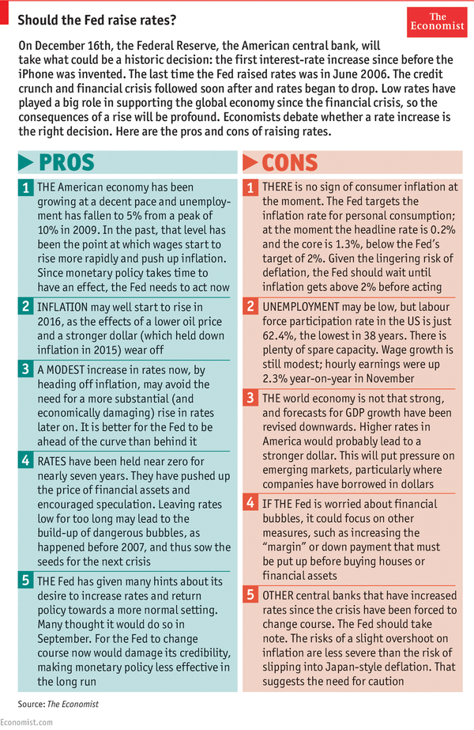

[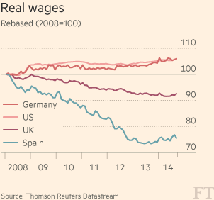](http://blogs.ft.com/ftdata/2014/12/08/datawatch-real-wages-since-the-crisis/)

[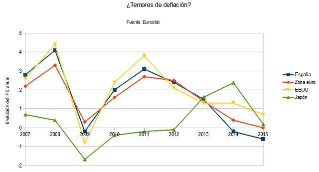](http://www.bolsamania.com/noticias/economia/los-cinco-graficos-que-explican-la-situacion-economica-mundial--1035065.html)

[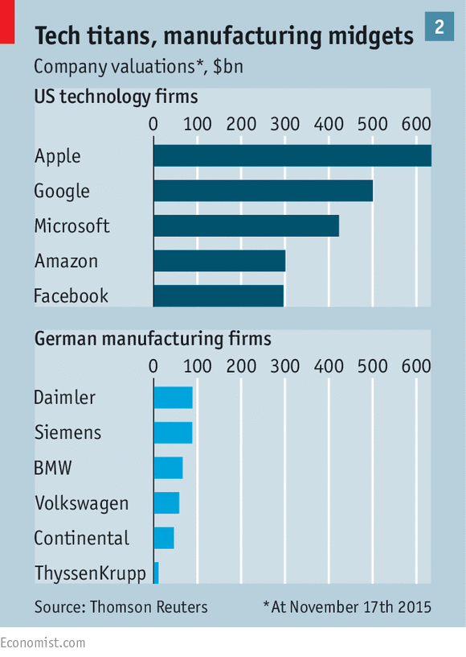](http://www.economist.com/news/business/21678774-europes-biggest-economy-rightly-worried-digitisation-threat-its-industrial)

[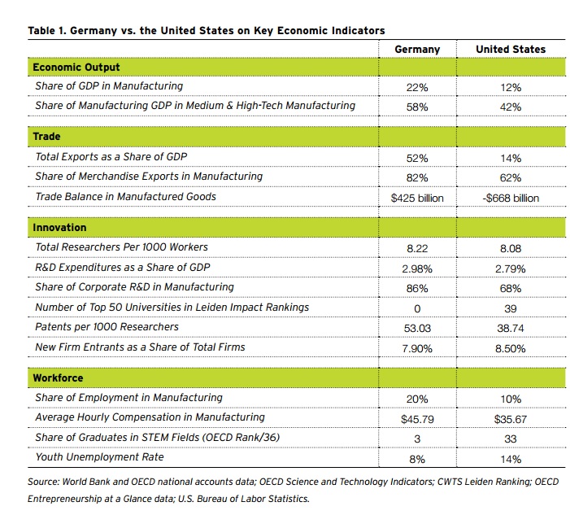](http://www.brookings.edu/~/media/Research/Files/Reports/2015/02/25-germany/LessonsFromGermany.pdf?la=en)

<blockquote class="twitter-tweet tw-align-center" data-lang="es">
Nasdaq 20 year monthly chart going back to the 2000 dot com bubble. <a href="https://twitter.com/search?q=%24QQQ&amp;src=ctag">$QQQ</a> <a href="https://twitter.com/search?q=%24SPY&amp;src=ctag">$SPY</a> <a href="https://twitter.com/search?q=%24NFLX&amp;src=ctag">$NFLX</a> <a href="https://twitter.com/search?q=%24AMZN&amp;src=ctag">$AMZN</a> <a href="https://twitter.com/search?q=%24GOOG&amp;src=ctag">$GOOG</a>  <a href="https://twitter.com/search?q=%24FB&amp;src=ctag">$FB</a> <a href="https://twitter.com/search?q=%24AAPL&amp;src=ctag">$AAPL</a> <a href="https://twitter.com/search?q=%24GOOGL&amp;src=ctag">$GOOGL</a> <a href="https://t.co/XZqim9WN34">pic.twitter.com/XZqim9WN34</a>
&mdash; GOODGREED (@GOODGREED) <a href="https://twitter.com/GOODGREED/status/697786991451111424">febrero 11, 2016</a></blockquote>

<blockquote class="twitter-tweet tw-align-center" data-lang="es">
How bad are tech stocks doing? We attached a chart. 😱  On momo stocks <a href="https://twitter.com/search?q=%24AMZN&amp;src=ctag">$AMZN</a>, <a href="https://twitter.com/search?q=%24NFLX&amp;src=ctag">$NFLX</a> and more: <a href="https://t.co/je8X1Ju2HG">https://t.co/je8X1Ju2HG</a> <a href="https://t.co/PXsXpXcZ5R">pic.twitter.com/PXsXpXcZ5R</a>
&mdash; StockTwits (@StockTwits) <a href="https://twitter.com/StockTwits/status/695649857785049088">febrero 5, 2016</a></blockquote>

<blockquote class="twitter-tweet tw-align-center" data-lang="es">
Is a recession coming? Everyone is freaked out that one is coming. But this chart. <a href="https://t.co/I8ZmbCFe27">https://t.co/I8ZmbCFe27</a> <a href="https://twitter.com/search?q=%24TLT&amp;src=ctag">$TLT</a> <a href="https://twitter.com/search?q=%24SPY&amp;src=ctag">$SPY</a> <a href="https://t.co/N9K2AmFrSd">pic.twitter.com/N9K2AmFrSd</a>
&mdash; StockTwits (@StockTwits) <a href="https://twitter.com/StockTwits/status/698966004022403073">febrero 14, 2016</a></blockquote>

<blockquote class="twitter-tweet tw-align-center" data-lang="es">
When the Fed tightens. This can be the impact. CHART: <a href="https://t.co/bR1LeT1DFp">https://t.co/bR1LeT1DFp</a><a href="https://twitter.com/search?q=%24SPY&amp;src=ctag">$SPY</a> <a href="https://twitter.com/search?q=%24TLT&amp;src=ctag">$TLT</a> <a href="https://twitter.com/search?q=%24GLD&amp;src=ctag">$GLD</a> <a href="https://t.co/ybBxczmYtW">pic.twitter.com/ybBxczmYtW</a>
&mdash; StockTwits (@StockTwits) <a href="https://twitter.com/StockTwits/status/699289052965515266">febrero 15, 2016</a></blockquote>

<blockquote class="twitter-tweet tw-align-center" data-lang="es">
DEUTCHE BANK Is Back: 5 Year Sub CDS Soar To Record High, similar to LEHMAN bankruptcy. <a href="https://t.co/HSyodUk3GH">https://t.co/HSyodUk3GH</a> <a href="https://t.co/fNFg80Sz21">pic.twitter.com/fNFg80Sz21</a>
&mdash; Marco-Hans (@mhwillik) <a href="https://twitter.com/mhwillik/status/697820500165324800">febrero 11, 2016</a></blockquote>

<blockquote class="twitter-tweet tw-align-center" data-lang="es">
<a href="https://twitter.com/hashtag/EU?src=hash">#EU</a>, it&#39;s time to wake up. <a href="https://twitter.com/hashtag/deutchebank?src=hash">#deutchebank</a> derivatives critical. <a href="https://twitter.com/hashtag/Italy?src=hash">#Italy</a> banks breaking.$EUR dying  Look into <a href="https://twitter.com/hashtag/bitcoin?src=hash">#bitcoin</a>. <a href="https://t.co/tW3XgjuxOt">pic.twitter.com/tW3XgjuxOt</a>
&mdash; Ansel Lindner (@AnselLindner) <a href="https://twitter.com/AnselLindner/status/694940218244239361">febrero 3, 2016</a></blockquote>

<blockquote class="twitter-tweet tw-align-center" data-lang="es">
&quot;rock solid&quot; Deutche bank shares hit all time low this week.  lets face the music<a href="https://t.co/n9pmQs2D3a">https://t.co/n9pmQs2D3a</a> <a href="https://t.co/0lYEm5LfJj">pic.twitter.com/0lYEm5LfJj</a>
&mdash; David Scott (@Albion_Rover) <a href="https://twitter.com/Albion_Rover/status/698614818610221056">febrero 13, 2016</a></blockquote>

<blockquote class="twitter-tweet tw-align-center" data-lang="es">
<a href="https://twitter.com/xaquinonil">@xaquinonil</a> las mentiras sobre fundamentales en bolsa. Hablan de problemas de Deutche Bank y es gemelo al santander. <a href="https://t.co/2pj2hcHFQa">pic.twitter.com/2pj2hcHFQa</a>
&mdash; xaquinonil (@xaquinonil) <a href="https://twitter.com/xaquinonil/status/698830464102993920">febrero 14, 2016</a></blockquote>

<blockquote class="twitter-tweet tw-align-center" data-lang="es">
Machines may replace half of human jobs <a href="https://t.co/eG4UM5H2KY">https://t.co/eG4UM5H2KY</a> <a href="https://t.co/wLEPMYJL0i">pic.twitter.com/wLEPMYJL0i</a>
&mdash; Business Insider (@businessinsider) <a href="https://twitter.com/businessinsider/status/699604520414945281">febrero 16, 2016</a></blockquote>

<blockquote class="twitter-tweet tw-align-center" data-lang="es">
There&#39;s a grim chart going around. And it&#39;s comparing the 08&#39; crash to today: <a href="https://t.co/Lfsb8nJkaA">https://t.co/Lfsb8nJkaA</a><a href="https://twitter.com/search?q=%24SPY&amp;src=ctag">$SPY</a> <a href="https://twitter.com/search?q=%24TLT&amp;src=ctag">$TLT</a> <a href="https://t.co/ggdYLYMfWt">pic.twitter.com/ggdYLYMfWt</a>
&mdash; StockTwits (@StockTwits) <a href="https://twitter.com/StockTwits/status/700424616339075072">febrero 18, 2016</a></blockquote>

<blockquote class="twitter-tweet tw-align-center" data-lang="es">
Unemployment in the UK down by 60,000 between October and December to 1.69 million, latest figures show <a href="https://t.co/KkJBXmHt9m">https://t.co/KkJBXmHt9m</a>
&mdash; BBC Breaking News (@BBCBreaking) <a href="https://twitter.com/BBCBreaking/status/699889334711951360">febrero 17, 2016</a></blockquote>

<blockquote class="twitter-tweet tw-align-center" data-lang="es">
Countries which have officially adopted metric system <a href="https://t.co/7JFA67A8BE">pic.twitter.com/7JFA67A8BE</a>
&mdash; Terrible Maps (@TerribleMaps) <a href="https://twitter.com/TerribleMaps/status/695745094239023104">febrero 5, 2016</a></blockquote>

<iframe width="560" height="315" src="https://www.youtube.com/embed/XKYQa5zvVvE?rel=0" frameborder="0" allowfullscreen class="video"></iframe>

 

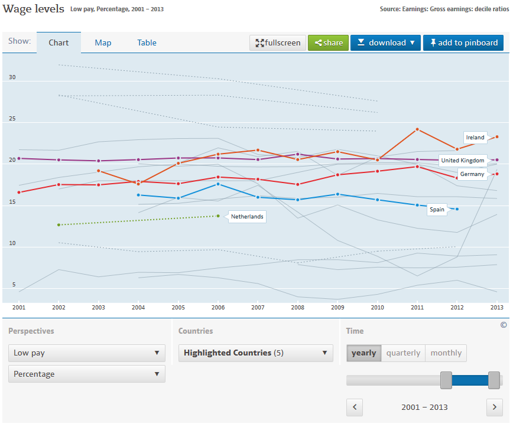

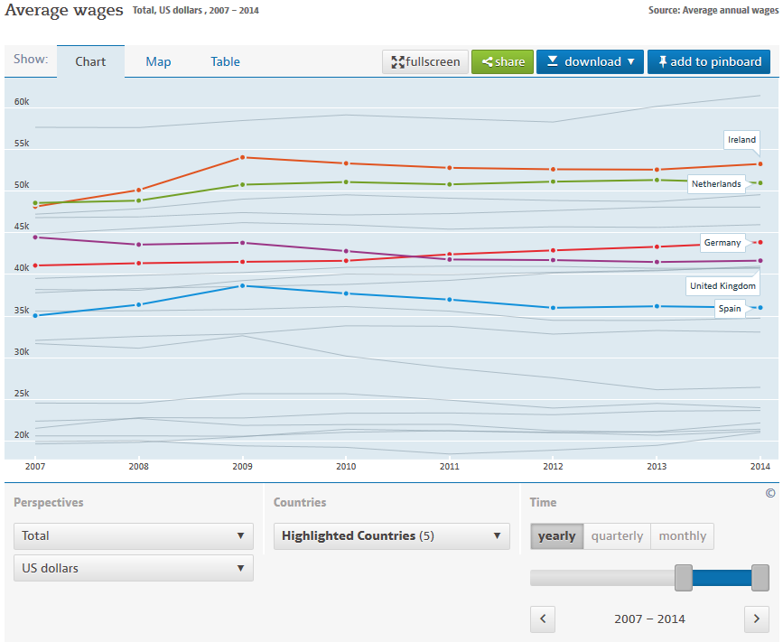

<iframe width="1280" height="720" src="https://www.youtube-nocookie.com/embed/IjZ-ke1kJrA?rel=0" frameborder="0" allowfullscreen class="video"></iframe>

  

<iframe width="560" height="315" src="https://www.youtube.com/embed/e6WyN4z0VGc?list=PL_U58TaSOS-VEg9U3ePdmkSu7VzIyrdW1" frameborder="0" allowfullscreen class="video"></iframe>

  

<iframe width="560" height="315" src="https://www.youtube.com/embed/v4P4cS5jKmQ?list=PL_U58TaSOS-VEg9U3ePdmkSu7VzIyrdW1" frameborder="0" allowfullscreen class="video"></iframe>

 

[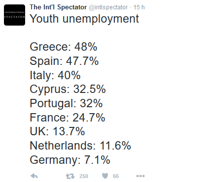](https://twitter.com/intlspectator)

[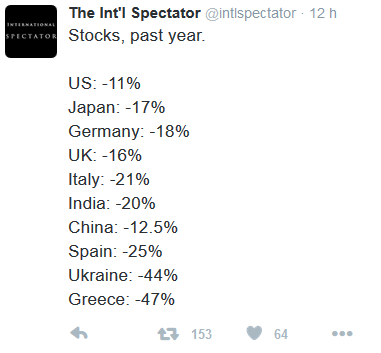](https://twitter.com/intlspectator)

<blockquote class="twitter-tweet tw-align-center" data-lang="es">
US spends $640 billion on its military; more than China, Russia, Saudi, France, UK, India and Germany combined. <a href="https://t.co/YSHHIqWpBg">pic.twitter.com/YSHHIqWpBg</a>
&mdash; The Int&#39;l Spectator (@intlspectator) <a href="https://twitter.com/intlspectator/status/700417049864982529">febrero 18, 2016</a></blockquote>

[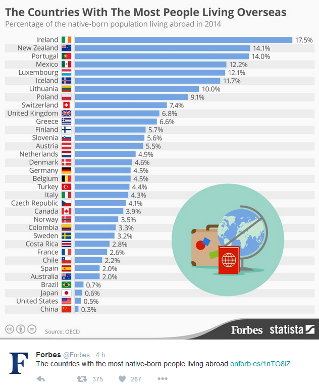](http://www.forbes.com/sites/niallmccarthy/2016/01/15/the-countries-with-the-most-native-born-people-living-abroad-infographic/)

[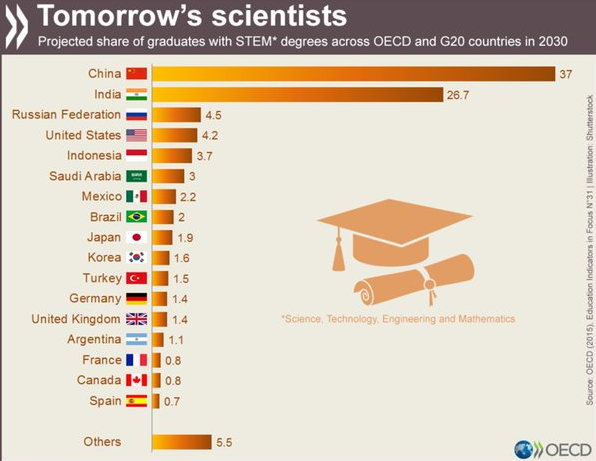](https://twitter.com/OECD)

<!--
worldpressphoto
-->

<iframe width="560" height="315" src="https://www.youtube-nocookie.com/embed/ihcdZax6aZI?rel=0" frameborder="0" allowfullscreen class="video"></iframe>

 

<iframe src="https://player.vimeo.com/video/121705174" width="500" height="281" frameborder="0" webkitallowfullscreen mozallowfullscreen allowfullscreen class="video"></iframe>

<a href="https://vimeo.com/121705174">Japan&#039;s Disposable Workers: Net Cafe Refugees</a> from <a href="https://vimeo.com/mediastorm">MediaStorm</a> on <a href="https://vimeo.com">Vimeo</a>.

Internet cafes have existed in Japan for over a decade, but in the mid 2000&rsquo;s, customers began using these spaces as living quarters. Internet cafe refugees are mostly temporary employees; their salary too low to rent their own apartments.  
 
Watch the full series at: http://mediastorm.com/clients/japans-disposable-workers-for-pulitzer-center

<iframe src="https://player.vimeo.com/video/114796942?color=ffffff&title=0&byline=0&portrait=0" width="500" height="281" frameborder="0" webkitallowfullscreen mozallowfullscreen allowfullscreen class="video"></iframe>

<a href="https://vimeo.com/114796942">The Fence</a> from <a href="https://vimeo.com/andrewhida">Andrew Hida</a> on <a href="https://vimeo.com">Vimeo</a>.

<iframe src="https://player.vimeo.com/video/91032041?color=ffffff&title=0&byline=0&portrait=0" width="500" height="281" frameborder="0" webkitallowfullscreen mozallowfullscreen allowfullscreen class="video"></iframe>

 
______________________________________________________________________________________________________________________________________

- [The World Press Photo 🌟](http://www.worldpressphoto.org)
	- [2015 Multimedia Contest 🌟](http://www.worldpressphoto.org/collection/mm/2015)
- [data.oecd.org](https://data.oecd.org)
	- [twitter.com/OECD 🌟🌟🌟🌟](https://twitter.com/OECD)
	- [twitter.com/OECD_Centre](https://twitter.com/OECD_Centre) 
	- [twitter.com/OECDEduSkills](https://twitter.com/OECDEduSkills)
	- [twitter.com/OECDinnovation](https://twitter.com/OECDinnovation) 
	- [twitter.com/OECDeconomy](https://twitter.com/OECDeconomy)
	- [twitter.com/OECD_Pubs](https://twitter.com/OECD_Pubs)
	- [twitter.com/OECD_Stat](https://twitter.com/OECD_Stat)
	- [twitter.com/OECD_Social](https://twitter.com/OECD_Social) 
	- [twitter.com/ocdeenespanol](https://twitter.com/ocdeenespanol)
- [ourworldindata.org](http://ourworldindata.org/) Topic by topic the data-entries show you how the world is changing
- [Real Time Economics twitter.com/WSJecon](https://twitter.com/WSJecon)
- [tradingeconomics.com/spain](http://www.tradingeconomics.com/spain/indicators)
- [Economy of Spain](https://en.wikipedia.org/wiki/Economy_of_Spain)
- [FT chart of the day: real wages in the US, Germany, UK and Spain since the crisis](http://blogs.ft.com/ftdata/2014/12/08/datawatch-real-wages-since-the-crisis/)
- [Cost of living database 🌟](http://www.numbeo.com/cost-of-living/)
- [Global house prices 🌟](http://www.economist.com/blogs/dailychart/2011/11/global-house-prices)
- [Why Londoners are worse off than any other British region since 2008](http://www.economist.com/news/britain/21688435-those-living-london-seem-have-fared-well-crisis-fact-their-ludicrously)
- [Property in San Francisco](http://www.economist.com/news/united-states/21677989-capital-disruption-fears-it-may-be-experiencing-too-much-golden-gates)
- [Why are house prices cheaper today than ever before?](https://contrarianstraighttalker.wordpress.com/2015/10/18/why-are-house-prices-cheaper-today-than-ever-before-2/)
- [These 10 cities have the fastest-growing startup scenes — and neither New York nor Silicon Valley made the cut](http://www.businessinsider.com/us-cities-with-fastest-growing-startup-scenes-2016-1)
- [All of the World’s Money and Markets in One Visualization 🌟🌟](http://money.visualcapitalist.com/all-of-the-worlds-money-and-markets-in-one-visualization/)
- [uk.businessinsider.com: Animated map shows the history of immigration to the US](http://uk.businessinsider.com/animated-map-shows-history-us-immigration-2015-12)
- [flowingdata.com: American Immigration history](http://flowingdata.com/2016/01/12/immigration-history/)
- [Irish biggest losers from financial crash - ECB 🌟](http://www.irishtimes.com/business/economy/irish-biggest-losers-from-financial-crash-ecb-1.2398588)
- [Britain is heading for another 2008 crash: here’s why](http://www.theguardian.com/commentisfree/2015/oct/28/2008-crash-government-economic-growth-budgetary-surplus)
- [Educated Greeks show highest rate of unemployment in OECD](http://www.ekathimerini.com/203808/article/ekathimerini/news/educated-greeks-show-highest-rate-of-unemployment-in-oecd)
- [zdnet.com: 'It's a graveyard': The software devs leaving Greece for good 🌟🌟](http://www.zdnet.com/article/its-a-graveyard-the-software-devs-leaving-greece-for-good/)
- [The Economist. The other side of paradise](http://www.economist.com/news/business/21688390-glamorous-tech-startups-can-be-brutal-places-workers-other-side-paradise) Glamorous tech startups can be brutal places for workers
- [businessinsider.com: The 13 worst things about Silicon Valley](http://www.businessinsider.com/the-dark-side-of-silicon-valley-2016-1)
- [uk.businessinsider.com: The 16 best countries in Europe if you want to get a job](http://uk.businessinsider.com/glassdoor-european-employment-rankings-201516-2015-12)
- [How does corruption in Africa really compare to OECD countries? Anti-Fraud & Corruption Law in Africa](http://africanantifraud.com/2016/01/20/circles-of-corruption-how-does-africa-stack-up-against-the-oecd/)
- [IT Jobs Watch, Tracking the IT Job Market](http://www.itjobswatch.co.uk/)
- [The General Theory of Employment, Interest and Money. John Maynard Keynes](https://en.wikipedia.org/wiki/The_General_Theory_of_Employment,_Interest_and_Money)
- [Thomas Piketty’s “Capital”, summarised in four paragraphs](http://www.economist.com/blogs/economist-explains/2014/05/economist-explains)
- [Debt: The First 5000 Years. David Graeber](https://en.wikipedia.org/wiki/Debt:_The_First_5000_Years)
- [The End of Work: The Decline of the Global Labor Force and the Dawn of the Post-Market Era. Jeremy Rifkin](https://en.wikipedia.org/wiki/The_End_of_Work)
- [blogs.wsj.com: Six Years Later, 93% of U.S. Counties Haven’t Recovered From Recession, Study Finds](http://blogs.wsj.com/economics/2016/01/12/six-years-later-93-of-u-s-counties-havent-recovered-from-recession-study-finds/)
- [businessinsider.com: Watch 1,400 US workers learn their jobs are moving to Mexico](http://www.businessinsider.com/carrier-workers-learn-jobs-are-moving-to-mexico-2016-2)
- [Laid-off IT workers muzzled as H-1B debate heats up](http://www.cio.com/article/3027539/outsourcing/laid-off-it-workers-muzzled-as-h-1b-debate-heats-up.html)
- [economist.com: The future of jobs. The onrushing wave.](http://www.economist.com/news/briefing/21594264-previous-technological-innovation-has-always-delivered-more-long-run-employment-not-less) Previous technological innovation has always delivered more long-run employment, not less. But things can change
- [economist.com: Youth unemployment is a massive waste of resources 🌟](http://www.economist.com/news/special-report/21688588-youth-unemployment-massive-waste-resources-walled-world-work)
- [theguardian.com: Each generation should be better off than their parents? Think again 🌟](http://www.theguardian.com/business/2016/feb/14/economics-viewpoint-baby-boomers-generation-x-generation-rent-gig-economy)
- [tradingview.com/widget](https://www.tradingview.com/widget)

______________________________________________________________________________________________________________________________________

- [Quince películas para entender la crisis 🌟](http://www.elmundo.es/cultura/2016/01/15/56991002e2704e61348b45cb.html)
	- [Margin Call quotes](http://www.imdb.com/title/tt1615147/quotes)
- [La banca especula con instrumentos semejantes a los usados antes de la crisis](http://www.mundiario.com/articulo/a-fondo/banca-especulando-instrumentos-semejantes-utilizados-antes-crisis/20151031004951048655.html)
- [José María Gay, el economista indignado 🌟](https://youtu.be/cby2vsK8O6k)
- Keiser Report en español:
	- [Una economía de casino (E715)](https://youtu.be/guLunFqJYw4)
	- [Una economía momificada (E718)](https://youtu.be/4wZNfZ5j_Ck)
	- [La destrucción de la clase media (E730)](https://youtu.be/y0HvhKH3YrQ)
	- [¡Compren oro! (E739)](https://youtu.be/Zqt18VH2F5o)
	- [Salarios, lo que baja no vuelve a subir (E754)](https://youtu.be/JHrXPlBpDNc)
	- [Una economía en coma (E760)](https://youtu.be/QC7LyJko7dA)
	- [Economías rentistas condenadas al fracaso (E767)](https://youtu.be/QXtbyGwnZEE)
	- [Esclavos de la deuda (E764)](https://youtu.be/esoMBsfa1M4)
	- [Caos financiero general (E782)](https://youtu.be/7yJEgClYDzU)
	- [La Unión Europea en la cuerda floja (E785)](https://youtu.be/P-XLyWS3Wek)
	- [El engaño de la burbuja inmobiliaria (E788)](https://youtu.be/qNQtcKqULcU)
	- [Las gigantes malvadas hipotecarias (E789)](https://youtu.be/mnErMBHrKPk)
	- [El comienzo del fin del capitalismo (E790)](https://youtu.be/OBNbUk3D2XM) El post-capitalismo
	- [El precariado: una nueva clase social (E791) 🌟](https://youtu.be/8cdPD71jZjM) El fenómeno supera todas la fronteras geográficas
	- [La maldita deuda (E792)](https://youtu.be/M89qDw1p2lQ)
	- [Un mundo de estafas Ponzi (E795)](https://youtu.be/Uv7KhOqiBSA)
	- [Volver a la norma del oro (E796)](https://youtu.be/cnfEC4PF23U)
	- [El caso de Chicago (E797)](https://youtu.be/TlA160S9mdw)
	- [La vertiginosa caída del precio del barril (E805)](https://youtu.be/1EvJr_-zx8g)
	- [Días de rabia (E816)](https://youtu.be/nHSPva8eTC0)
	- [El páramo de los mercados financieros (E817)](https://youtu.be/xaJ8rClIjOs)
	- [Todos a endeudarse! (E818)](https://youtu.be/875-LANXBeg)
	- [Guerra contra la pobreza y políticos marioneta (E823)](https://youtu.be/4CmZaGTEZnc)
	- [El control de la riqueza mundial (E824)](https://youtu.be/FcIL2k0LuyY)
	- [Banqueros centrales, secretarios del Tesoro y otros mentirosos (E825)](https://youtu.be/YPEq8_ygWh8)
	- [El imperio de la deuda y calcetines como garantía (E826)](https://youtu.be/NP_Mh2XNy2w)
	- [El fin del capitalismo (E828)](https://youtu.be/IIcIPz4wpCU)
	- [China: el gigante despierto (E830)](https://youtu.be/k0q_zUO4e1M)
	- [La fiesta de las criptodivisas (E832)](https://youtu.be/8xtmuV18Y04)
	- [Misterio y magia en los mercados financieros (E833)](https://youtu.be/dekXrmppTUg)
	- [La muerte del comercio mundial y sobredosis de heroína (E835)](https://youtu.be/1m_NODT6I8g)
	- [Mentiras, evasivas, disparates, odios y esquizofrenia (E839)](https://youtu.be/yWoeZsZdaxs)
	- [Época de recesiones (E840) 🌟](https://youtu.be/esnj2lfr4zA)
- [Una de mates: Media y mediana (sueldos)](https://youtu.be/lynZYPTVelw)
- [Ser informático ya no es lo que era](http://www.readwriteweb.es/ser-informatico/)
- [El sarcasmo de Niño Becerra con la economía española y su visión sobre la recesión mundial](http://www.bolsamania.com/noticias/economia/el-sarcasmo-de-nino-becerra-con-la-economia-espanola--1029719.html)
- [Economistas frente a la crisis](http://economistasfrentealacrisis.com/)
    - [Crisis generacional. Los jóvenes dejan de buscar empleo en España](http://economistasfrentealacrisis.com/crisis-generacional-los-jovenes-dejan-de-buscar-empleo-en-espana/) 
- [¿Va a estallar Silicon Valley? 🌟](http://www.elmundo.es/tecnologia/2016/01/15/568f99eeca4741b7398b466f.html) "En realidad, me preocupa mucho más que España sufra por la falta de digitalización y de productividad que por su exceso"
- [Desmontando los mitos sobre la inflación y la creación de dinero 🌟](http://eduardogarzon.net/desmontando-los-mitos-sobre-la-inflacion-y-la-creacion-de-dinero/)
- [El gran desajuste: "Las empresas germanas son 16 veces más eficientes que los gigantes tecnológicos americanos generando empleo" 🌟🌟🌟](http://xavierferras.blogspot.com.es/2016/02/el-gran-desajuste.html)
- [Capitalismo clientelista](https://es.wikipedia.org/wiki/Capitalismo_clientelista)
- [“El clientelismo amenaza el futuro económico de España” 🌟](http://www.lavanguardia.com/ciencia/20160207/301978772341/clientelismo-corrupcion-amiguismo-economia-espanola.html)

<iframe width="560" height="315" src="https://www.youtube.com/embed/lynZYPTVelw" frameborder="0" allowfullscreen class="video"></iframe>

 
______________________________________________________________________________________________________________________________________

- [15 documentaries on Netflix that will make you smarter about business](http://www.businessinsider.com/business-documentaries-on-netflix-watch-instantly-2016-1)
- [The Italian Tech Sector Is Getting A Boost From Big U.S. Partners 🌟](http://techcrunch.com/2016/02/04/the-italian-tech-sector-is-getting-a-boost-from-big-u-s-partners)