<!-- MarkdownTOC -->

- [QA and Testing](#qa-and-testing)
    - [Blogs](#blogs)
    - [Mapas Mentales para Software Testing](#mapas-mentales-para-software-testing)
    - [ISTQB](#istqb)
        - [V Model Testing](#v-model-testing)
        - [Onion Model Testing](#onion-model-testing)
    - [TMAP](#tmap)
    - [Application Security Testing](#application-security-testing)
    - [DevOps Quality Blueprint](#devops-quality-blueprint)
    - [Testing Tools](#testing-tools)

<!-- /MarkdownTOC -->

<iframe width="560" height="315" src="https://www.youtube.com/embed/U5o_KMFrFpc?rel=0" frameborder="0" allowfullscreen class="video"></iframe>

 

[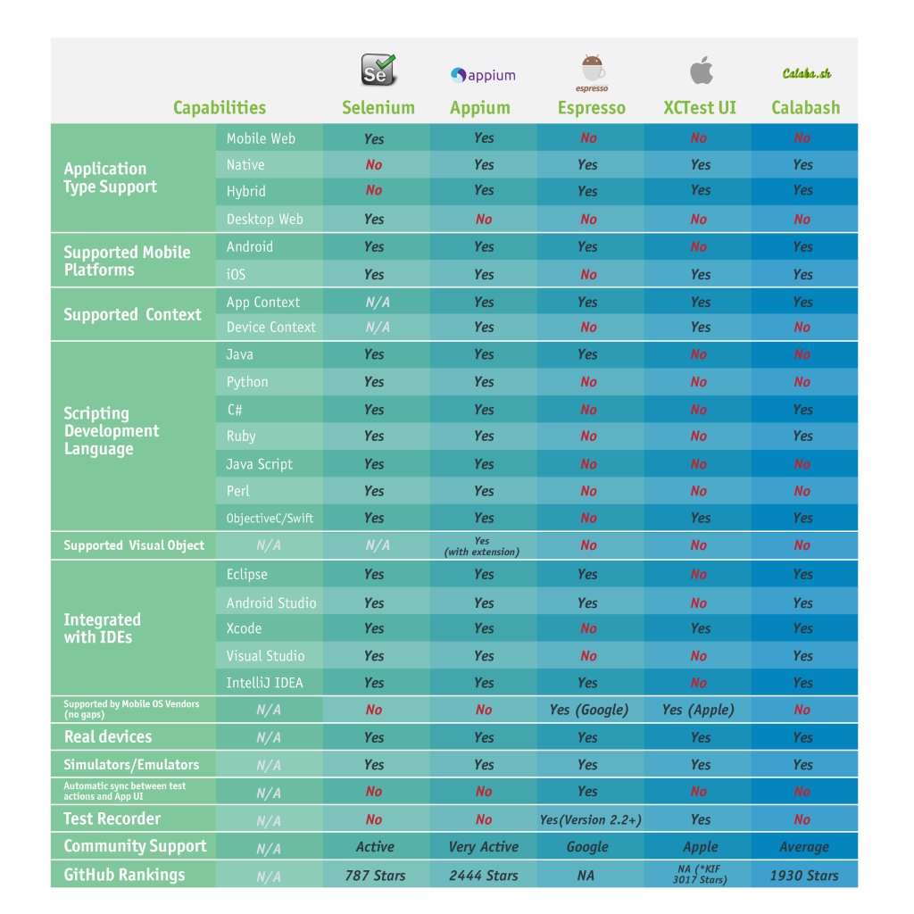](https://dzone.com/articles/selecting-the-best-open-source-test-automation-too)

<blockquote class="twitter-tweet tw-align-center" data-lang="es">
6 challenges in finding the right test automation tool for your team <a href="https://t.co/vrNqjN0SIb">https://t.co/vrNqjN0SIb</a> <a href="https://twitter.com/hashtag/SoftwareTestingNews?src=hash">#SoftwareTestingNews</a>
&mdash; TEST Magazine (@testmagazine) <a href="https://twitter.com/testmagazine/status/740496694740127744">8 de junio de 2016</a></blockquote>

<blockquote class="twitter-tweet tw-align-center" data-lang="es">
Why 100% of dev-test will be done using <a href="https://twitter.com/hashtag/cloud?src=hash">#cloud</a>-based platforms, infrastructure &amp; software within 10 years: <a href="https://t.co/G6WSCpt2VA">https://t.co/G6WSCpt2VA</a> <a href="https://twitter.com/forbesbv">@forbesbv</a>
&mdash; Oracle (@Oracle) <a href="https://twitter.com/Oracle/status/699383199261036545">febrero 16, 2016</a></blockquote>

<blockquote class="twitter-tweet tw-align-center" data-lang="es">
When debugging Perl/Python code or networking issue <a href="https://twitter.com/hashtag/sysadmin?src=hash">#sysadmin</a> <a href="https://twitter.com/hashtag/unix?src=hash">#unix</a> <a href="https://twitter.com/hashtag/linux?src=hash">#linux</a>  via <a href="https://t.co/34KKaad00d">https://t.co/34KKaad00d</a> <a href="https://t.co/kqA7mR3AKy">pic.twitter.com/kqA7mR3AKy</a>
&mdash; nixCraft (@nixcraft) <a href="https://twitter.com/nixcraft/status/706194879915757568">5 de marzo de 2016</a></blockquote>

<blockquote class="twitter-tweet tw-align-center" data-lang="es">
Show this to anyone who argues about whether that refactoring effort is worth the investment. <a href="https://t.co/vxw5PvDXq0">pic.twitter.com/vxw5PvDXq0</a>
&mdash; David Whittaker (@rundavidrun) <a href="https://twitter.com/rundavidrun/status/690651629494775808">22 de enero de 2016</a></blockquote>

<blockquote class="twitter-tweet tw-align-center" data-lang="es">
Sobre las vacunas, dos seres de ficción: La monja Forcades  (FAV) <a href="https://t.co/hBM8SMCcZK">https://t.co/hBM8SMCcZK</a> vs. el doctor House <a href="https://t.co/xjIyh0D9ZQ">https://t.co/xjIyh0D9ZQ</a> (RT)
&mdash; Santiago Navajas (@santiagonavajas) <a href="https://twitter.com/santiagonavajas/status/608706540829294592">10 de junio de 2015</a></blockquote>

<blockquote class="twitter-tweet tw-align-center" data-lang="es">
5 open source alternatives to Trello <a href="https://t.co/hRxWcRLuSM">https://t.co/hRxWcRLuSM</a> via <a href="https://twitter.com/opensourceway">@opensourceway</a> <a href="https://t.co/IWXy4FVasv">pic.twitter.com/IWXy4FVasv</a>
&mdash; Red Hat Partners (@RedHatPartners) <a href="https://twitter.com/RedHatPartners/status/734912845557665792">24 de mayo de 2016</a></blockquote>

<blockquote class="twitter-tweet tw-align-center" data-lang="es">
The Hitchhiker&#39;s Guide to Testing Infrastructure as Code<a href="https://t.co/7m6nbyNgTH">https://t.co/7m6nbyNgTH</a> <a href="https://twitter.com/hashtag/MVBs?src=hash">#MVBs</a> Igor Galić &amp; David Schmitt <a href="https://t.co/NCD52l9yEX">pic.twitter.com/NCD52l9yEX</a>
&mdash; DZone (@DZone) <a href="https://twitter.com/DZone/status/741449951134253056">11 de junio de 2016</a></blockquote>

<blockquote class="twitter-tweet tw-align-center" data-lang="es">
The role of QA in a DevOps world <a href="https://t.co/tO1L7TBkOW">https://t.co/tO1L7TBkOW</a>  <a href="https://twitter.com/hashtag/devops?src=hash">#devops</a> <a href="https://t.co/O2AJH6tvpl">pic.twitter.com/O2AJH6tvpl</a>
&mdash; DevOps Guy (@DevopsG) <a href="https://twitter.com/DevopsG/status/742094300863811584">12 de junio de 2016</a></blockquote>

<iframe src="//www.slideshare.net/slideshow/embed_code/key/9rLrHAs1OMNd0L" width="595" height="485" frameborder="0" marginwidth="0" marginheight="0" scrolling="no" style="border:1px solid #CCC; border-width:1px; margin-bottom:5px; max-width: 100%;" allowfullscreen class="video"> </iframe> 
 <strong> <a href="//www.slideshare.net/sourcesense/atlassian-roadshow-2016-devops-session" title="Atlassian Roadshow 2016 - DevOps Session" target="_blank">Atlassian Roadshow 2016 - DevOps Session</a> </strong> from <strong><a href="//www.slideshare.net/sourcesense" target="_blank">Sourcesense</a></strong> 

 

<iframe src="//www.slideshare.net/slideshow/embed_code/key/vv0CP6Bc6rH8zv" width="595" height="485" frameborder="0" marginwidth="0" marginheight="0" scrolling="no" style="border:1px solid #CCC; border-width:1px; margin-bottom:5px; max-width: 100%;" allowfullscreen class="video"> </iframe> 
 <strong> <a href="//www.slideshare.net/PeterLeschev/how-atlassians-build-engineering-team-has-scaled-to-150k-builds-per-month-and-beyond-puppetconf-2015" title="How Atlassian&#x27;s Build Engineering Team Has Scaled to 150k Builds Per Month and Beyond – PuppetConf 2015" target="_blank">How Atlassian&#x27;s Build Engineering Team Has Scaled to 150k Builds Per Month and Beyond – PuppetConf 2015</a> </strong> from <strong><a href="//www.slideshare.net/PeterLeschev" target="_blank">Peter Leschev</a></strong> 

 

# QA and Testing
- [dzone.com: The QA Checklist Framework. 13 considerations for building your own QA checklist](https://dzone.com/articles/the-qa-checklist-avoid-costly-oversights-by-implem)
- [blog.testproject.io - World’s most desirable test automation skills!](http://blog.testproject.io/2015/12/03/worlds-most-desirable-automation-skills/)
- [TestNG: Run tests sequentially with @DataProvider inside one test class](http://www.javacodegeeks.com/2014/01/testng-run-tests-sequentially-with-dataprovider-inside-one-test-class.html)
- [thenewstack.io: How Vagrant Eases Software Research and Testing](http://thenewstack.io/vagrant-developers-researchers/)
- [Free online Book: O'Reilly® Test-Driven Development with Python](http://freecomputerbooks.com/Test-Driven-Development-with-Python.html)
- [eBook: Testing Python. Applying Unit Testing, TDD, BDD and Acceptance Testing](http://it-ebooks.info/book/3778/)
- [pyvideo.org: TDD with Django, from scratch: a beginner's intro to testing and web development](http://www.pyvideo.org/video/3509/tdd-with-django-from-scratch-a-beginners-intro)
- [Declarative HTTP Testing. Gabbi is a tool for running HTTP tests where requests and responses are represented in a declarative YAML-based form](http://gabbi.readthedocs.org/)
- [The first tool that automatically refactors your Python code](https://www.quantifiedcode.com/how-it-works)
- [obeythetestinggoat.com: TDD for the Web, with Python, Selenium, Django, JavaScript and pals](http://www.obeythetestinggoat.com/)
	- [Testing, async, asyncio, and performance](http://www.obeythetestinggoat.com/testing-async-asyncio-and-performance.html)
- [javacodegeeks.com: 10 Reasons why you should NOT write unit test cases!](http://www.javacodegeeks.com/2013/10/10-reasons-why-you-should-not-write-unit-test-cases.html)
- [DZone: Graybox Testing — Control Your Dependencies](https://dzone.com/articles/graybox-testing-control-your-dependencies) This post continues the story about functional testing which I referred to in Blackbox Testing Microservices. 
- [Testing: Appetite Comes With Eating](http://www.javacodegeeks.com/2016/01/testing-appetite-comes-eating.html) Why are tests needed should be obvious by now. It’s not all about finding bugs (because then you can use an excuse like “QAs will find them anyway”), it’s about having a codebase that can remain stable with changes. And it’s about writing better code, because testable code is cleaner.
- [Test Anything Protocol (TAP)](https://testanything.org/)
- [Dzone/DevOps Zone: Four Ways Testers Can Eliminate Risks in Test Automation](https://dzone.com/articles/4-ways-testers-can-eliminate-risks-in-test-automat)
- [adictosaltrabajo.com: Tutorial ‘Docker Integration Test’](http://www.adictosaltrabajo.com/tutoriales/tutorial-docker-integration-test/)
- [DZone/Integration Zone: API Testing With Runscope](https://dzone.com/articles/api-testing-with-runscope) If you're using APIs, you need to test well. Here's a guide to testing APIs with Runscope, with a breakdown of creating a bucket and making a test.
	- [runscope.com](https://www.runscope.com/)
- [Why Automated Testing is the key to rapid product development](https://nothingventured.rocks/why-automated-testing-is-the-key-to-rapid-product-development-e8b0a3d3040)
- [certifications.bcs.org: ISTQB Certified Tester](http://certifications.bcs.org/category/15574)
- [JavaScript Unit Test Code Coverage Using NodeJS](https://dzone.com/articles/javascript-unit-test-code-coverage-using-nodejs-1) Allow me to show you how to use Node.js to provide JavaScript unit test code coverage. The main tools we will be using to pull this off are Karma and Istanbul. The test we write will be using Jasmine.
- [developers.redhat.com: Test-Driven-Development for building APIs in Node.js and Express 🌟](http://developers.redhat.com/blog/2016/03/15/test-driven-development-for-building-apis-in-node-js-and-express)
- [nubelo.com: Los Analistas QA están cansados de que los confundan con testers](http://www.nubelo.com/blog/los-analistas-estan-cansados-que-los-confundan-con-testers)
- [capgemini.com: DevOps with Quality - 7 principles, integrated approach to DevOps Quality 🌟🌟🌟](https://www.capgemini.com/resources/devops-with-quality-7-principles-integrated-approach-to-devops-quality)
- [Jumpstarting DevOps with continuous testing](http://www.devopsonline.co.uk/jumpstarting-devops-with-continuous-testing/)
- [DZone: Open-Source Test Automation Tools and You 🌟🌟🌟](https://dzone.com/articles/selecting-the-best-open-source-test-automation-too) 
- [capgemini.com: DevOps with Quality - Achieving the desired quality at every stage of the DevOps lifecycle 🌟🌟🌟](https://www.capgemini.com/resources/devops-with-quality-achieving-the-desired-quality-at-every-stage-of-the-devops-lifecycle)
- [DZone: 3 Reasons Why People Write Insanely Bad Code 🌟](https://dzone.com/articles/3-reasons-why-people-write-insanely-bad-code) Ever wondered why you see bad code... everywhere? There are a few reasons why this keeps happening.
- [DZone: Detecting Java Race Conditions With Tests Part 2: Non-Atomic Updates](https://dzone.com/articles/detecting-java-race-conditions-with-tests-part-2-n-1) If you update a field from different threads, you must make sure the field isn't updated by one thread between the read and write of another. This article shows how you can test it.
- [DZone: What Is Regression Testing? 🌟](https://dzone.com/articles/what-is-regression-testing) Regression testing is a type of functional testing that checks for issues that are introduced by new additions or updates to the codebase. This post deep dives into exactly what it consists of and when you should be doing it.
- [DZone: Developing a Regression Testing Strategy](https://dzone.com/articles/developing-a-regression-testing-strategy) Software doesn’t work in isolation. The tendrils of one feature reach out and touch other features. Sometimes in surprising ways. Regression testing is how these surprises are sometimes discovered.

<blockquote class="twitter-tweet tw-align-center" data-lang="es">
Can We Neglect Manual Testing for Automation Testing? <a href="https://twitter.com/hashtag/DevOps?src=hash">#DevOps</a><a href="https://t.co/mrztTSgcrt">https://t.co/mrztTSgcrt</a>   via Pavan Kumar <a href="https://t.co/qgnKWG3vlb">pic.twitter.com/qgnKWG3vlb</a>
&mdash; DZone (@DZone) <a href="https://twitter.com/DZone/status/743171375754514432">15 de junio de 2016</a></blockquote>

<blockquote class="twitter-tweet tw-align-center" data-lang="es">
Open-Source Test Automation Tools and You<a href="https://twitter.com/hashtag/DevOps?src=hash">#DevOps</a><a href="https://t.co/qS8iUKZ6EF">https://t.co/qS8iUKZ6EF</a>  via <a href="https://twitter.com/ek121268">@ek121268</a> <a href="https://t.co/xeeTMMF4xr">pic.twitter.com/xeeTMMF4xr</a>
&mdash; DZone (@DZone) <a href="https://twitter.com/DZone/status/744651123596857344">19 de junio de 2016</a></blockquote>

<a href="http://agile-testing.tumblr.com/post/139044569770/accelerating-devops-processes-through-agile">http://agile-testing.tumblr.com/post/139044569770/accelerating-devops-processes-through-agile</a>

[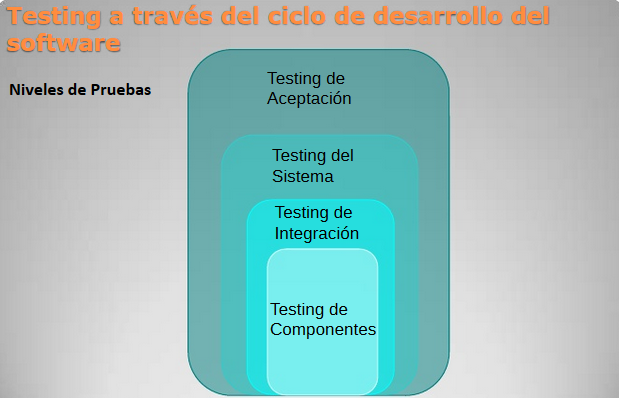](http://www.slideshare.net/educar_bressano/testing-ing-gabriela-muoz)

 <strong style="display:block;margin:12px 0 4px"><a href="http://slideplayer.com/slide/1493816/" title="Ivan Marsic Rutgers University LECTURE 8: Software Testing." target="_blank">Ivan Marsic Rutgers University LECTURE 8: Software Testing.</a></strong><iframe src="http://player.slideplayer.com/5/1493816/" width="765" height="623" frameborder="0" marginwidth="0" marginheight="0" scrolling="no" style="border:1px solid #CCC;border-width:1px 1px 0" allowfullscreen></iframe>

[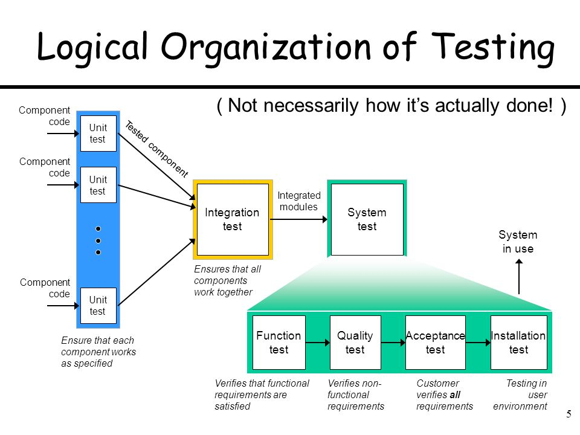](http://slideplayer.com/slide/1493816/)

[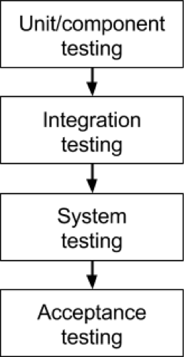](http://reqtest.com/uncategorized/differences-between-different-test-levels/)

[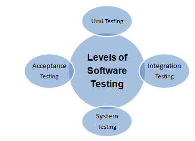](http://mylearning.qualityprotech.com/testinguideC01x2.html)

<iframe src="//www.slideshare.net/slideshow/embed_code/key/thb8jCfGeCLQ7a" width="595" height="485" frameborder="0" marginwidth="0" marginheight="0" scrolling="no" style="border:1px solid #CCC; border-width:1px; margin-bottom:5px; max-width: 100%;" allowfullscreen class="video"> </iframe> 
 <strong> <a href="//www.slideshare.net/educar_bressano/testing-ing-gabriela-muoz" title="Testing - Ing. Gabriela Muñoz" target="_blank">Testing - Ing. Gabriela Muñoz</a> </strong> from <strong><a href="//www.slideshare.net/educar_bressano" target="_blank">Mario Osvaldo Bressano</a></strong> 

 

<iframe src="//www.slideshare.net/slideshow/embed_code/key/uJ8rtaWxJvLZMP" width="595" height="485" frameborder="0" marginwidth="0" marginheight="0" scrolling="no" style="border:1px solid #CCC; border-width:1px; margin-bottom:5px; max-width: 100%;" allowfullscreen class="video"> </iframe> 
 <strong> <a href="//www.slideshare.net/GuillermoLemus/tipos-de-pruebas-de-software" title="Tipos de pruebas de software" target="_blank">Tipos de pruebas de software</a> </strong> from <strong><a href="//www.slideshare.net/GuillermoLemus" target="_blank">Guillermo Lemus</a></strong> 

 

## Blogs
- [Testing & QA Management blog by PractiTest](http://qablog.practitest.com/)
    - [International 2016 State of Testing. What it means to be a tester worldwide 🌟🌟](http://qablog.practitest.com/state-of-testing/)

[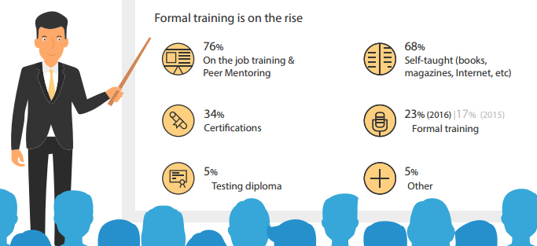](http://qablog.practitest.com/state-of-testing/)

## Mapas Mentales para Software Testing
- [TestingBaires Mapas Mentales para Software Testing](http://testingbaires.com/mapas-mentales/)

## ISTQB
- [International Software Testing Qualifications Board](https://en.wikipedia.org/wiki/International_Software_Testing_Qualifications_Board)
- [istqb.org](http://www.istqb.org/) 
- [sstqb.es](http://www.sstqb.es/)
- [Software QA - Software testing levels onion model](http://blog.panel.es/index.php/software-qa-software-testing-levels-onion-model/)

[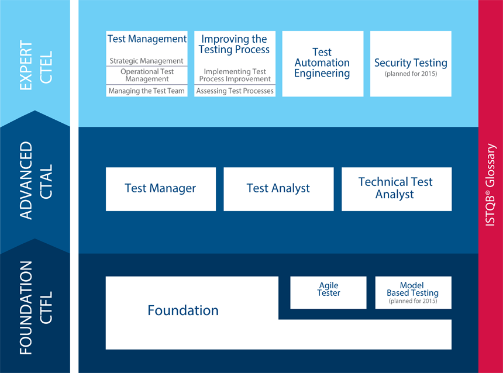](http://dawconsblog.blogspot.com.es/2015/02/testing-e-istqb.html)

[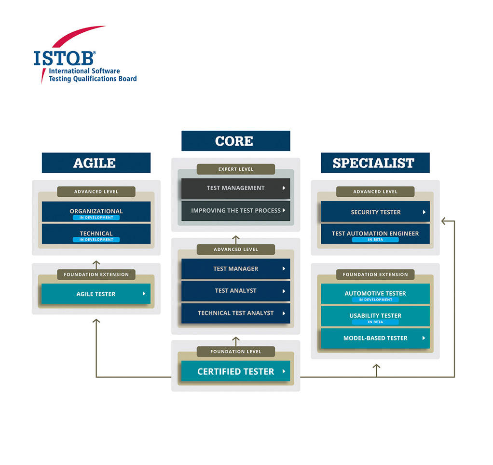](http://www.istqb.org)

[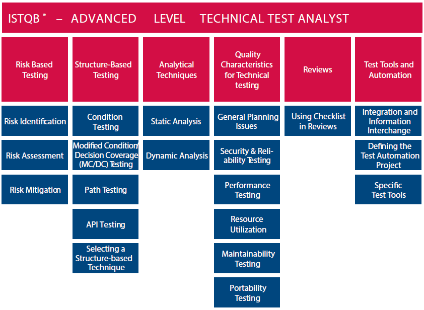](http://www.businessinnova.com)

### V Model Testing

[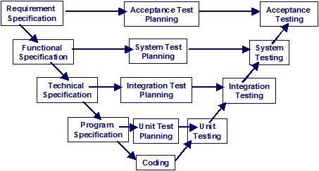](http://blog.panel.es/index.php/software-qa-software-testing-levels-onion-model/)

[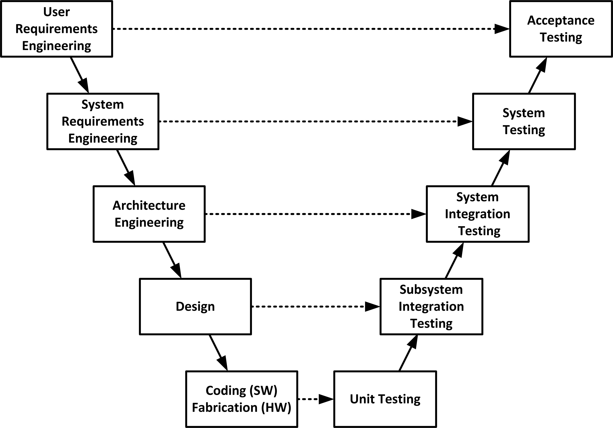](https://insights.sei.cmu.edu/sei_blog/2013/11/using-v-models-for-testing.html)

[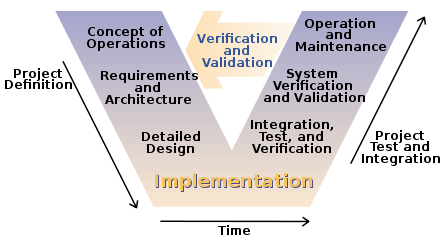](https://en.wikipedia.org/wiki/V-Model_(software_development))

[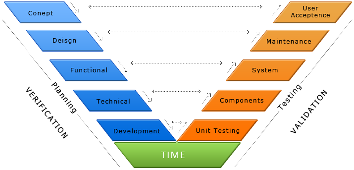](http://www.softobiz.com/v-model)

### Onion Model Testing

[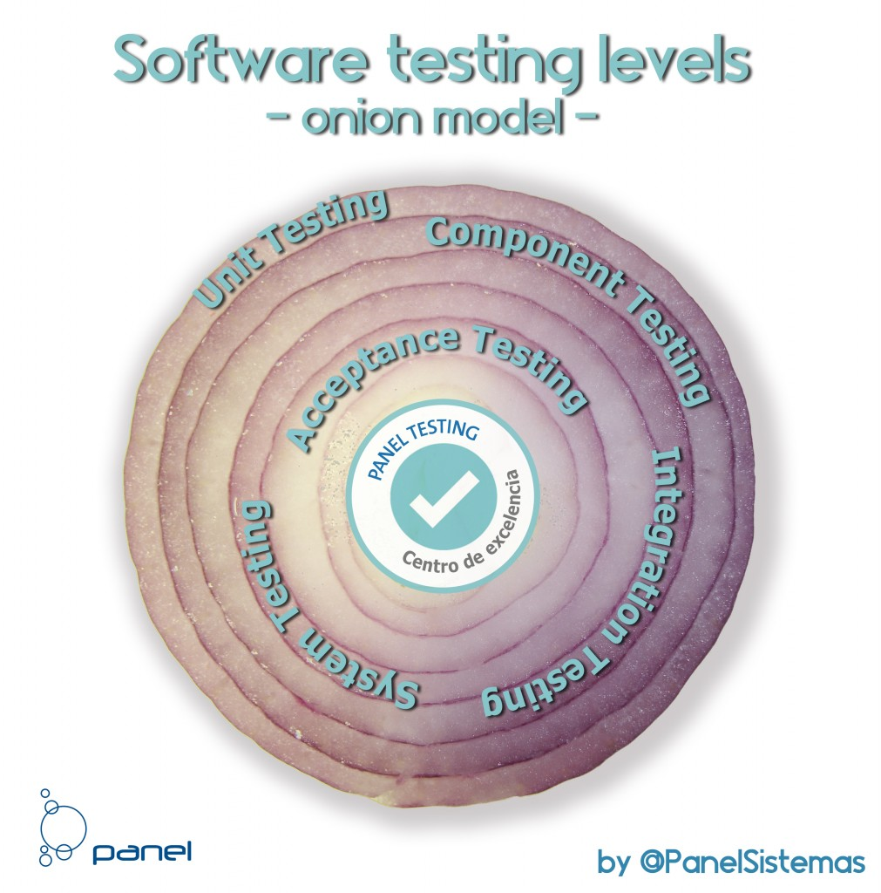](http://blog.panel.es/index.php/software-qa-software-testing-levels-onion-model/)

## TMAP
- [Test Management Approach](https://en.wikipedia.org/wiki/Test_Management_Approach)
- [tmap.net](http://www.tmap.net/)
- [TMap NEXT structured testing](http://www.tmap.net/tmap-next)
- [What is TMap NEXT? A quick overview](https://www.linkedin.com/pulse/what-tmap-quick-overview-humayun-shaukat)
- [Los 4 fundamentos de TMap – Sogeti](http://testingbaires.com/los-4-fundamentos-de-tmap-sogeti/)

[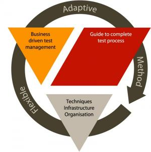](http://www.tmap.net/tmap-next)

[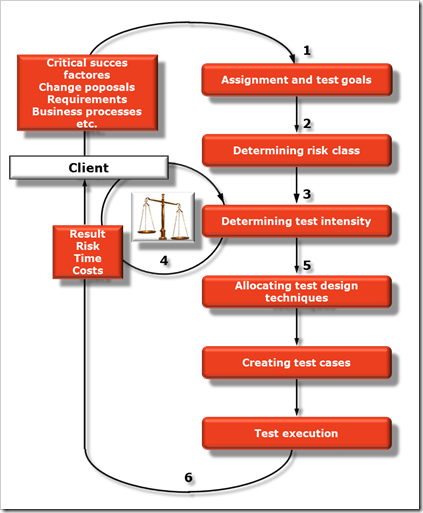](https://www.linkedin.com/pulse/what-tmap-quick-overview-humayun-shaukat)

[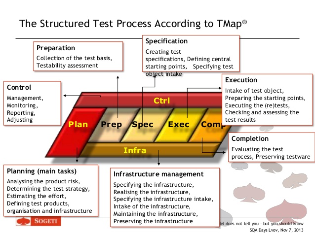](http://www.slideshare.net/VLDCORP/test-process-improvement-with-tpi-next-what-the-model-does-not-tell-you-but-you-should-know)

<iframe src="//www.slideshare.net/slideshow/embed_code/key/2nWJ3Ngr7pWeZb" width="595" height="485" frameborder="0" marginwidth="0" marginheight="0" scrolling="no" style="border:1px solid #CCC; border-width:1px; margin-bottom:5px; max-width: 100%;" allowfullscreen class="video"> </iframe> 
 <strong> <a href="//www.slideshare.net/VLDCORP/test-process-improvement-with-tpi-next-what-the-model-does-not-tell-you-but-you-should-know" title="Test Process Improvement with TPI NEXT - what the model does not tell you but you should know " target="_blank">Test Process Improvement with TPI NEXT - what the model does not tell you but you should know </a> </strong> from <strong><a href="//www.slideshare.net/VLDCORP" target="_blank">SQALab</a></strong> 

 

<blockquote class="twitter-tweet tw-align-center" data-lang="es">
From our sister site <a href="https://twitter.com/testmagazine">@testmagazine</a>: Continuous performance testing in an agile environment. <a href="https://t.co/hkjnKR5wXJ">https://t.co/hkjnKR5wXJ</a> <a href="https://t.co/GUTvtD4Wot">pic.twitter.com/GUTvtD4Wot</a>
&mdash; DevOps Online News (@DevOpsOnline) <a href="https://twitter.com/DevOpsOnline/status/735470641332158464">25 de mayo de 2016</a></blockquote>

<blockquote class="twitter-tweet tw-align-center" data-lang="es">
Fitting the pieces together with <a href="https://twitter.com/hashtag/ContinuousTesting?src=hash">#ContinuousTesting</a> <a href="https://t.co/6TqcyonqJ1">https://t.co/6TqcyonqJ1</a> <a href="https://t.co/WVxZqSzarX">pic.twitter.com/WVxZqSzarX</a>
&mdash; DevOps Online News (@DevOpsOnline) <a href="https://twitter.com/DevOpsOnline/status/739426599854972928">5 de junio de 2016</a></blockquote>

## Application Security Testing
- [Application Security Testing](app_sec_testing.md)

## DevOps Quality Blueprint
- [Assessing state of your DevOps Adoption - Use of a Quality Blueprint (QBP) Approach](https://www.capgemini.com/blog/capping-it-off/2016/05/assessing-state-of-your-devops-adoption-use-of-a-quality-blueprint-qbp/)
- [New Breed of Testers with DevOps](https://www.capgemini.com/blog/capping-it-off/2015/08/new-breed-of-testers-with-devops)
- [World Quality Report 2015-16](https://www.capgemini.com/thought-leadership/world-quality-report-2015-16)

[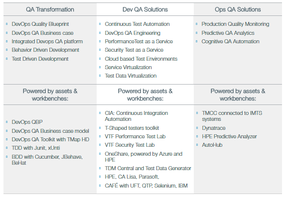](https://www.capgemini.com/testing-services/devops-qa-increasing-speed-and-quality)

<iframe width="560" height="315" src="https://www.youtube.com/embed/szNowbML4Ck?rel=0" frameborder="0" allowfullscreen class="video"></iframe>

 

## Testing Tools
- [Testing Tools](qa_tools.md)

[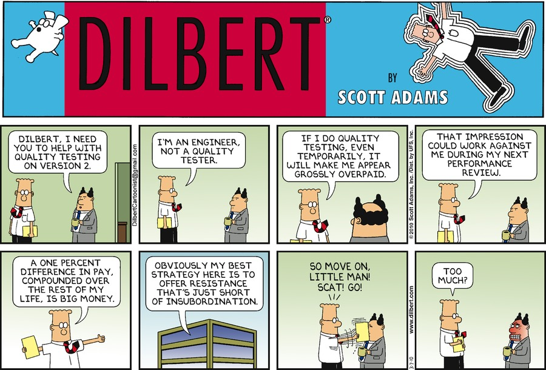](http://dilbert.com/strip/2010-03-07)

