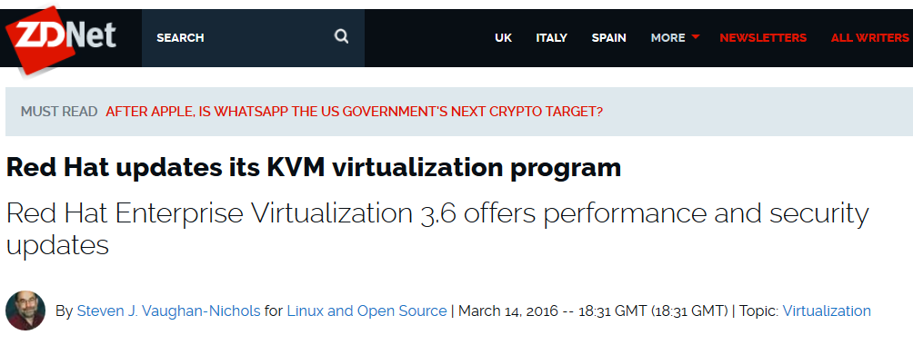
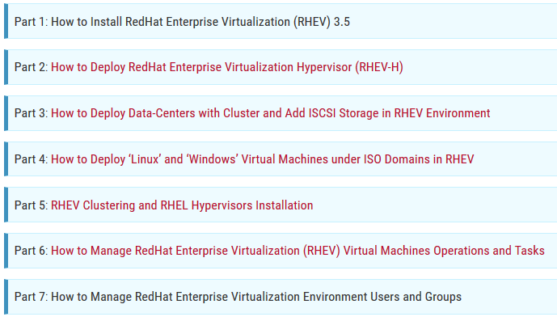

<!-- MarkdownTOC -->

- [Red Hat Virtualization](#red-hat-virtualization)

<!-- /MarkdownTOC -->

# Red Hat Virtualization
- [tecmint.com: How to Install RedHat Enterprise Virtualization (RHEV) 3.5](http://www.tecmint.com/install-redhat-virtualization-rhev/)
	- [Open source Virtualization by Quru, the fastest-growing Red Hat solution provider based in London](https://youtu.be/F2lxJTdfVy8)
	- [How to Create Virtual Machines in Linux Using KVM (Kernel-based Virtual Machine)](http://www.tecmint.com/install-and-configure-kvm-in-linux/)
- [community.redhat.com: Up and Running with oVirt 3.5](http://community.redhat.com/blog/2014/10/up-and-running-with-ovirt-3-5/)
	- [Up and Running with oVirt 3.5, Part Two](http://community.redhat.com/blog/2014/11/up-and-running-with-ovirt-3-5-part-two/)
- [gluster.org: GlusterFS scalable network filesystem](http://www.gluster.org/)
	- [GlusterFS Documentation](http://gluster.readthedocs.org/en/latest/)
	- [tecmint.com: Introduction to GlusterFS (File System) and Installation on RHEL/CentOS and Fedora](http://www.tecmint.com/introduction-to-glusterfs-file-system-and-installation-on-rhelcentos-and-fedora/)
- [Apple Dumps VMware Licensing Agreement, Will Step Up Deployment Of Open-Source KVM Virtualization](http://www.crn.com/news/data-center/300078323/sources-apple-dumps-vmware-licensing-agreement-will-step-up-deployment-of-open-source-kvm-virtualization.htm)
- [rhelblog.redhat.com: Virtual Machine Migration Best Practices 🌟](http://rhelblog.redhat.com/2016/05/11/migratevms/)
- [Live Migrating QEMU-KVM Virtual Machines 🌟](http://developers.redhat.com/blog/2015/03/24/live-migrating-qemu-kvm-virtual-machines/)
- [captainkvm.com 🌟🌟🌟](http://captainkvm.com)

<iframe width="560" height="315" src="https://www.youtube.com/embed/HsqtHT8auxg?rel=0" frameborder="0" allowfullscreen class="video"></iframe>

 

<iframe width="560" height="315" src="https://www.youtube-nocookie.com/embed/F2lxJTdfVy8?rel=0" frameborder="0" allowfullscreen class="video"></iframe>

 

<iframe width="560" height="315" src="https://www.youtube.com/embed/IU9_I33UnG8?rel=0" frameborder="0" allowfullscreen class="video"></iframe>

 

<iframe width="560" height="315" src="https://www.youtube.com/embed/RbRtRoxTmvI?rel=0" frameborder="0" allowfullscreen class="video"></iframe>

 

<iframe width="560" height="315" src="https://www.youtube.com/embed/bOeH-bjTSLw?rel=0" frameborder="0" allowfullscreen class="video"></iframe>

 

<blockquote class="twitter-tweet tw-align-center" data-partner="tweetdeck">
.<a href="https://twitter.com/vmherold">@vmherold</a> on modernizing your <a href="https://twitter.com/hashtag/datacenter?src=hash">#datacenter</a>: <a href="https://t.co/HnaKvxNYGc">https://t.co/HnaKvxNYGc</a> <a href="https://twitter.com/hashtag/moderndatacenters?src=hash">#moderndatacenters</a> <a href="https://twitter.com/hashtag/virtualization?src=hash">#virtualization</a>
&mdash; Red Hat, Inc. (@RedHatNews) <a href="https://twitter.com/RedHatNews/status/707174032135729153">March 8, 2016</a></blockquote>

<blockquote class="twitter-tweet tw-align-center" data-lang="es">
<a href="https://twitter.com/hashtag/Red?src=hash">#Red</a> Hat Enterprise <a href="https://twitter.com/hashtag/Virtualization?src=hash">#Virtualization</a> 3.6 has new tools to ease <a href="https://twitter.com/hashtag/VMware?src=hash">#VMware</a> <a href="https://twitter.com/hashtag/vSphere?src=hash">#vSphere</a> migrations <a href="https://t.co/fkZTQHqnf9">https://t.co/fkZTQHqnf9</a> <a href="https://t.co/Vf8YW4kyu9">pic.twitter.com/Vf8YW4kyu9</a>
&mdash; Red Hat, Inc. (@RedHatNews) <a href="https://twitter.com/RedHatNews/status/707706032378634240">marzo 9, 2016</a></blockquote>

<blockquote class="twitter-tweet tw-align-center" data-lang="es">
New whitepaper: Advanced operations with <a href="https://twitter.com/hashtag/RedHat?src=hash">#RedHat</a> Enterprise Virtualization 3.6 <a href="https://t.co/3gj3LJU4Wr">https://t.co/3gj3LJU4Wr</a> <a href="https://twitter.com/hashtag/databasevirtualization?src=hash">#databasevirtualization</a> <a href="https://twitter.com/hashtag/RHEV?src=hash">#RHEV</a>
&mdash; Red Hat, Inc. (@RedHatNews) <a href="https://twitter.com/RedHatNews/status/743539145004376065">16 de junio de 2016</a></blockquote>

<blockquote class="twitter-tweet tw-align-center" data-lang="es">
<a href="https://twitter.com/hashtag/Linux?src=hash">#Linux</a> containers vs. <a href="https://twitter.com/hashtag/VMs?src=hash">#VMs</a>: A <a href="https://twitter.com/hashtag/security?src=hash">#security</a> comparison <a href="https://t.co/tp76nVqfKY">https://t.co/tp76nVqfKY</a> via <a href="https://twitter.com/infoworld">@infoworld</a>
&mdash; Red Hat Cloud (@RedHatCloud) <a href="https://twitter.com/RedHatCloud/status/734785211674697728">23 de mayo de 2016</a></blockquote>

<blockquote class="twitter-tweet tw-align-center" data-lang="es">
Want to detect execution in a virtualized environment on Linux?  systemd-detect-virt  OR  dmidecode -s system-manufacturer<a href="https://twitter.com/hashtag/sysadmin?src=hash">#sysadmin</a>
&mdash; nixCraft (@nixcraft) <a href="https://twitter.com/nixcraft/status/714602201222524928">28 de marzo de 2016</a></blockquote>

<blockquote class="twitter-tweet tw-align-center" data-lang="es">
A lot of good work happening in the <a href="https://twitter.com/hashtag/ovirt?src=hash">#ovirt</a>, <a href="https://twitter.com/hashtag/fedora?src=hash">#fedora</a> and <a href="https://twitter.com/hashtag/rhel?src=hash">#rhel</a> communities. <a href="https://twitter.com/RedHatNews">@RedHatNews</a> <a href="https://t.co/Ks5ENiCb4S">https://t.co/Ks5ENiCb4S</a>
&mdash; Scott McCarty (@fatherlinux) <a href="https://twitter.com/fatherlinux/status/734727633871724544">23 de mayo de 2016</a></blockquote>

<blockquote class="twitter-tweet tw-align-center" data-lang="es">
From a Dockerfile to a VM <a href="https://t.co/X2FEjlNxvH">https://t.co/X2FEjlNxvH</a> [Demo]
&mdash; Fedora Project (@fedora) <a href="https://twitter.com/fedora/status/738034930219941888">1 de junio de 2016</a></blockquote>

<iframe width="560" height="315" src="https://www.youtube.com/embed/hMOKrmvYRC0?rel=0" frameborder="0" allowfullscreen class="video"></iframe>

 

<iframe width="420" height="315" src="https://www.youtube.com/embed/HlwEDioaigM?rel=0" frameborder="0" allowfullscreen class="video"></iframe>

 

<iframe width="560" height="315" src="https://www.youtube.com/embed/1YDzbn0V6XQ?rel=0" frameborder="0" allowfullscreen class="video"></iframe>

 
