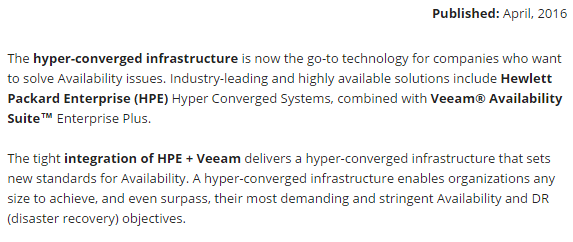
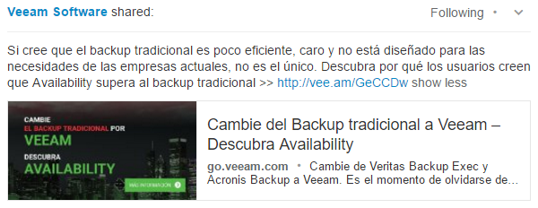
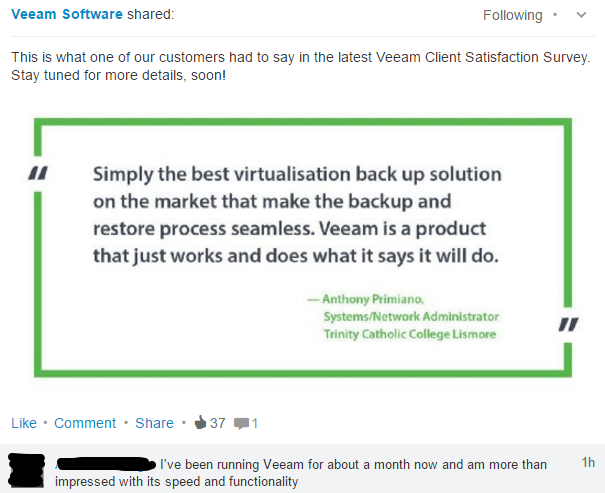
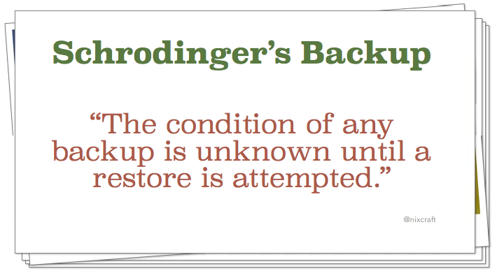

**Table of Contents**
<!-- MarkdownTOC -->

- [Servers, Storage and Backup](#servers-storage-and-backup)
	- [Dell](#dell)
	- [HP](#hp)
	- [FlexPod Datacenter](#flexpod-datacenter)
	- [VxRail VMware Hyper Converged Infrastructure HCI](#vxrail-vmware-hyper-converged-infrastructure-hci)
	- [Cisco HyperFlex Systems](#cisco-hyperflex-systems)
	- [Lenovo Servers](#lenovo-servers)
	- [RAID disks](#raid-disks)
	- [Remote PC Access](#remote-pc-access)
	- [VMware](#vmware)
	- [Storage](#storage)
		- [Linux LVM Logical Volume Management and FileSystems](#linux-lvm-logical-volume-management-and-filesystems)
			- [File Systems](#file-systems)
				- [ZFS RAID](#zfs-raid)
	- [Veritas Volume Manager VxVM and Cluster VCS](#veritas-volume-manager-vxvm-and-cluster-vcs)
	- [Backup](#backup)

<!-- /MarkdownTOC -->

<blockquote class="twitter-tweet tw-align-center" data-lang="es">
According to one analyst <a href="https://twitter.com/hashtag/CloudComputing?src=hash">#CloudComputing</a> Not Seen Cannibalizing <a href="https://twitter.com/hashtag/Server?src=hash">#Server</a> Market, As Assumed <a href="https://t.co/93MecfNxPG">https://t.co/93MecfNxPG</a> via <a href="https://twitter.com/IBDinvestors">@IBDInvestors</a>
&mdash; Red Hat Cloud (@RedHatCloud) <a href="https://twitter.com/RedHatCloud/status/726738435973640192">1 de mayo de 2016</a></blockquote>

<blockquote class="twitter-tweet tw-align-center" data-lang="es">
Senior vs junior <a href="https://twitter.com/hashtag/sysadmin?src=hash">#sysadmin</a> during an outage. <a href="https://t.co/0Ag6eN0tTg">pic.twitter.com/0Ag6eN0tTg</a>
&mdash; Sentral (@SentralSystems) <a href="https://twitter.com/SentralSystems/status/738662874638323712">3 de junio de 2016</a></blockquote>

<blockquote class="twitter-tweet tw-align-center" data-lang="es">
<a href="https://twitter.com/hashtag/FloppyDisks?src=hash">#FloppyDisks</a> <a href="https://twitter.com/hashtag/OldSchoolCool?src=hash">#OldSchoolCool</a> <a href="https://twitter.com/hashtag/History?src=hash">#History</a> <a href="https://t.co/AtHGcR1UfU">pic.twitter.com/AtHGcR1UfU</a>
&mdash; nixCraft (@nixcraft) <a href="https://twitter.com/nixcraft/status/746763306560413696">25 de junio de 2016</a></blockquote>

|||||
|:---:|:---:|:---:|:---:|

||||||
|:---:|:---:|:---:|:---:|:---:|

|||||||
|:---:|:---:|:---:|:---:|:---:|:---:|

|||||||
|:---:|:---:|:---:|:---:|:---:|:---:|

# Servers, Storage and Backup
- [opensource.com: Linux monitoring tools to keep your hardware cool 🌟](https://opensource.com/life/15/11/linux-temperature-monitoring-tools)

## Dell
- [Dell Community](http://community.dell.com/)
- [New PowerEdge R930: Powerful and reliable, ideal for customers migrating to more innovative x86 platforms from proprietary UNIX](http://www.dell.com/learn/us/en/uscorp1/press-releases/2015-04-28-dell-r930-server)
- [Dell PowerEdge R930](http://www.dell.com/es/empresas/p/poweredge-r930/pd?~ck=anav)
- [The Forecast for UNIX: Hazy and Overcast, so reach for your Umbrella and Red Hat](http://www.gartner.com/technology/media-products/newsletters/red_hat/vol2_issue1/index.html) Why Red Hat Enterprise Linux is the optimal choice when migrating from proprietary UNIX systems
- [Dell launches PowerEdge entry-level servers for SMBs](http://www.infotechlead.com/networking/dell-launches-entry-level-servers-for-smbs-36295)
- [Dell PowerEdge solutions for SMBs and suggested uses 🌟](http://blog.neweggbusiness.com/buying-guides/windows-server-2012-migration-dell-poweredge-solutions/)
- [Dell Announces 13th Generation PowerEdge Servers](http://www.mellanox.com/blog/2014/09/dell-announces-13th-generation-poweredge-servers/)
- [storagereview.com Dell PowerEdge 13G R730 Server Review](http://www.storagereview.com/dell_poweredge_13g_r730_server_review)
	- [Red Hat Enterprise Linux achieves 2-processor world record result on two-tier SAP® Sales and Distribution standard application benchmark](http://www.redhat.com/en/about/blog/red-hat-enterprise-linux-achieves-2-processor-world-record-result-two-tier-sap%C2%AE-sales-and-distribution-standard-application-benchmark)
- [thevarguy.com: Dell and Red Hat Deliver Easier Firmware Updates for Linux Users](http://thevarguy.com/open-source-application-software-companies/dell-and-red-hat-deliver-easier-firmware-updates-linux-us)
- [Dell Unveils New OpenStack Extensions at Red Hat Summit 2016](http://www.eweek.com/cloud/dell-unveils-new-openstack-extensions-at-red-hat-summit.html)
- [PowerEdge FC380](http://www.dell.com/us/business/p/poweredge-fx/fs?ST=dell%20poweredge%20fc830) “It continues to offer amazing performance in an incredibly small 1U footprint”. [StorageReview deep dives into the PowerEdge FC380](http://www.storagereview.com/dell_poweredge_fc830_with_intel_broadwell_review).

<blockquote class="twitter-tweet tw-align-center" data-lang="es">
<a href="https://twitter.com/hashtag/Dell?src=hash">#Dell</a> and <a href="https://twitter.com/hashtag/RedHat?src=hash">#RedHat</a> deliver easier <a href="https://twitter.com/hashtag/firmware?src=hash">#firmware</a> updates for <a href="https://twitter.com/hashtag/Linux?src=hash">#Linux</a> users <a href="https://t.co/GruU90bU9O">https://t.co/GruU90bU9O</a> (via <a href="https://twitter.com/thevarguy">@thevarguy</a>)
&mdash; Red Hat EMEA (@RedHatEMEA) <a href="https://twitter.com/RedHatEMEA/status/699967981548343296">febrero 17, 2016</a></blockquote>

<blockquote class="twitter-tweet tw-align-center" data-lang="es">
<a href="https://twitter.com/hashtag/Ceph?src=hash">#Ceph</a> on a <a href="https://twitter.com/hashtag/Dell?src=hash">#Dell</a> beast <a href="https://t.co/6e4aDtYLya">https://t.co/6e4aDtYLya</a>
&mdash; African Zoe (@AfricanZoe) <a href="https://twitter.com/AfricanZoe/status/745672595639570432">22 de junio de 2016</a></blockquote>

<blockquote class="twitter-tweet tw-align-center" data-lang="es">
Monitoring <a href="https://twitter.com/Dell">@Dell</a> infra with <a href="https://twitter.com/docker">@Docker</a> <a href="https://twitter.com/hashtag/containers?src=hash">#containers</a> by <a href="https://twitter.com/jdelaros1">@jdelaros1</a> &amp; <a href="https://twitter.com/hashtag/DockerCaptain?src=hash">#DockerCaptain</a> <a href="https://twitter.com/ajeetsraina">@ajeetsraina</a>: <a href="https://t.co/b9OggpHXed">https://t.co/b9OggpHXed</a> <a href="https://t.co/wZXXb1iXxT">pic.twitter.com/wZXXb1iXxT</a>
&mdash; Docker (@docker) <a href="https://twitter.com/docker/status/740500631883001856">8 de junio de 2016</a></blockquote>

<iframe width="560" height="315" src="https://www.youtube-nocookie.com/embed/1fGjgB__yxY?rel=0" frameborder="0" allowfullscreen class="video"></iframe>

 

<iframe width="560" height="315" src="https://www.youtube.com/embed/USbhT1Q1HQU?rel=0" frameborder="0" allowfullscreen class="video"></iframe>

 

<iframe width="560" height="315" src="https://www.youtube.com/embed/FvZXu-sy2KI?rel=0" frameborder="0" allowfullscreen class="video"></iframe>

 

<iframe width="560" height="315" src="https://www.youtube.com/embed/F8npdLYyfLw?rel=0" frameborder="0" allowfullscreen class="video"></iframe>

 

<blockquote class="twitter-tweet tw-align-center" data-lang="es">
.<a href="https://twitter.com/Dell">@Dell</a> and <a href="https://twitter.com/hashtag/RedHat?src=hash">#RedHat</a>: One of the 10 most important tech partnerships in 2016 according to <a href="https://twitter.com/CRN">@CRN</a> <a href="https://t.co/oPATSZL59u">https://t.co/oPATSZL59u</a> <a href="https://t.co/DhMf51UxwG">pic.twitter.com/DhMf51UxwG</a>
&mdash; Red Hat EMEA (@RedHatEMEA) <a href="https://twitter.com/RedHatEMEA/status/761598975812272128">5 de agosto de 2016</a></blockquote>

## HP
- [HP releases new servers and storage for SMEs](http://www.itwire.com/business-it-news/hardware-and-storage/67312-hp-releases-new-servers-and-storage-for-smes)
- [HP Intros New StoreVirtual-Based Hyper-Converged Infrastructure Appliance](http://www.crn.com/news/storage/300077656/hp-intros-new-storevirtual-based-hyper-converged-infrastructure-appliance.htm)
- [HP’s hyper-converged portfolio grows: meet the CS250-HC](http://www.bitcon.be/?p=3093)
- [HPE launches midmarket hyperconverged system, bets on UI, integration](http://www.zdnet.com/article/hpe-launches-midmarket-hyperconverged-system-bets-on-ui-integration/)

<iframe width="560" height="315" src="https://www.youtube.com/embed/Sb7nfmf4vVQ?rel=0" frameborder="0" allowfullscreen class="video"></iframe>

 

<iframe width="560" height="315" src="https://www.youtube-nocookie.com/embed/EHZVxCcN7wU?rel=0" frameborder="0" allowfullscreen class="video"></iframe>

 

<iframe width="560" height="315" src="https://www.youtube.com/embed/MpUm2sWuQ0Q?rel=0" frameborder="0" allowfullscreen class="video"></iframe>

 

<blockquote class="twitter-tweet tw-align-center" data-lang="es">
HPE launches midmarket hyperconverged system, bets on UI, integration <a href="https://t.co/XwfsrawAPL">https://t.co/XwfsrawAPL</a> by <a href="https://twitter.com/ldignan">@ldignan</a>
&mdash; ZDNet (@ZDNet) <a href="https://twitter.com/ZDNet/status/709706982836469761">15 de marzo de 2016</a></blockquote>

<blockquote class="twitter-tweet tw-align-center" data-lang="es">
HPE to Bundle Docker Containers Into All Servers <a href="https://t.co/UufzZW8Zi3">https://t.co/UufzZW8Zi3</a>
&mdash; Docker (@docker) <a href="https://twitter.com/docker/status/749400141602361344">3 de julio de 2016</a></blockquote>

<blockquote class="twitter-tweet tw-align-center" data-lang="es">
Laughed so hard I got stitch (via Reddit) <a href="https://t.co/ujn3lWmDaX">pic.twitter.com/ujn3lWmDaX</a>
&mdash; Holly Brockwell (@holly) <a href="https://twitter.com/holly/status/767496822336126976">21 de agosto de 2016</a></blockquote>

## FlexPod Datacenter
- [FlexPod Datacenter](http://www.netapp.com/solutions/flexpod/datacenter.aspx)

<blockquote class="twitter-tweet tw-align-center" data-lang="es">
<a href="https://twitter.com/hashtag/FlexPod?src=hash">#FlexPod</a> <a href="https://twitter.com/hashtag/Datacenter?src=hash">#Datacenter</a> with Red Hat <a href="https://twitter.com/hashtag/OpenStack?src=hash">#OpenStack</a> Design Guide <a href="https://t.co/P3nqOvfBKf">https://t.co/P3nqOvfBKf</a>
&mdash; FlexPod (@FlexPod) <a href="https://twitter.com/FlexPod/status/746737226185334784">25 de junio de 2016</a></blockquote>

<iframe width="560" height="315" src="https://www.youtube.com/embed/gDyDy-h9rc4?rel=0" frameborder="0" allowfullscreen class="video"></iframe>

 

## VxRail VMware Hyper Converged Infrastructure HCI
- [Hyper-Converged Infrastructure (HCI)](https://www.vmware.com/products/hyper-converged-infrastructure)
- [VxRail](http://www.vce.com/products/hyper-converged/vxrail)
- [VxRack System 1000 with FLEX Nodes- Holistically Addressing the Data Center Requirements of Today and Tomorrow](https://community.emc.com/community/products/scaleio/blog/2016/05/25/vxrack-system-1000-with-flex-nodes-hollistically-addressing-the-data-center-requirements-of-today-and-tomorrow)

<iframe width="560" height="315" src="https://www.youtube.com/embed/K_wX6ZGgF7s?rel=0" frameborder="0" allowfullscreen class="video"></iframe>

 

<iframe width="560" height="315" src="https://www.youtube.com/embed/it8SVSIknWc?rel=0" frameborder="0" allowfullscreen class="video"></iframe>

 

<iframe width="560" height="315" src="https://www.youtube.com/embed/j33xY65069s?rel=0" frameborder="0" allowfullscreen class="video"></iframe>

 

<iframe width="560" height="315" src="https://www.youtube.com/embed/EDgSTlPLs00?list=PLeI0J3mFLYgwk2G0wkTCXpygnXuvBlVE6" frameborder="0" allowfullscreen class="video"></iframe>

 

## Cisco HyperFlex Systems
- [Cisco Hyperconverged Infrastructure](http://www.cisco.com/go/hyperflex)

<iframe width="560" height="315" src="https://www.youtube.com/embed/gd2KHjZs_2g?rel=0" frameborder="0" allowfullscreen class="video"></iframe>

 

## Lenovo Servers
- [Strategic alliance: Red Hat and Lenovo](https://www.redhat.com/en/partners/strategic-alliance/lenovo)

<blockquote class="twitter-tweet tw-align-center" data-lang="es">
We&#39;re proud to partner with <a href="https://twitter.com/LenovoServers">@LenovoServers</a>. Learn more about our partnership: <a href="https://t.co/PVvsdxQPRk">https://t.co/PVvsdxQPRk</a> <a href="https://t.co/NJ0sbqrEtL">https://t.co/NJ0sbqrEtL</a>
&mdash; Red Hat Partners (@RedHatPartners) <a href="https://twitter.com/RedHatPartners/status/751150976392892416">7 de julio de 2016</a></blockquote>

<iframe width="560" height="315" src="https://www.youtube.com/embed/kVoj4zrrBSA?rel=0" frameborder="0" allowfullscreen class="video"></iframe>

 

## RAID disks
- [Practical RAID Choices for Spindle Based Arrays](http://www.smbitjournal.com/2015/03/practical-raid-choices-for-spindle-based-arrays/)
- [Can I use a desktop hard drive in my storage array?](http://blog.seagate.com/business/can-i-use-a-desktop-hard-drive-in-my-storage-array/)
- [commandlinefu.com: Get the serial numbers from HP RAID](http://www.commandlinefu.com/commands/view/17608/get-the-serial-numbers-from-hp-raid)
- [nixCraft: Linux Check The Health of Adaptec RAID array](http://www.cyberciti.biz/faq/howto-check-adaptec-raid-array/)

<a href="http://securityreactions.tumblr.com/post/132158475779/noticing-a-zmapmasscan-hit-your-command-and">http://securityreactions.tumblr.com/post/132158475779/noticing-a-zmapmasscan-hit-your-command-and</a>

<blockquote class="twitter-tweet tw-align-center" data-lang="es">
Linux Check The Health of Adaptec RAID array <a href="https://t.co/DVObj3GgXN">https://t.co/DVObj3GgXN</a> <a href="https://t.co/XiluYTevbJ">pic.twitter.com/XiluYTevbJ</a>
&mdash; DevOps Guy (@DevopsG) <a href="https://twitter.com/DevopsG/status/766711409388367872">19 de agosto de 2016</a></blockquote>

## Remote PC Access
- [Alternatives to LogMeIn for Remote PC Access](http://www.storagecraft.com/blog/alternatives-logmein-remote-pc-access/)
- [Guacamole is a clientless remote desktop gateway. It supports standard protocols like VNC and RDP](http://guac-dev.org/)
- [Nomachine](https://www.nomachine.com/)
- [X2Go](http://x2go.org)

## VMware
- [VMware](vmware.md)

## Storage
- [StorageReview.com](http://www.storagereview.com/)
- [Presentación Synology 2015 Evento Madrid](http://qloudea.com/blog/evento-synology-2015-madrid/)
	- [Forum.synology.com](http://forum.synology.com)
	- [Automatiza tus backups con rsync en Synology](http://qloudea.com/blog/automatiza-tus-backups-con-rsync-en-synology/)
	- [Synology Add-on Packages](https://www.synology.com/en-uk/dsm/app_packages)
	- [Synology Case Study: Somersault Productions](https://www.synology.com/en-uk/company/case_study/somersault)
	- [Synology Case Study: Bridges Electrical Engineers](https://www.synology.com/en-uk/company/case_study/Bridges_Electrical)
	- [Lanzamiento Synology DS3615xs](http://qloudea.com/blog/synology-ds3615xs-lanzamiento/)
	- [Synology RackStation RS18016xs+](https://www.synology.com/en-uk/products/RS18016xs+)
	- [Synology RS815+ NAS](https://www.synology.com/es-es/products/RS815+)
	- [Synology DS214Play Revisión a fondo](http://qloudea.com/blog/review-synology-ds214play/)
	- [Synology DiskStation DS3615xs review](http://www.itpro.co.uk/storage/23990/synology-diskstation-ds3615xs-review)
- [12 best NAS drives 2015/2016 UK: What's the best network storage you can buy in the UK?](http://www.pcadvisor.co.uk/test-centre/pc-peripheral/12-best-nas-drives-2015-2016-uk-3217608/)
- [Soluciones de almacenamiento Flash Array basadas en Dell y en Supermicro](http://searchdatacenter.techtarget.com/feature/Rethinking-data-center-components-as-commodities)
- [All Flash Buying Guide](http://www.infostor.com/disk-arrays/all-flash-buying-guide.html)
- [opensource.com: 5 open source web app alternatives to Google Drive 🌟](https://opensource.com/life/15/12/5-open-source-web-apps-self-hosted)
- [nixCraft: 7 Awesome Open Source Cloud Storage Software For Your Privacy and Security 🌟](http://www.cyberciti.biz/cloud-computing/7-awesome-open-source-cloud-storage-software-for-your-privacy-and-security/)
- [learnitguide.net: Disk Management in Linux - Understand the Basic Concepts](http://www.learnitguide.net/2016/05/disk-management-in-linux-basic-concepts.html)
- [QNAP_nas now makes FreeBSD based enterprise NAS+ZFS 🌟🌟🌟](https://www.qnap.com/i/en/product/model.php?II=218)

<blockquote class="twitter-tweet tw-align-center" data-lang="es">
It&#39;s time to give your data the flash it demands &amp; from the provider you trust. <a href="https://twitter.com/hashtag/YourDataDemandsMore?src=hash">#YourDataDemandsMore</a><a href="https://t.co/rGQiDGPh5k">https://t.co/rGQiDGPh5k</a>
&mdash; NetApp (@NetApp) <a href="https://twitter.com/NetApp/status/748154380805824512">29 de junio de 2016</a></blockquote>

<blockquote class="twitter-tweet tw-align-center" data-lang="es">
<a href="https://twitter.com/hashtag/NetApp?src=hash">#NetApp</a> FAS2500 Series. Almacenamiento Híbrido para tu Plataforma Convergente de <a href="https://twitter.com/hashtag/FlexPod?src=hash">#FlexPod</a> <a href="https://t.co/OEGlkbKDIm">https://t.co/OEGlkbKDIm</a> <a href="https://t.co/QiAyCN0kf1">pic.twitter.com/QiAyCN0kf1</a>
&mdash; Ingram Micro ES (@IngramMicroES) <a href="https://twitter.com/IngramMicroES/status/748066834075750400">29 de junio de 2016</a></blockquote>

<iframe width="560" height="315" src="https://www.youtube.com/embed/uf0taABJ5rU?rel=0" frameborder="0" allowfullscreen class="video"></iframe>

 

<iframe width="560" height="315" src="https://www.youtube.com/embed/0R1-Y1ZtbFQ?rel=0" frameborder="0" allowfullscreen class="video"></iframe>

 

<iframe width="560" height="315" src="https://www.youtube-nocookie.com/embed/S-mJSmTmeN4?rel=0" frameborder="0" allowfullscreen class="video"></iframe>

 

<iframe width="560" height="315" src="https://www.youtube-nocookie.com/embed/biH5xgyj1vU?rel=0" frameborder="0" allowfullscreen class="video"></iframe>

 

<blockquote class="twitter-tweet tw-align-center" data-lang="es">
Need a self-hosted alternative to Google Drive? Check out these <a href="https://twitter.com/hashtag/opensource?src=hash">#opensource</a> options: <a href="https://t.co/VxgHUh6Kzd">https://t.co/VxgHUh6Kzd</a> <a href="https://t.co/kIq5YBmWWO">pic.twitter.com/kIq5YBmWWO</a>
&mdash; Open Source Way (@opensourceway) <a href="https://twitter.com/opensourceway/status/700591151191949313">febrero 19, 2016</a></blockquote>

<blockquote class="twitter-tweet tw-align-center" data-lang="es">
&quot;Disk Management in Linux - Understand the Basic Concepts&quot; <a href="https://t.co/E0AeX01zHT">https://t.co/E0AeX01zHT</a> <a href="https://twitter.com/hashtag/openstack?src=hash">#openstack</a>
&mdash; Gajendra D Ambi (@MrAmbiG1) <a href="https://twitter.com/MrAmbiG1/status/735770750074769412">26 de mayo de 2016</a></blockquote>

<iframe width="560" height="315" src="https://www.youtube.com/embed/O_McgGUAQKA?rel=0" frameborder="0" allowfullscreen class="video"></iframe>

 

<blockquote class="twitter-tweet tw-align-center" data-lang="es">
&quot;Self-documenting code&quot; <a href="https://t.co/qKKpL0I8CU">pic.twitter.com/qKKpL0I8CU</a>
&mdash; Sad Operator (@sadoperator) <a href="https://twitter.com/sadoperator/status/755046687073198081">18 de julio de 2016</a></blockquote>

<blockquote class="twitter-tweet tw-align-center" data-lang="es">
Wow. <a href="https://twitter.com/QNAP_nas">@QNAP_nas</a> now makes <a href="https://twitter.com/freebsd">@FreeBSD</a> based enterprise NAS+ZFS  <a href="https://t.co/SiO7z0c3NH">https://t.co/SiO7z0c3NH</a>  Does any1 know what version of FreeBSD it&#39;s based on?
&mdash; nixCraft (@nixcraft) <a href="https://twitter.com/nixcraft/status/758230019772600320">27 de julio de 2016</a></blockquote>

### Linux LVM Logical Volume Management and FileSystems
- [RHEL6 doc: LVM Administrator Guide](https://access.redhat.com/knowledge/docs/en-US/Red_Hat_Enterprise_Linux/6/html-single/Logical_Volume_Manager_Administration/index.html)
- [RHEL7 doc: LVM Administrator Guide](https://access.redhat.com/documentation/en-US/Red_Hat_Enterprise_Linux/7/html-single/Logical_Volume_Manager_Administration/index.html)
- [Tecmint: Setup Flexible Disk Storage with Logical Volume Management (LVM) in Linux – PART 1](http://www.tecmint.com/create-lvm-storage-in-linux/)
	- [Tecmint: How to Extend/Reduce LVM’s (Logical Volume Management) in Linux – Part II](http://www.tecmint.com/extend-and-reduce-lvms-in-linux/)
	- [Tecmint: How to Take ‘Snapshot of Logical Volume and Restore’ in LVM – Part III](http://www.tecmint.com/take-snapshot-of-logical-volume-and-restore-in-lvm/)
- [Tecmint: Logical Volume Management on Debian Linux](http://www.tecmint.com/logical-volume-management-on-debian-linux/)
- [Tecmint: Create Centralized Secure Storage using iSCSI Target on RHEL/CentOS/Fedora Part -I](http://www.tecmint.com/create-centralized-secure-storage-using-iscsi-targetin-linux/)
- [Tecmint: How to Create and Setup LUNs using LVM in “iSCSI Target Server” on RHEL/CentOS/Fedora – Part II](http://www.tecmint.com/create-luns-using-lvm-in-iscsi-target/)
- [Tecmint.com: 8 Linux ‘Parted’ Commands to Create, Resize and Rescue Disk Partitions](http://www.tecmint.com/parted-command-to-create-resize-rescue-linux-disk-partitions/)

<blockquote class="twitter-tweet tw-align-center" data-lang="es">
Create and Setup LUNs using LVM in “iSCSI Target Server”<a href="https://t.co/E2G0zwbXWQ">https://t.co/E2G0zwbXWQ</a> RT <a href="https://twitter.com/linuxtoday">@linuxtoday</a>  <a href="https://twitter.com/hashtag/linux?src=hash">#linux</a> <a href="https://t.co/l55gq6VoyD">pic.twitter.com/l55gq6VoyD</a>
&mdash; TecMint.com (@tecmint) <a href="https://twitter.com/tecmint/status/748745273577385985">1 de julio de 2016</a></blockquote>

#### File Systems
- [Linux File System Structure](http://www.tecmint.com/linux-directory-structure-and-important-files-paths-explained/linux-directory-structure/)
- [Linux File System Explained: Boot Loading, Disk Partitioning, BIOS, UEFI and File System Types](http://www.tecmint.com/linux-file-system-explained/)
- [How to Create and Manage Btrfs File System in Linux](http://www.tecmint.com/create-btrfs-filesystem-in-linux/)
- [RHCSA Series: XFS and ACLs (Access Control Lists)](http://www.tecmint.com/rhcsa-exam-configure-acls-and-mount-nfs-samba-shares/)
- [RHCSA Series: Using ‘Parted’ and ‘SSM’ to Configure and Encrypt System Storage](http://www.tecmint.com/rhcsa-exam-create-format-resize-delete-and-encrypt-partitions-in-linux/)
- [Sistemas de archivos en Linux: ¿es hora de dejar ext4 por Btrfs y XFS?](http://www.muylinux.com/2015/01/23/sistema-de-archivos-linux-ext4-btrfs-xfs)

<iframe src="//www.slideshare.net/slideshow/embed_code/key/5IMFuE8obToyyM" width="595" height="485" frameborder="0" marginwidth="0" marginheight="0" scrolling="no" style="border:1px solid #CCC; border-width:1px; margin-bottom:5px; max-width: 100%;" allowfullscreen class="video"> </iframe> 
 <strong> <a href="//www.slideshare.net/michal6103/lvm-10336503" title="Linux: LVM" target="_blank">Linux: LVM</a> </strong> from <strong><a href="//www.slideshare.net/michal6103" target="_blank">Michal Sedlak</a></strong> 

 

<iframe src="//www.slideshare.net/slideshow/embed_code/key/4BYxpR89SQwHee" width="595" height="485" frameborder="0" marginwidth="0" marginheight="0" scrolling="no" style="border:1px solid #CCC; border-width:1px; margin-bottom:5px; max-width: 100%;" allowfullscreen class="video"> </iframe> 
 <strong> <a href="//www.slideshare.net/gnunify/storage-management-using-lvm" title="Storage Management using LVM" target="_blank">Storage Management using LVM</a> </strong> from <strong><a href="//www.slideshare.net/gnunify" target="_blank">Priyank Kapadia</a></strong> 

 

<blockquote class="twitter-tweet tw-align-center" data-lang="es">
<a href="https://twitter.com/hashtag/Linux?src=hash">#Linux</a> filesystem wallpaper for new users/sysadmin Large version <a href="https://t.co/MtIjtlMyUw">https://t.co/MtIjtlMyUw</a> via reddit user /u/threekun <a href="https://t.co/jPxxJJFu1w">pic.twitter.com/jPxxJJFu1w</a>
&mdash; nixCraft (@nixcraft) <a href="https://twitter.com/nixcraft/status/709027880345280512">13 de marzo de 2016</a></blockquote>

##### ZFS RAID
- [How to install ZFS on Ubuntu Linux 16.04 LTS](http://www.cyberciti.biz/faq/how-to-install-zfs-on-ubuntu-linux-16-04-lts/)
- [How to create RAID 10 – Striped Mirror Vdev ZPool On Ubuntu Linux](http://www.cyberciti.biz/faq/how-to-create-raid-10-striped-mirror-vdev-zpool-on-ubuntu-linux/)

<blockquote class="twitter-tweet tw-align-center" data-lang="es">
How to create Striped Mirror Vdev ZPool (RAID 10) On Ubuntu Linux or Any Distro <a href="https://t.co/2nvePR3FwT">https://t.co/2nvePR3FwT</a> <a href="https://twitter.com/hashtag/sysadmin?src=hash">#sysadmin</a> <a href="https://t.co/VDPl5TNsjV">pic.twitter.com/VDPl5TNsjV</a>
&mdash; nixCraft (@nixcraft) <a href="https://twitter.com/nixcraft/status/760880707212148741">3 de agosto de 2016</a></blockquote>

## Veritas Volume Manager VxVM and Cluster VCS
- [Learnitguide.net: Veritas Volume Manager (VxVM) - Online Resizing of Volumes](http://www.learnitguide.net/2016/04/veritas-volume-manager-online-resizing.html)
- [learnitguide.net: VCS Cluster Interview Questions and Answers](http://www.learnitguide.net/2016/05/vcs-cluster-interview-questions-and-answers.html)
- [Learnitguide.net: Configure two node VCS Cluster in Linux - Step by Step](http://www.learnitguide.net/2016/05/configure-two-node-vcs-cluster-in-linux.html)
- [Learnitguide.net: Veritas Cluster Server 6.2 (VCS) Installation on RHEL7](http://www.learnitguide.net/2016/04/veritas-cluster-server-installation-on-rhel7.html)

<blockquote class="twitter-tweet tw-align-center" data-lang="es">
Veritas se relanza tras independizarse de Symantec <a href="https://t.co/Z2TBg5lQPw">https://t.co/Z2TBg5lQPw</a> <a href="https://t.co/kDamQq3Qdo">pic.twitter.com/kDamQq3Qdo</a>
&mdash; Cinco Días (@CincoDiascom) <a href="https://twitter.com/CincoDiascom/status/709315094325268480">14 de marzo de 2016</a></blockquote>

<iframe width="560" height="315" src="https://www.youtube.com/embed/LYWuy1rXV3g?rel=0" frameborder="0" allowfullscreen class="video"></iframe>

 

## Backup
- [6 Steps to Better Data Backup and Quicker Recovery](https://www.linkedin.com/pulse/6-steps-better-data-backup-quicker-recovery-manuel-w-lloyd)
	- [3 Ways To Ensure 100 Percent Secure Enterprise File Sharing](http://www.vaultize.com/blog/3-ways-to-ensure-100-percent-secure-enterprise-file-sharing)
- [Best Practices for Linux Backup Every Administrator Should Know](http://www.storagecraft.com/blog/best-practices-for-linux-backup-every-administrator-should-know/)
- [Synology Data Backup](https://www.synology.com/en-us/dsm/data_backup)
	- [Synology RC18015xs+ and Snapshot Manager at Computex 2015](https://youtu.be/YeMoCDxZYDU?list=PLbeBr03sf2pUuYdoZCwJQ5oGvFhIMvAWM)
	- [Automatiza tus backups con rsync en Synology NAS - Qloudea Blog](http://qloudea.com/blog/automatiza-tus-backups-con-rsync-en-synology/)
- [rsnapshot Remote MySQL Backup Shell Script](http://bash.cyberciti.biz/backup/rsnapshot-remote-mysql-backup-shell-script/)
	- [rsnapshot.org, filesystem snapshot](http://rsnapshot.org/)
- [rsync.net Enterprise Cloud Storage](http://rsync.net)
	- [rsync.net: ZFS Replication to the cloud is finally here—and it’s fast](http://arstechnica.com/information-technology/2015/12/rsync-net-zfs-replication-to-the-cloud-is-finally-here-and-its-fast/)
- [Moving from Tape to Disk Backup with Data Deduplication](http://www.datamation.com/data-center/moving-from-tape-to-disk-backup-with-data-deduplication.html)
- [You need deduplication to do disk backup! Really?](http://www.virtualtothecore.com/en/you-need-deduplication-to-do-disk-backup-really/)
- [Top 5 Benefits of Online Backup](http://www.cwps.com/blog/top-5-benefits-of-online-backup)
- [Infrascale: Cloud Disaster Recovery. Is it time to breakup with your backup?](https://www.infrascale.com/)
- [Bacula Enterprise is changing the definition of Open-source Backup Software](http://storageswiss.com/2015/03/19/bacula-enterprise-changing-the-definition/)
- [baculasystems.com](http://www.baculasystems.com/) Bacula Systems open source data backup and recovery software
- [unixmen.com: How To Install Bacula-web On Ubuntu](https://www.unixmen.com/install-bacula-web-ubuntu/)
- [Bareos open source data protection](http://www.bareos.com/en/)
- [Metricon Reduces Backup Time by 80% with NetApp SteelStore](http://community.netapp.com/t5/Technology/Metricon-Reduces-Backup-Time-by-80-with-NetApp-SteelStore/ba-p/102486)
- [Dell Software adds encryption at rest capabilities to updated deduplication appliances](http://www.networksasia.net/article/dell-software-adds-encryption-rest-capabilities-updated-deduplication-appliances.1430791085/)
	- [Dell Deduplication Backup and Recovery Appliances](http://software.dell.com/solutions/deduplication-appliances/)
	- [Dell DR4100 Disk Backup Appliance](http://www.dell.com/us/business/p/dell-software-dr4100-disk-backup-appliance/pd)
- [Veeam Endpoint Backup Free for desktops and laptops](http://www.veeam.com/endpoint-backup-free.html)
	- [VMWare ESXi 5.1 (Free) Easily backup your Virtual Machines using Veeam Backup & Replication (Free)](https://www.youtube.com/watch?v=05dkQnhY9qo)
	- [Architecture and Deployment Deep Dive Veeam Backup & Replication v7](https://www.youtube.com/watch?v=8xiucXOinqw)
	- [Libro sobre Veeam Backup, by Xavier Genestós](https://www.linkedin.com/pulse/libro-sobre-veeam-backup-xavier-genestós-josep-ros)
	- [Announcing: Veeam Backup for Linux](https://www.veeam.com/blog/announcing-linux-server-backup.html)
	- [Veeam Availability Suite and SAP on Oracle Deployment Guide](https://www.veeam.com/wp-sap-oracle-deployment-guide.html)
- [Vembu Online Backup supports Amazon Glacier](https://www.vembu.com/blog/vembu-supports-amazon-glacier)
- [tecmint.com: Amanda – An Advanced Automatic Network Backup Tool For Linux](http://www.tecmint.com/amanda-an-advanced-automatic-network-backup-tool-for-linux/)
- [sqlbackupandftp.com: Sql Backup and FTP. SQL Server backups. Efforless](http://sqlbackupandftp.com)
- [simple-talk.com: SQL Server 2014 Backup Basics](https://www.simple-talk.com/sql/backup-and-recovery/sql-server-2014-backup-basics/)
- [relax-and-recover.org 🌟🌟🌟](http://relax-and-recover.org/)
	- [eweek.com: Red Hat Enterprise Linux 7.2 Adds Security, DR Features 🌟🌟🌟](http://www.eweek.com/enterprise-apps/red-hat-enterprise-linux-7.2-adds-security-dr-features.html)
- [silicon.es: Tecnologías para manejar y asegurar la información](http://www.silicon.es/tecnologias-manejar-asegurar-informacion-2310166) La información que manejan las empresas se ha multiplicado en los últimos años. Tecnologías como Snapshots, Incremental Change Capture y live Copy ayuden a gestionar efizcamente la información.
- [distrowatch.com: SystemRescueCd](http://distrowatch.com/table.php?distribution=systemrescue)
- [Linux.com: Let Attic Deduplicate and Store your Backups 🌟🌟🌟](https://www.linux.com/learn/let-attic-deduplicate-and-store-your-backups)
- [Backup and archive to AWS Storage Gateway VTL with Veeam Backup & Replication v9 🌟🌟](https://aws.amazon.com/es/about-aws/whats-new/2016/08/backup-and-archive-to-aws-storage-gateway-vtl-with-veeam-backup-and-replication-v9/)
- [SEP Backup and Disaster Recovery Announces Support for Red Hat Virtualization 4.0](http://finance.yahoo.com/news/sep-backup-disaster-recovery-announces-214400634.html)
- [Veeam Backup for Microsoft Office 365: Availability vs Recoverability](https://www.veeam.com/blog/how-backup-office-365-email.html)

<iframe width="560" height="315" src="https://www.youtube.com/embed/33326XobwYg?rel=0" frameborder="0" allowfullscreen class="video"></iframe>

 

<blockquote class="twitter-tweet tw-align-center" data-lang="es">
Dedupe your backups to save space on your Linux system with Attic, via <a href="https://twitter.com/jlwallen">@jlwallen</a>: <a href="https://t.co/DbioYU9dQr">https://t.co/DbioYU9dQr</a> <a href="https://t.co/6URqfZ1r94">pic.twitter.com/6URqfZ1r94</a>
&mdash; Linux.com (@LinuxDotCom) <a href="https://twitter.com/LinuxDotCom/status/749567120552304640">3 de julio de 2016</a></blockquote>

<blockquote class="twitter-tweet tw-align-center" data-lang="es">
LOL. Via <a href="https://t.co/zzGQ5Fzlht">https://t.co/zzGQ5Fzlht</a> <a href="https://twitter.com/hashtag/IT?src=hash">#IT</a> <a href="https://twitter.com/hashtag/CloudComputing?src=hash">#CloudComputing</a> <a href="https://twitter.com/hashtag/sysadmin?src=hash">#sysadmin</a> <a href="https://t.co/2L8OG2mGHv">pic.twitter.com/2L8OG2mGHv</a>
&mdash; nixCraft (@nixcraft) <a href="https://twitter.com/nixcraft/status/709861013093359616">15 de marzo de 2016</a></blockquote>

<blockquote class="twitter-tweet tw-align-center" data-lang="es">
&quot;Backups need to be offsite, offline, and incremental&quot; <a href="https://t.co/V3tJZM28Ot">https://t.co/V3tJZM28Ot</a> <a href="https://twitter.com/hashtag/ansible?src=hash">#ansible</a> <a href="https://twitter.com/hashtag/DevOps?src=hash">#DevOps</a>
&mdash; François Baligant (@fbaligant) <a href="https://twitter.com/fbaligant/status/720004702839140352">12 de abril de 2016</a></blockquote>

<blockquote class="twitter-tweet tw-align-center" data-lang="es">
Long story short, I won the argument about database replication not being the same as backups.
&mdash; Sad Operator (@sadoperator) <a href="https://twitter.com/sadoperator/status/748545362638434308">30 de junio de 2016</a></blockquote>

<blockquote class="twitter-tweet tw-align-center" data-lang="es">
Distribution:  06/04 SystemRescueCd 4.7.3 <a href="https://t.co/t3h6qG8isd">https://t.co/t3h6qG8isd</a>
&mdash; DistroWatch (@DistroWatch) <a href="https://twitter.com/DistroWatch/status/739425030153641985">5 de junio de 2016</a></blockquote>

<iframe width="560" height="315" src="https://www.youtube-nocookie.com/embed/9PJL8wa4s8A?rel=0" frameborder="0" allowfullscreen class="video"></iframe>

 

<blockquote class="twitter-tweet tw-align-center" data-lang="es">
Ever wonder what happens inside a crash test center? Check out this cool behind-the-scenes video. <a href="https://twitter.com/IIHS_autosafety">@IIHS_autosafety</a> <a href="https://t.co/HSzuKnFYMm">https://t.co/HSzuKnFYMm</a>
&mdash; Good Deeds Insurance (@GoodDeedsDone) <a href="https://twitter.com/GoodDeedsDone/status/710460397770375168">17 de marzo de 2016</a></blockquote>

<blockquote class="twitter-tweet tw-align-center" data-lang="es">
US motor vehicle deaths, per 100,000 population.  1970: 25.6 1980: 22.4 1990: 17.8  2000: 14.8  2010: 10.6 <a href="https://t.co/HavYVhxl5C">pic.twitter.com/HavYVhxl5C</a>
&mdash; The Int&#39;l Spectator (@intlspectator) <a href="https://twitter.com/intlspectator/status/768100920307494912">23 de agosto de 2016</a></blockquote>

