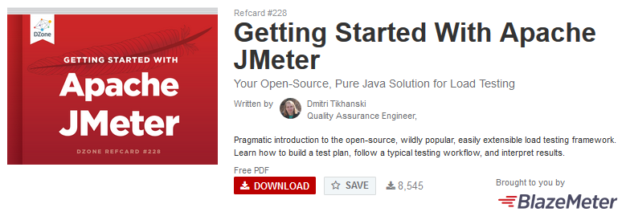

<!-- MarkdownTOC -->

- [Performance Testing. Traffic injectors/generators](#performance-testing-traffic-injectorsgenerators)
    - [JMeter](#jmeter)
        - [Video Streaming Load Testing](#video-streaming-load-testing)
    - [Webpagetest](#webpagetest)
    - [Performance tools in Firefox](#performance-tools-in-firefox)
    - [Google New website Testing tool for Small Businesses](#google-new-website-testing-tool-for-small-businesses)
    - [Alternatives](#alternatives)

<!-- /MarkdownTOC -->

|||
|:---:|:---:|

# Performance Testing. Traffic injectors/generators
- [DZone: Top 10 Web Performance Killers](https://dzone.com/articles/top-10-web-performance-killers) Sam Holt talks about the Top 10 Web Performance Killers, including uncompressed static assets and not leveraging HTML features.

<iframe width="560" height="315" src="https://www.youtube.com/embed/xJ-INb8ZVkk?rel=0" frameborder="0" allowfullscreen class="video"></iframe>

 

## JMeter
- [javacodegeeks.com: JMeter Tutorial for Load Testing – The ULTIMATE Guide](http://www.javacodegeeks.com/2014/11/jmeter-tutorial-load-testing.html)
- [blazemeter.com: The Ultimate JMeter Resource List (july 2015)](https://blazemeter.com/blog/ultimate-jmeter-resource-list)
- [guru99.com: Free Jmeter Tutorials](http://www.guru99.com/jmeter-tutorials.html)
- [unpocodejava.wordpress.com: ¿Cómo hacer pruebas de carga de una clase Java con JMeter?](https://unpocodejava.wordpress.com/2015/12/21/como-hacer-pruebas-de-carga-de-una-clase-java-con-jmeter-2/)
- [DZone refcard: Getting Started With Apache JMeter 🌟](https://dzone.com/refcardz/getting-started-with-apache-jmeter)
- [The DNS Cache Manager: The Right Way To Test Load Balanced Apps 🌟](https://www.blazemeter.com/blog/dns-cache-manager-right-way-test-load-balanced-apps)

### Video Streaming Load Testing
- [blazemeter.com: How to Load Test HTTP Live Media Streaming (HLS) with JMeter](http://blazemeter.com/blog/how-load-test-http-live-media-streaming-hls-jmeter)

<iframe width="560" height="315" src="https://www.youtube-nocookie.com/embed/cv7KqxaLZd8?rel=0" frameborder="0" allowfullscreen class="video"></iframe>

 

<iframe src="//www.slideshare.net/slideshow/embed_code/key/nbWSTjvNUVhYxT" width="595" height="485" frameborder="0" marginwidth="0" marginheight="0" scrolling="no" style="border:1px solid #CCC; border-width:1px; margin-bottom:5px; max-width: 100%;" allowfullscreen class="video"> </iframe> 
 <strong> <a href="//www.slideshare.net/BlazeMeter/webdriver-webinar-v7" title="Performance Testing using Real Browsers with JMeter &amp; Webdriver" target="_blank">Performance Testing using Real Browsers with JMeter &amp; Webdriver</a> </strong> from <strong><a href="//www.slideshare.net/BlazeMeter" target="_blank">BlazeMeter</a></strong> 

 

<iframe src="//www.slideshare.net/slideshow/embed_code/key/pSXioeGqKi7hxp" width="595" height="485" frameborder="0" marginwidth="0" marginheight="0" scrolling="no" style="border:1px solid #CCC; border-width:1px; margin-bottom:5px; max-width: 100%;" allowfullscreen class="video"> </iframe> 
 <strong> <a href="//www.slideshare.net/keytorc/jmeter-database-performace-testing-keytorc-approach" title="JMeter Database Performace Testing - Keytorc Approach" target="_blank">JMeter Database Performace Testing - Keytorc Approach</a> </strong> from <strong><a href="//www.slideshare.net/keytorc" target="_blank">Keytorc Software Testing Services</a></strong> 

 

<blockquote class="twitter-tweet tw-align-center" data-lang="es">
Finding the signal in the noise of Linux system monitoring <a href="https://t.co/5LoVOTSySH">https://t.co/5LoVOTSySH</a>
&mdash; Open Source Way (@opensourceway) <a href="https://twitter.com/opensourceway/status/743473462497312769">16 de junio de 2016</a></blockquote>

## Webpagetest
- [webpagetest.org](http://www.webpagetest.org) Test a website's performance
- [website-speedtest.com](http://www.website-speedtest.com)
	- [twitter.com/Web_Speedtest](https://twitter.com/Web_Speedtest)
- [Iframe loading techniques and performance](http://www.aaronpeters.nl/blog/iframe-loading-techniques-performance)

<iframe src="//es.slideshare.net/slideshow/embed_code/key/mcjpimBYK0PsoM" width="595" height="485" frameborder="0" marginwidth="0" marginheight="0" scrolling="no" style="border:1px solid #CCC; border-width:1px; margin-bottom:5px; max-width: 100%;" allowfullscreen class="video"> </iframe> 
 <strong> <a href="//es.slideshare.net/AndyDavies/speed-matters-so-why-is-your-site-so-slow" title="Speed matters, So why is your site so slow?" target="_blank">Speed matters, So why is your site so slow?</a> </strong> from <strong><a href="//es.slideshare.net/AndyDavies" target="_blank">Andy Davies</a></strong> 

 

<iframe src="//es.slideshare.net/slideshow/embed_code/key/mGQp2yMZSIeGHQ" width="595" height="485" frameborder="0" marginwidth="0" marginheight="0" scrolling="no" style="border:1px solid #CCC; border-width:1px; margin-bottom:5px; max-width: 100%;" allowfullscreen class="video"> </iframe> 
 <strong> <a href="//es.slideshare.net/tammyeverts/how-slow-load-times-hurt-your-bottom-line-and-17-things-you-can-do-to-fix-it" title="How Slow Load Times Hurt Your Bottom Line (And 17 Things You Can Do to Fix It)" target="_blank">How Slow Load Times Hurt Your Bottom Line (And 17 Things You Can Do to Fix It)</a> </strong> from <strong><a href="//es.slideshare.net/tammyeverts" target="_blank">Tammy Everts</a></strong> 

 

## Performance tools in Firefox

<iframe width="560" height="315" src="https://www.youtube.com/embed/WBmttwfA_k8?rel=0" frameborder="0" allowfullscreen class="video"></iframe>

 

## Google New website Testing tool for Small Businesses
- [testmysite.thinkwithgoogle.com 🌟🌟🌟](https://testmysite.thinkwithgoogle.com/)
- [Google Launches New website Testing tool for Small Businesses](http://www.learnunbound.com//articles/google-launches-new-website-testing-tool-for-small-businesses)

## Alternatives
- [Siege, a CLI tool ideal for a simple testing of AWS Auto Scaling 🌟](https://www.joedog.org/siege-home/)
- [Grinder](http://grinder.sourceforge.net/)
- [xmodulo.com: What are good web server benchmarking tools for Linux](http://xmodulo.com/web-server-benchmarking-tools-linux.html)
- [Performance Testing With Real Browsers: using Selenium WebDriver with BlazeMeter and/or JMeter on its own](https://blazemeter.com/blog/view-webcast-performance-testing-real-browsers)
- [httpress: 1M HTTP Requests per second using Nginx and Ubuntu 12.04 on EC2](http://raby.sh/1m-http-requests-per-second-using-nginx-and-ubuntu-1204-on-ec2.html)
	- [httpress](https://bitbucket.org/yarosla/httpress/wiki/Home)
- [ApacheBench](https://en.wikipedia.org/wiki/ApacheBench)
	- [digitalocean.com: How To Use ApacheBench To Do Load Testing on an Ubuntu 13.10 VPS](https://www.digitalocean.com/community/tutorials/how-to-use-apachebench-to-do-load-testing-on-an-ubuntu-13-10-vps)
- [DZone: How to Easily Load Test With Open Source Tools 🌟🌟🌟](https://dzone.com/articles/how-to-easily-load-test-with-open-source-tools) Learn how to use open source tools for testing in continuous delivery environments presented by Noga Cohen of BlazeMeter.
    - [Taurus 🌟](http://gettaurus.org/) Automation-friendly framework for Continuous Testing. Taurus improves experience of JMeter, Selenium and others. 
    - [Gatling stress tool 🌟](http://gatling.io) 
    - [Locust 🌟](http://locust.io/)

<blockquote class="twitter-tweet tw-align-center" data-lang="es">
Para ser un buen <a href="https://twitter.com/hashtag/SysAdmin?src=hash">#SysAdmin</a> de red aprende a monitorear el rendimiento de servidores <a href="https://twitter.com/hashtag/Apache?src=hash">#Apache</a> <a href="https://t.co/YP6OBrI0Yn">https://t.co/YP6OBrI0Yn</a> <a href="https://t.co/iLFVlYIrHP">pic.twitter.com/iLFVlYIrHP</a>
&mdash; Solvetic (@solvetic) <a href="https://twitter.com/solvetic/status/715657005881561088">31 de marzo de 2016</a></blockquote>

<iframe width="420" height="315" src="https://www.youtube.com/embed/hRFxCf9w7oo?rel=0" frameborder="0" allowfullscreen class="video"></iframe>

 

<iframe width="420" height="315" src="https://www.youtube.com/embed/KK2XfDmQ5Jg?rel=0" frameborder="0" allowfullscreen class="video"></iframe>

 
